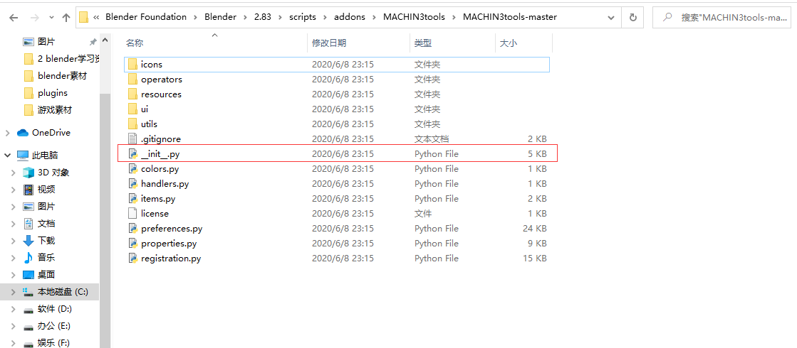
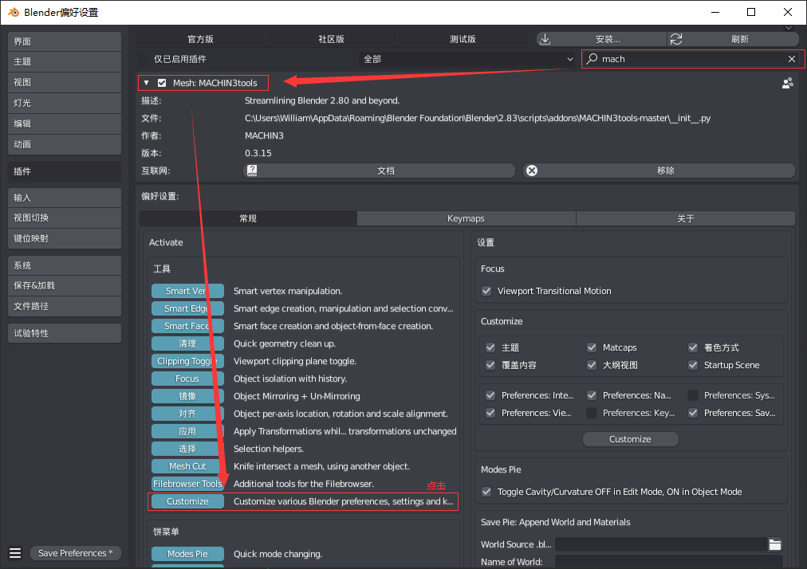
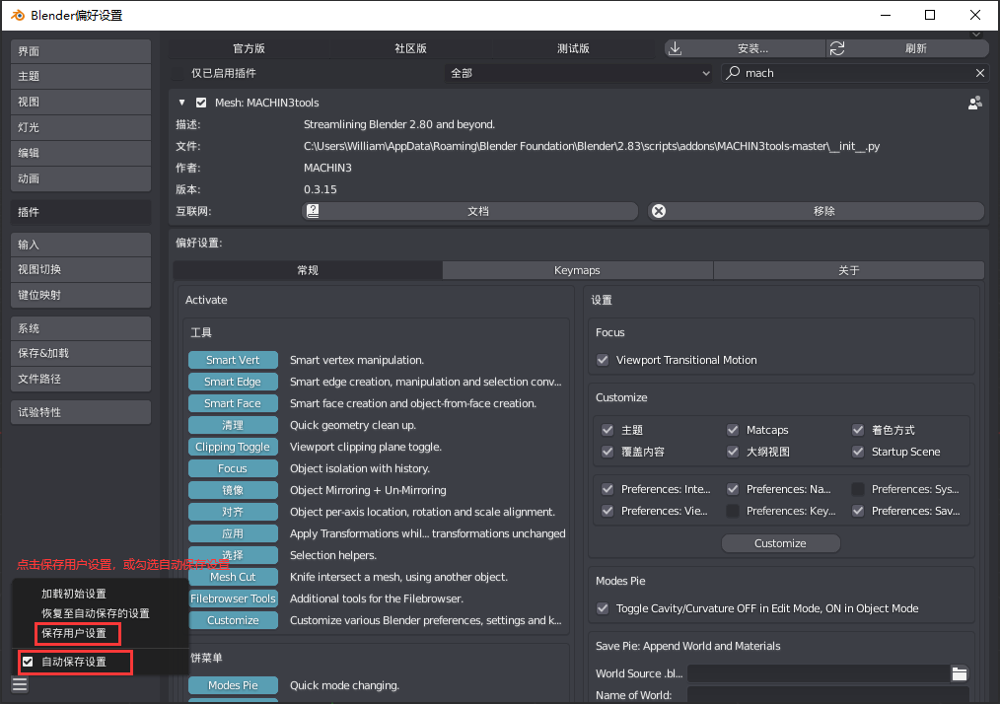
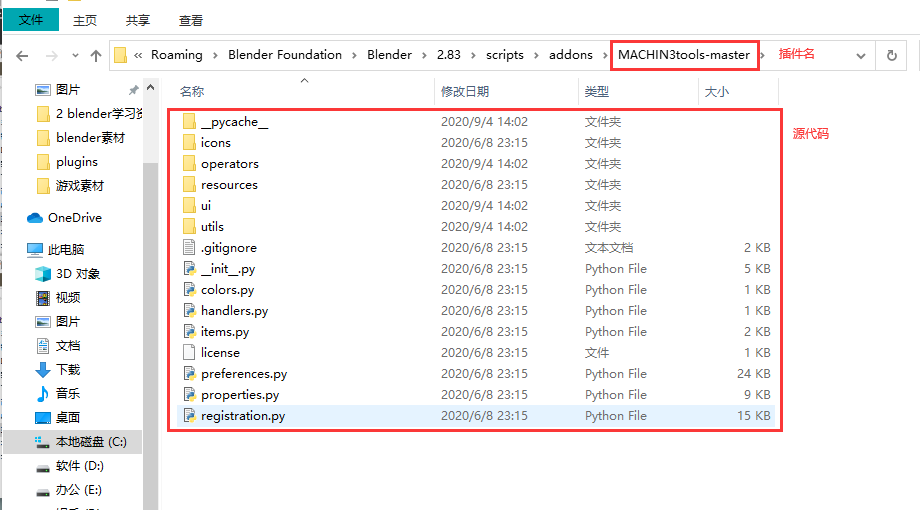

## **环境说明**

#### 准备工作

- Windows 10 2004 版本（Windows 系统）
- blender version 2.83
- [MACHIN3tools 下载](https://github.com/machin3io/MACHIN3tools)

## **步骤说明**

**1. 将下载好的文件复制到 C:\Users\用户名\AppData\Roaming\Blender Foundation\Blender\2.83\scripts\addons 下并解压，其中用户名（不同的电脑和用户名字会不相同）是系统用户，需要改成自己的**

- AppData 可能会不显示，要把顶上“查看”里面的“隐藏的项目”前的框框打上勾才能看到
- 检查一下看是否有一个"**init**.py"的文件

**2. 重启并打开 blender,依次点击编辑-》偏好设置-》插件，搜索“MACHIN3tools”并勾选它前面的框**

- 选中中文笔刷后双击进入

**3. 至此，插件安装完成**

#### 注意事项

- 插件的文件路径一定是：插件文件+源代码，否则在 blender 里启用插件的时候识别不了

