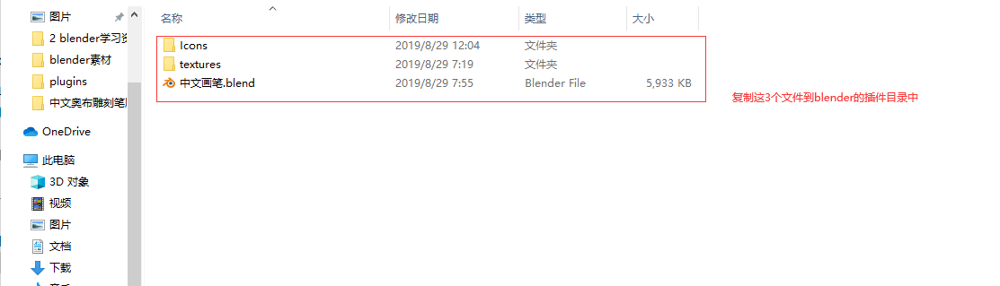
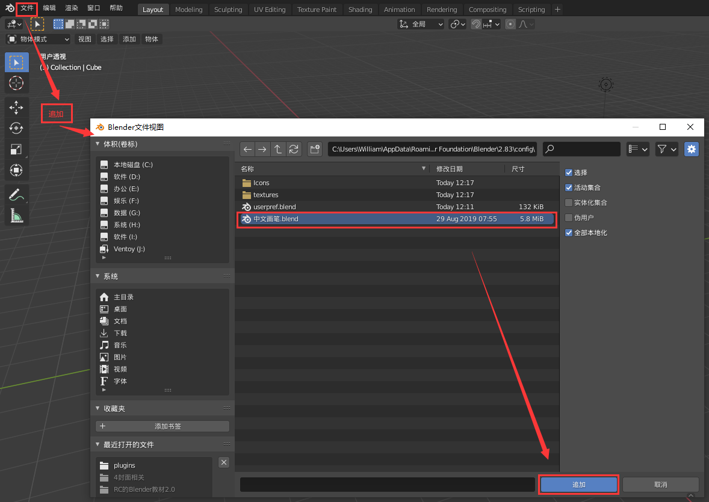
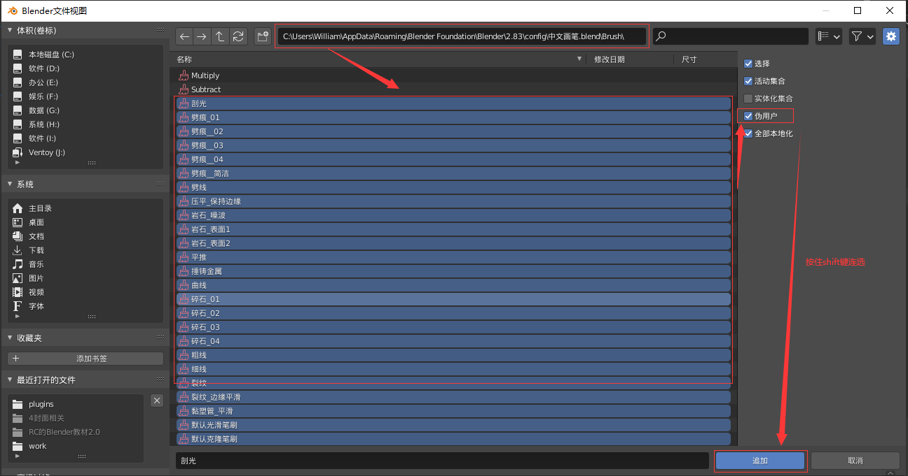
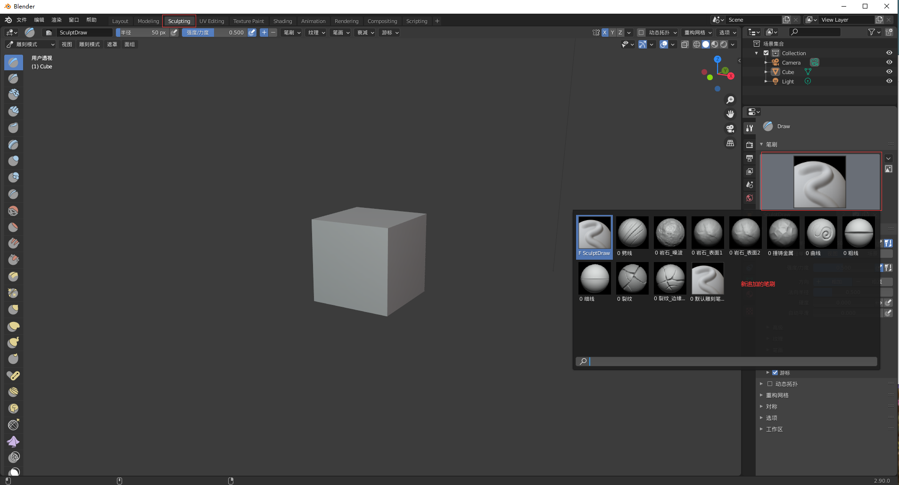
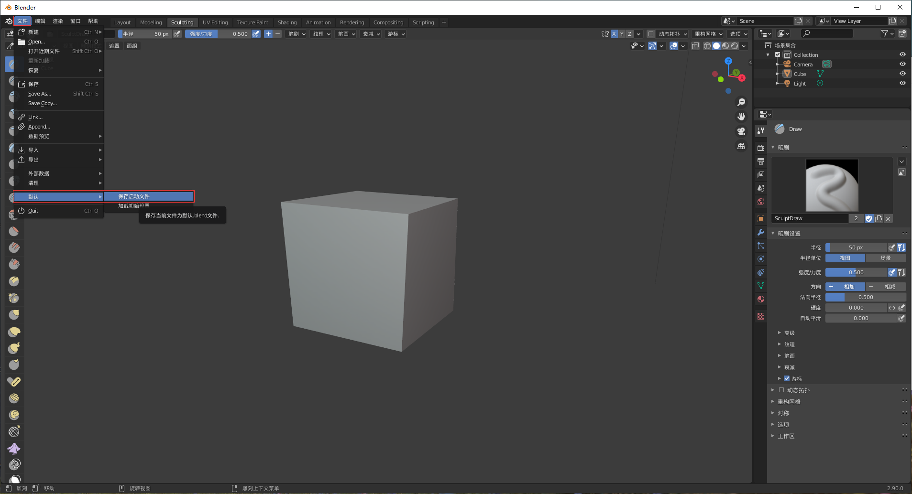

## **环境说明**

#### 准备工作

- Windows 10 2004 版本（Windows 系统）
- blender version 2.83
- 奥布笔刷

## **步骤说明**

**1. 解压下载好的笔刷文件，将文件复制到 C:\Users\用户名\AppData\Roaming\Blender Foundation\Blender\2.83\config 下，其中用户名（不同的电脑和用户名字会不相同）是系统用户，需要改成自己的**

- AppData 可能会不显示，要把顶上“查看”里面的“隐藏的项目”前的框框打上勾才能看到

**2. 打开 blender,点击文件-》append-》选择文件路径，将笔刷追加，在右侧设置中将伪用户勾选**

- 选中中文笔刷后双击进入

**3. 点击菜单栏中的 Sculpting，切换到雕刻视图，并保存此视图**

**4. 笔刷升级，重复上面步骤即可**
