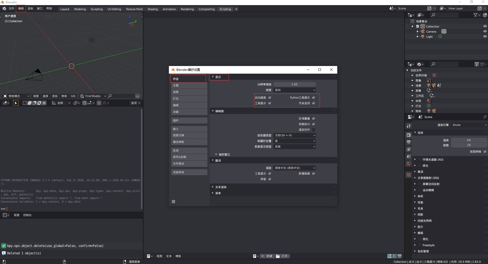

## **环境说明**

#### 准备工作

- Windows 10 2004 版本（Windows 系统）
- blender version 2.83
- [Blender Python API](https://docs.blender.org/api/2.83/)
- [Cookbook](https://archive.blender.org/wiki/index.php/Dev:Py/Scripts/Cookbook/)

## **步骤说明**

**1. 111**

**2. 111**

#### 注意事项
