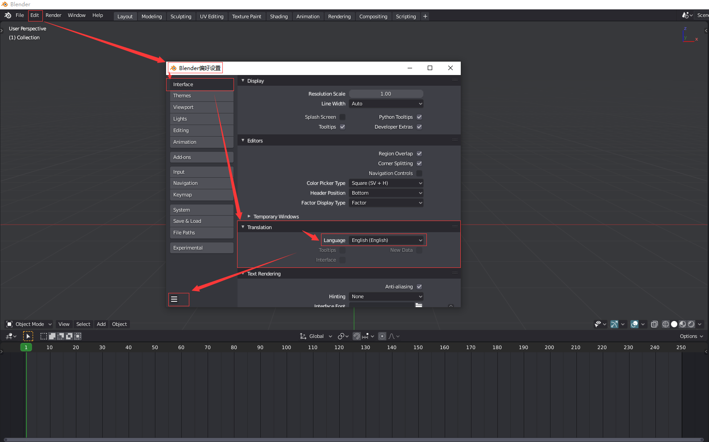

## **环境说明**

#### 准备工作

- Windows 10 2004 版本（Windows 系统）
- blender version 2.83

## **步骤说明**

**1. 打开 blender,依次点击 Edit-》Pregerences-》Interface-》Translation-》Language，选择简体中文，然后保存设置**

**2. 关闭设置界面，就能看到已经汉化了**

