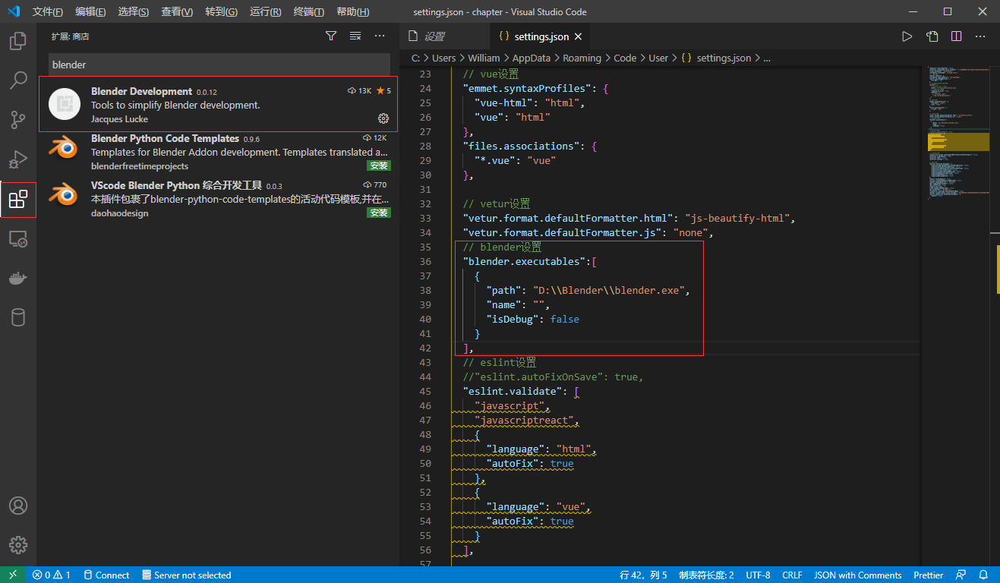
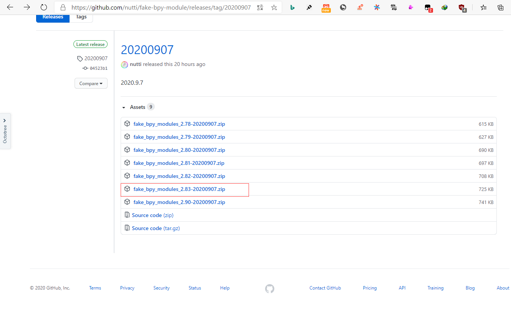
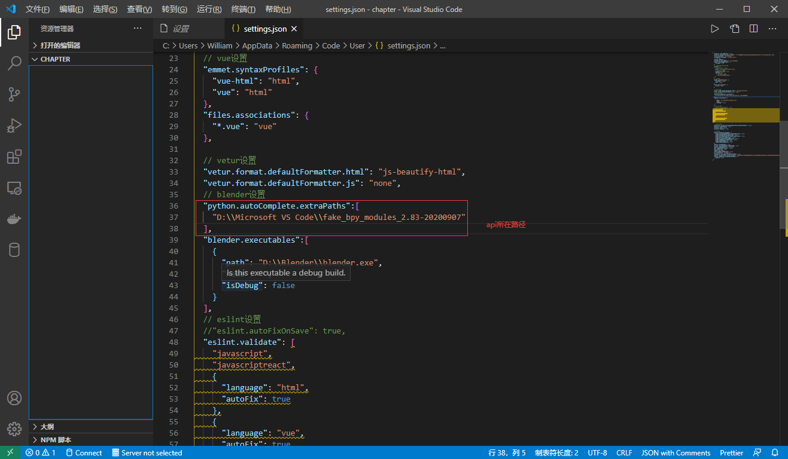
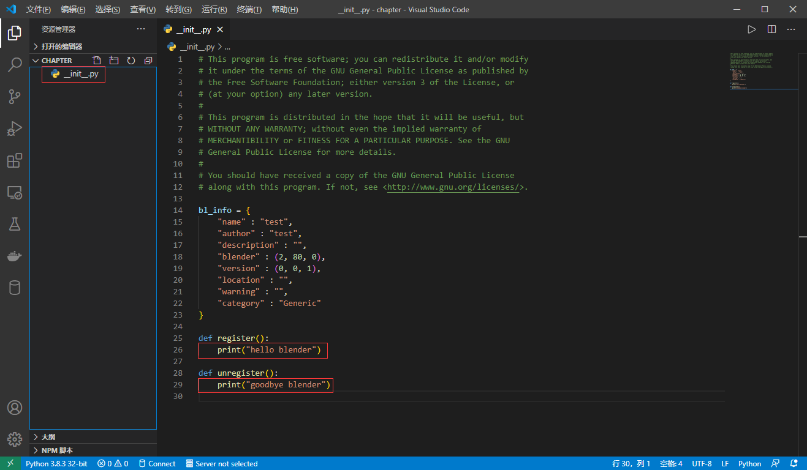
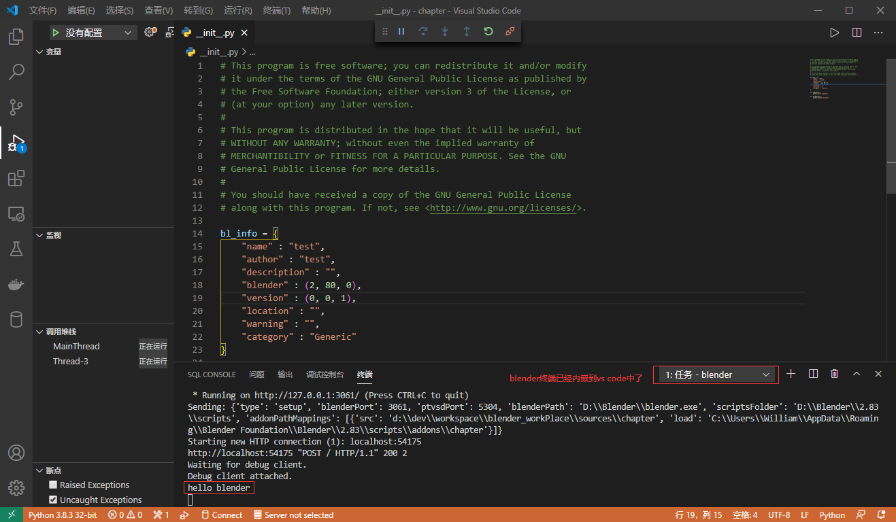
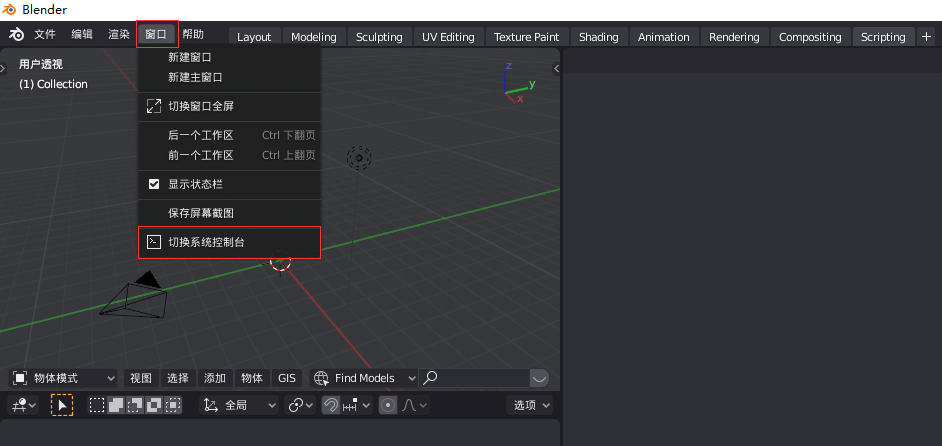
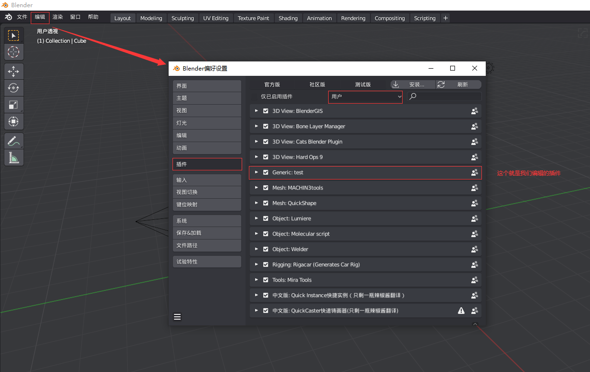

## **环境说明**

#### 准备工作

- Windows 10 2004 版本（Windows 系统）
- blender version 2.83
- [blender api 下载](https://github.com/nutti/fake-bpy-module/releases/tag/20200907)
- vs code
- Blender Development 插件
- 安装 python

## **步骤说明**

**1. 打开 blender,依次点击编辑-》偏好设置-》界面，勾选启动画面、Python 工具提示、工具提示、开发选项后并保存**

**2. 安装 python 并打开 VS Code 安装 blender 开发插件(Blender Development)**

- 设置插件

- 下载 blender api 并解压，将解压后的文件复制到 VS Code 的安装目录下，并在 VS Code 设置中进行设置，注意下载对应版本的 API 压缩包

**3. 新建工作区，用于保存插件代码，并使用 VS Code 打开**

- 按住 ctrl+shift+p 后，搜索 bleder,依次选择 Blender:New Addon-》Simple-》输入插件名后并选择保存目录

- 保存代码后，按住 ctrl+shift+p 后，搜索 bleder,依次选择 Blender:Start-》blender 安装目录

- 打开 blender,点击窗口-》切换系统控制台，即可打开 blender 自带的终端

**4. 查看插件是否以启用，打开编辑-》偏好设置-》插件，找到你命名的插件**

#### 注意事项
