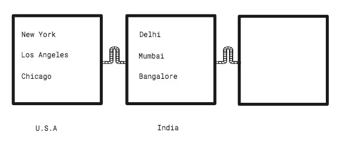
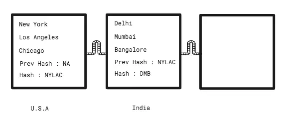

## **那么这个 “区块链”到底是什么呢?**

其实是两个东西：一个是区块一个是链。说玄虚一点，就是一链子的区块。因为它是存在于计算机中的东西，所以我们可以厘定它的一个物理形态是啥样子的，就是数字信息被分成一个一个区块然后把这些区块链接起来。举个例子，下图中的方块，每一个都表示一个国家，而且每一个都包含了对应国家的城市名称。


等等，其实还有更多东西来着。这里的每一个方块都一个叫做哈希的东西。一个哈希就是一串字符 (比如 “1hi515AHA5H” )。哈希是根据方块里面所包含的信息来得到的。 U.S.A 的方块拥有 New York, Los Angeles, 还有 Chicago 这几个城市，所以它的哈希就是像 “NYLAC” 的东西了 (技术上其实远非如此，但你理会精要就行了)。


每一个接续的方块都会包含前一个方块的哈希，所以这个就是（强制性的）将它们绑到一起的纽带。如果有人擅自篡改了第一个方块，加入了城市 Boston，那么新的哈希就会是 “NYLACB”，然而后面接续的 India 这个方块已经存着的哈希还是 “NYLAC”，这种不匹配就会把链条打断。所以哈希的目的就是确保没有人可以篡改区块。

那如果有人修改了一个方块的内容，然后把后面的接续方块的哈希也一并更新会如何呢? 这也是有可能的，不过有一件事情我还没有告诉你。区块链的数据并不只是存在于仅仅一台计算机里面。一台计算机里面的区块链数据并不能骗到人，因为它会被复制到网络中每一个用户的计算机里面去。如果你加入了一个区块链网络，那么你的计算机就会去下载这些区块数据，如果有人篡改了他拥有的版本，整个网络也会考虑占多数的人的计算机上所拥有的版本才是正确的。

还有一件事，在一个区块链网络中，不仅是数据，就连整个系统的程序都被复制到了所有的电脑中。大多数互联网应用都是集中话的，比如 Facebook，她的数据和程序都被放在了她的服务器上，你的计算机会从 Facebook 的服务器上获取到你一个人需要知道的信息。但在区块链的世界理，就没有存在于中心的东西，它依赖的是用户的计算机来容纳自己的程序。是的，这就意味着，如果整个区块链网络中的每一台电脑都关机了，那么这个区块链系统就死翘翘了。

#### 公共区块链
这是不是就意味着区块链系统其实就是由一群心怀善意自愿让他们的计算机保持运行的人来组成的呢? 还有这些防篡改的区块是用来干嘛的呢?

区块链网络的功效不胜枚举。比特币是一种数据货币和一个支付系统。它所有的防篡改区块中所保存的就是全部交易的分类账。那些贡献了他们自己的计算机的人被称为矿工。系统会给他们提供比特币作为奖励。

Ethereum 有意向附加功能。它可以承载你的代码，从头开始发展出一个区块链系统，而要构建一个属于你自己的系统也许会非常地困难（记住这得看有人为你牺牲他们的计算机运行能力才行哦）。Ethereum 就维护着这些耗损巨大的运算能力，而你则需要为这些计算消耗买单。

区块链应用并不非得是支付系统或者加密货币。它可以任何东西，像是一个社交网络，一个像 LiveEdu 这样的学习平台，等等。

#### 私有区块链
Bitcoin, Ethereum 等等这些都是公共区块链的例子，任何人都可以成为其中的一分子。那如果我们想要有一个私有的区块链网络该如何呢？有些人想要一个私有的区块链是想干嘛呢？那就来瞧瞧下面的故事吧。

Mark 和 Sara

Mark 已经五个月没交房租了，当 Sara 找他要的时候，他就说晚点会给她。她付不起律师费，而法院强制执行诉讼就需要8个月甚至一年，所以唯一的选择就是去说服 Mark。

Joe 的生意

Joe 是一个商人，他经常要跟不同的公司做生意。几个月之前他和一家零售商签了一份合同，尽管合同条款都已经履约了，可零售商确拒绝付款。这帮人利用法律制度中的漏洞来游说 Joe，想以此达到少付钱的目的。Joe 在这以前就是有这方面经验的，在某些情况下，他会找法院求助，但这样做所耗费的时间和金钱却要损失他自己的利润。

我们该如何帮助 Sara 和 Joe 呢?

我们是不是能在其它地方解决这个问题呢? 在 Sara 遇到的这种情况中，我们需要让 Mark  按月支付房租，这其实就是一个基于时间的触发机制。你的日历程序使用这样的触发器来给你提供预设事件的通知。

在 Joe 遇到的场景中，一旦合约中的条款都满足了，当事人就得付款，这其实就是一个基于条件的触发机制。你想想上次从 Amazon 买电子书的时候，是不是得先确认付款了，Amazon 才会把电子书发给你？

重点是，计算机程序会始终如一的执行诸如此类的指令。当你点击着这篇文章，向下滚动，诸如这类的操作，它也会照着执行不误。为了能帮助到 Sara ，我们需要将合同的条款转变成代码。

Sara 和 Mark 之间所订立的智能合同的伪代码
```
If today’s date is 30th and rent is not paid then
Transfer $500 from Mark’s account to Sara’s account
```
可是我们在哪儿部署这些代码呢? 它就应该被部署到所有参与者的计算机上。Sara 的还有 Mark 的银行都会是这一个私有区块链网络的一部分。Joe 和 Sara 会签署一份编码的协议(也就是智能合同)，然后这份协议会被分发到网络中去，Mark 的和 Sara 的银行都会有一份拷贝。在每个月的 30 号，当时钟跳动到 12 点整，协议好的金额就会从 Mark 的账户转移到 Sara 的账户上去。Joe 也开始使用智能合同来强制让他的客户支付协议好的货款。

Sara 高兴了，因为她再也不用去烦心 Mark 会不会如约付房租了。Joe 也高兴，因为他也不用找法院要说法了，省下这些精力，他可以继续发展自己的生意了。

私有区块链只限于业务中涉及到的相关各方，因此 Joe 不会是 Sara 和 Mark 所属区块链网络的一部分。