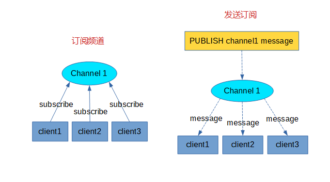

## **环境说明**

#### 准备工作

- Windows 10 2004 版本（Windows 系统）
- Redis version 5.0.9

## **步骤说明**

**1. Redis 发布订阅**

- Redis 发布订阅(pub/sub)是一种消息通信模式：发送者(pub)发送消息，订阅者(sub)接收消息。
- Redis 客户端可以订阅任意数量的频道



**2. 实例**

```@cmd
SUBSCRIBE redisChat #创建订阅频道为redisChat
# 重新开启个 redis 客户端，然后在同一个频道 redisChat 发布两次消息，订阅者就能接收到消息
PUBLISH redisChat "Redis is a great caching technique"
PUBLISH redisChat "Learn redis by runoob.com"
```

**3. 发布订阅常用命令**

| 序号 | 命令                                     | 描述                             |
| ---- | ---------------------------------------- | -------------------------------- |
| 1    | PSUBSCRIBE pattern[pattern...]           | 订阅一个或多个符合给定模式的频道 |
| 2    | PUBSUB subcommand[argument[argument...]] | 查看订阅与发布系统状态           |
| 3    | PUBLISH channel message                  | 将信息发送到指定的频道           |
| 4    | PUNSUBSCRIBE [pattern[pattern...]]       | 退订所有给定模式的频道           |
| 5    | SUBSCRIBE channel[channel...]            | 订阅给定的一个或多个频道的信息   |
| 6    | UNSUBSCRIBE [channel[channel...]]        | 指退订给定的频道                 |
