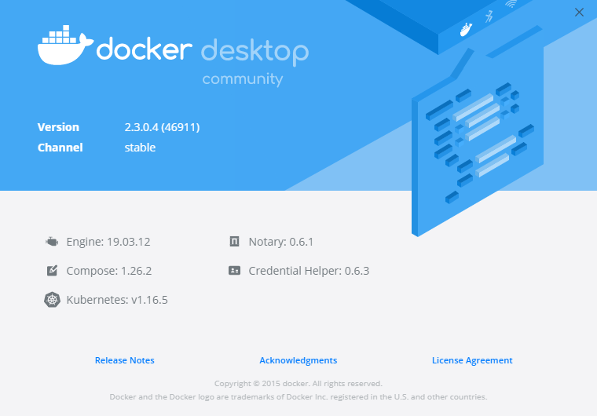
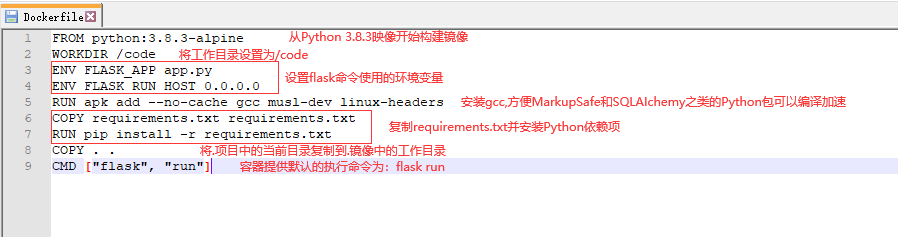

## **环境说明**

#### 准备工作

- Windows 10 2004 版本（Windows 系统）
- Docker version 19.03.12, build 48a66213fe
- python version 3.8.3
- [Compose 最新发行版](https://github.com/docker/compose/releases)

## **步骤说明**

**1. Compose 安装**

- Linux 上安装 Compose,注意： 对于 alpine，需要以下依赖包： py-pip，python-dev，libffi-dev，openssl-dev，gcc，libc-dev，和 make。

```terminal
sudo curl -L "https://github.com/docker/compose/releases/download/1.26.1/docker-compose-$(uname -s)-$(uname -m)" -o /usr/local/bin/docker-compose  #下载
sudo chmod +x /usr/local/bin/docker-compose     #将可执行权限应用于二进制文件
sudo ln -s /usr/local/bin/docker-compose /usr/bin/docker-compose   #创建软链
docker-compose --version    #查看是否安装成功
```

- Windows 的 Docker 桌面版和 Docker Toolbox 已经包括 Compose 和其他 Docker 应用程序，因此 Windows 用户不需要单独安装 Compose



**2. 准备创建一个测试目录**

```cmd
mkdir composetest
cd composetest
```

- 在测试目录中创建一个名为 app.py 的文件，并复制粘贴以下内容：

```composetest/app.py
import time
import redis
from flask import Flask

app = Flask(__name__)
cache = redis.Redis(host='redis', port=6379)

def get_hit_count():
    retries = 5
    while True:
        try:
            return cache.incr('hits')
        except redis.exceptions.ConnectionError as exc:
            if retries == 0:
                raise exc
            retries -= 1
            time.sleep(0.5)
@app.route('/')
def hello():
    count = get_hit_count()
    return 'Hello World! I have been seen {} times.\n'.format(count)
```

- 在 composetest 目录中创建另一个名为 requirements.txt 的文件，内容如下:

```requirements.txt
flask
redis
```

**3. 创建 Dockerfile 文件**

- 在 composetest 目录中，创建一个名为的文件 Dockerfile，内容如下：

```Dockerfile
FROM python:3.7-alpine
WORKDIR /code
ENV FLASK_APP app.py
ENV FLASK_RUN_HOST 0.0.0.0
RUN apk add --no-cache gcc musl-dev linux-headers
COPY requirements.txt requirements.txt
RUN pip install -r requirements.txt
COPY . .
CMD ["flask", "run"]
```



**4. 创建 docker-compose.yml**

- 在 composetest 目录中创建一个名为 docker-compose.yml 的文件，然后粘贴以下内容：

```docker-compose.yml
# yaml 配置
version: '3'
services:
  web:
    build: .
    ports:
     - "5000:5000"
  redis:
    image: "redis:alpine"
```

- 说明：Compose 文件定义了两个服务：web 和 redis。
  - web：该 web 服务使用从 Dockerfile 当前目录中构建的镜像。然后，它将容器和主机绑定到暴露的端口 5000。此示例服务使用 Flask Web 服务器的默认端口 5000 。
  - redis：该 redis 服务使用 Docker Hub 的公共 Redis 映像。

**5. 使用 Compose 命令构建和运行应用**

- 在 composetest 目录中，执行以下命令来启动应用程序：

```
docker-compose up -d  #-d:在后台执行该服务
```

#### 注意事项
