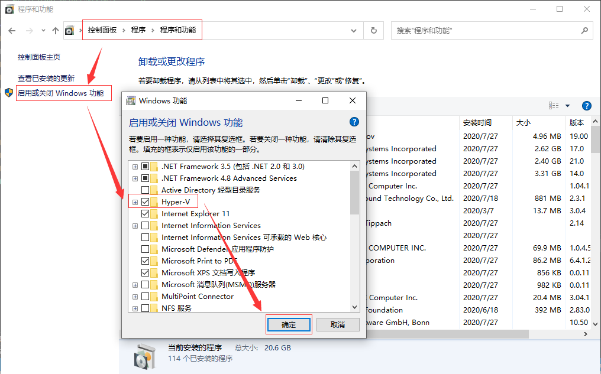
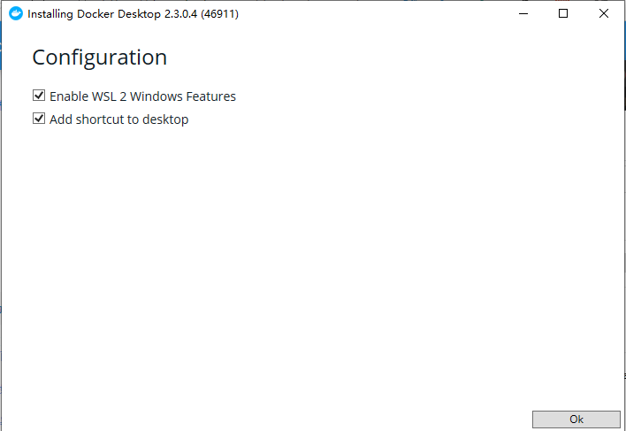
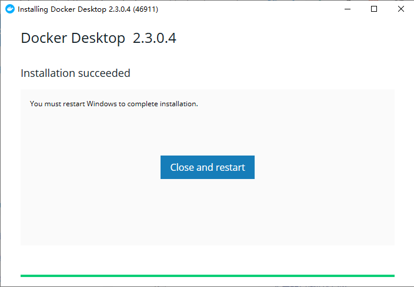
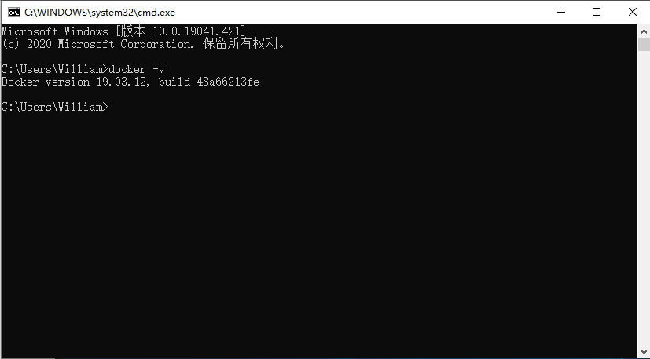
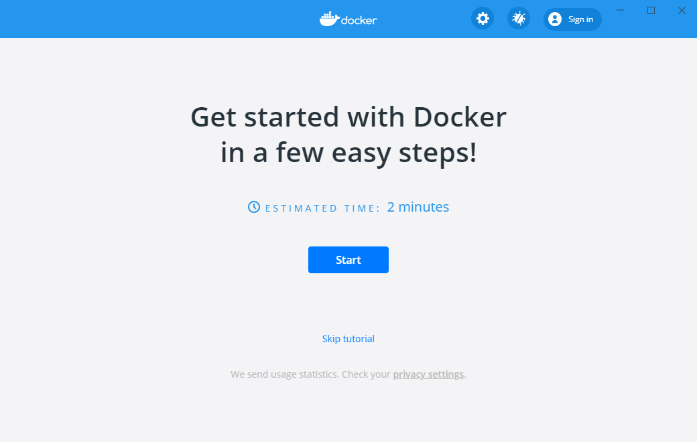
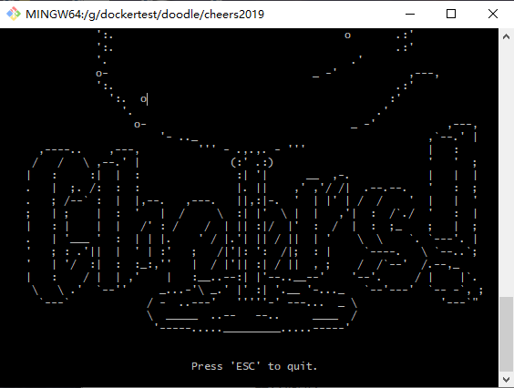
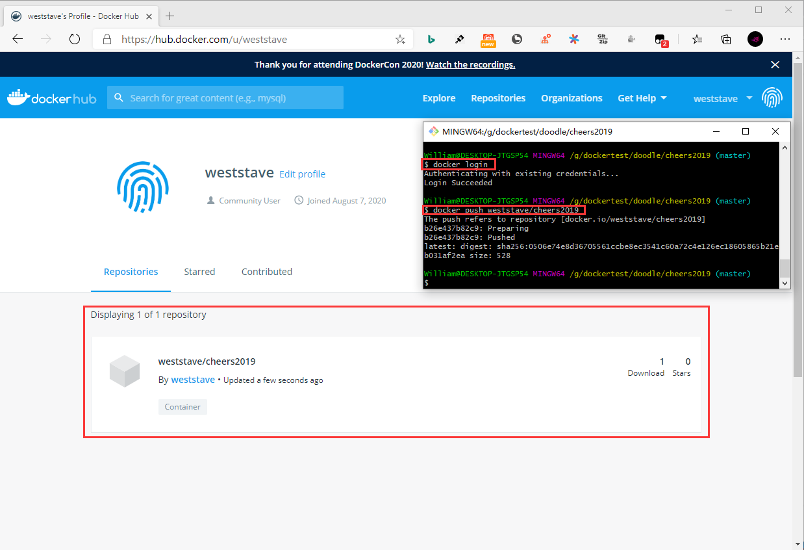

## **环境说明**

#### 准备工作

- Windows 10 x64 专业版(版本 2004)
- 启用 Hyper-V 和容器 Windows 功能
- [更新 WSL 2 Linux 内核](https://docs.microsoft.com/zh-cn/windows/wsl/wsl2-kernel)
- [docker-machine 下载](https://github.com/docker/machine/releases)

## **步骤说明**

**1. 开启 Hyper-V 功能，并重启计算机**



**2. 下载 docker 应用程序，并双击 Docker 桌面安装程序.exe 以运行安装程序**

**3. 按照安装向导上的说明授权安装程序并继续安装**




**4. 如果您的管理员帐户与用户帐户不同，则必须将用户添加到 Docker 用户组。以管理员身份运行计算机管理，并导航到本地用户和组>组> Docker 用户。右键单击可将用户添加到组。注销并重新登录更改以生效。**

**5. 启用 docker 并进行设置**




**6. 安装 docker-machine**

- Docker Machine 是一种可以让您在虚拟主机上安装 Docker 的工具，并可以使用 docker-machine 命令来管理主机。
- Docker Machine 也可以集中管理所有的 docker 主机，比如快速的给 100 台服务器安装上 docker。

- Windows 安装命令如下：

```bash
base=https://github.com/docker/machine/releases/download/v0.16.0 &&
  mkdir -p "$HOME/bin" &&
  curl -L $base/docker-machine-Windows-x86_64.exe > "$HOME/bin/docker-machine.exe" &&
  chmod +x "$HOME/bin/docker-machine.exe"
docker-machine version  #检测是否安装成功
```

- macOS 安装命令如下：

```
base=https://github.com/docker/machine/releases/download/v0.16.0 &&
  curl -L $base/docker-machine-$(uname -s)-$(uname -m) >/usr/local/bin/docker-machine &&
  chmod +x /usr/local/bin/docker-machine
```

- Linux 安装命令如下：

```
base=https://github.com/docker/machine/releases/download/v0.16.0 &&
  curl -L $base/docker-machine-$(uname -s)-$(uname -m) >/tmp/docker-machine &&
  sudo mv /tmp/docker-machine /usr/local/bin/docker-machine &&
  chmod +x /usr/local/bin/docker-machine
```

**7. docker-machine 使用,打开 Windows 的 powershell 工具**

```shell
docker-machine create test1  #创建名为test1的docker虚拟机
docker-machine ls  #查看所有的docker虚拟机
docker-machine ip test1  #查看机器的 ip
docker-machine start test1 #启动机器
docker-machine ssh test1  #连接名为test1的docker虚拟机
docker version  #查看版本号
exit #退出
docker-machine stop test1  #停用名为test1的docker虚拟机
docker-machine rm test1  #删除名为test1的docker虚拟机
docker-machine active   #查看当前激活状态的docker主机
```

**8. 官方案例测试(可选)**

- 注册[docker hub](https://hub.docker.com/)账号

- 随便找个目录，然后克隆 docker 官方提供的仓库

```bash
git clone https://github.com/docker/doodle.git
```

- 更改目录，并执行 build，注意将 login-name 替换成自己的登录名

```bash
cd doodle/cheers2019
docker build -t <login-name>/cheers2019 .
```

- build 成功后，执行 run, 同样替换 login-name 为自己的用户名，执行会输出特殊动态效果,若报错则在命令前加 winpty

```bash
docker run -it --rm <login-name>/cheers2019
```



- 把这个快速体验推到 Docker Hub 上

```bash
docker login
docker push <login-name>/cheers2019
```



#### 注意事项

**解决 Windows 的 Hyper-V 虚拟化与 VMware 冲突问题**

- 以管理员身份运行 Powershell,并执行如下代码后重启计算机

```shell
bcdedit /set hypervisorlaunchtype off
```
