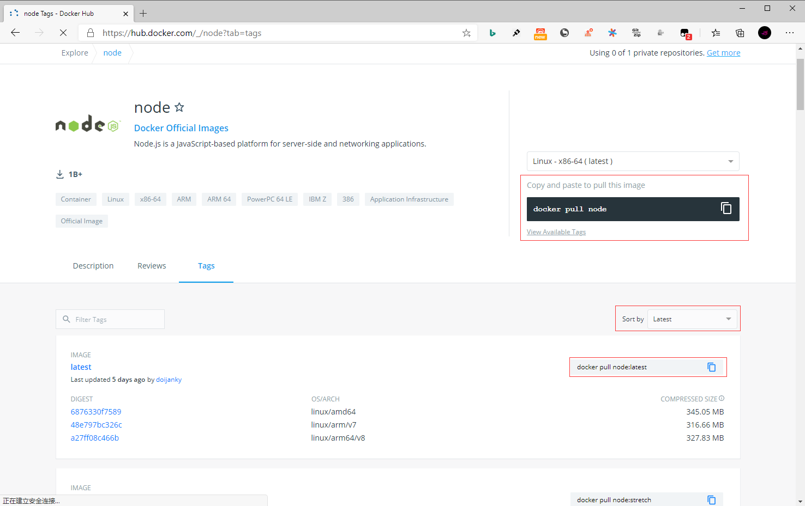

## **环境说明**

#### 准备工作

- Windows 10 x64 专业版(版本 2004)
- Docker version 19.03.12, build 48a66213fe
- [Docker Hub](https://hub.docker.com/)
- [Node 镜像库地址](https://hub.docker.com/_/node?tab=tags)

## **步骤说明**

**1. 访问 Node 镜像库地址，可以通过 Sort by 查看其他版本的 Node 。默认是最新版本 node:latest 。**



**2. 拉取最新版本的 node 镜像，这里我们拉去官方的最新版本为例**

```cmd
docker search node   #查看node可用版本
docker pull node:latest    #拉去最新版本
docker images   #查看本地镜像
```

**3. 运行容器**

```cmd
docker run -itd --name node node
```

- 参数说明：
  - --name node：容器名称。

**4. 安装成功**

- 通过以下命令查看容器运行的 node 版本

```cmd
docker exec -it node /bin/bash
node -v
exit
```

#### 注意事项
