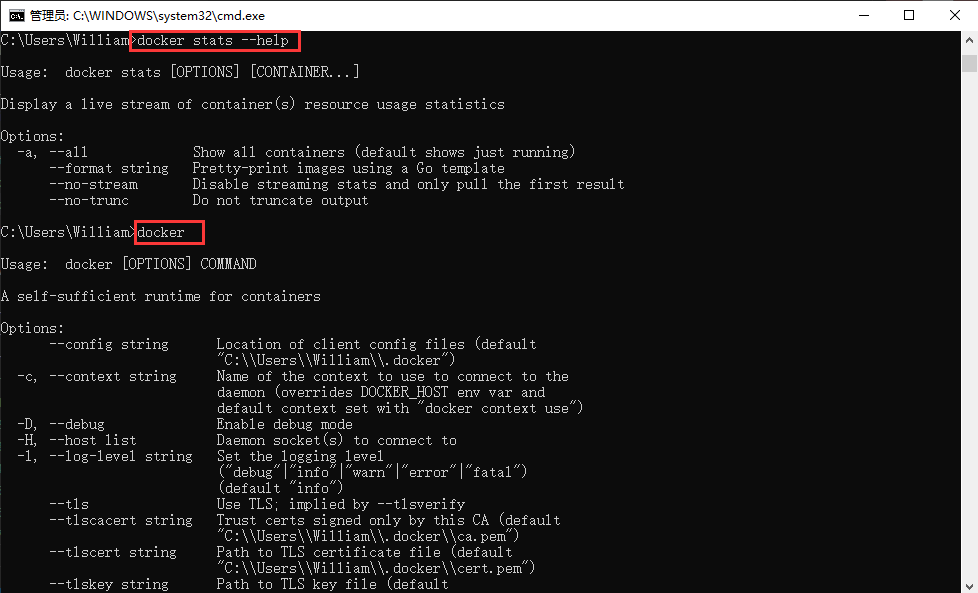
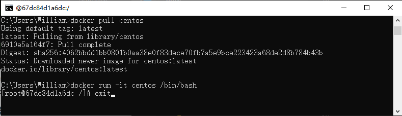
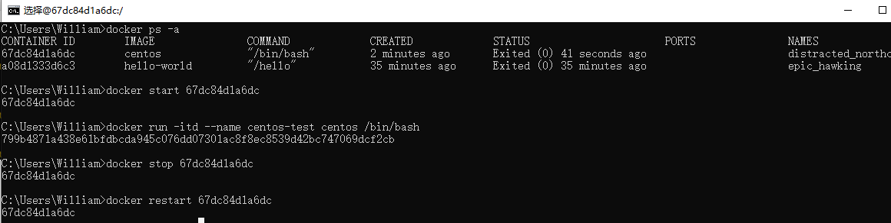
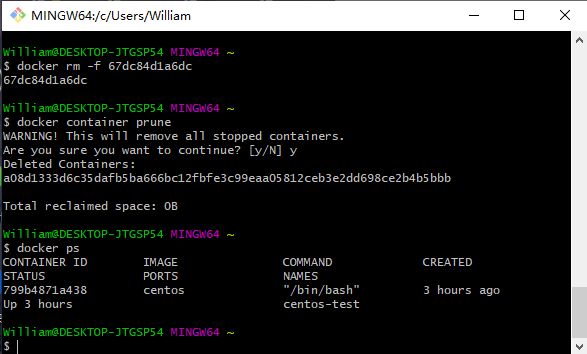
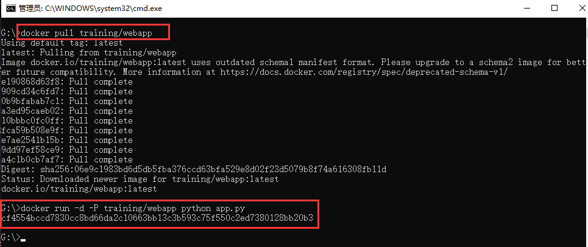
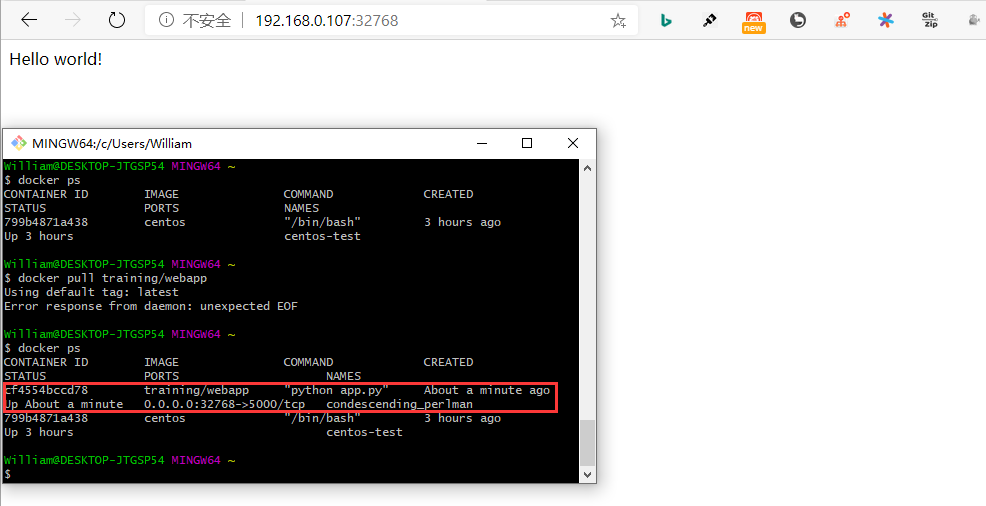
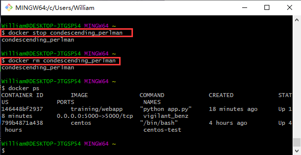

## **环境说明**

#### 准备工作

- Windows 10 x64 专业版(版本 2004)
- Docker version 19.03.12, build 48a66213fe

## **步骤说明**

**1. 直接输入 docker 命令来查看到 Docker 客户端的所有命令选项**

```cmd
docker  #查看到Docker客户端的所有命令选项
docker command --help  #了解指定的Docker命令使用方法
docker stats --help  #查看help指令的具体使用方法
```



**2. 容器使用**

- 获取镜像：如果我们本地没有 centos 镜像，我们可以使用 docker pull 命令来载入 centos 镜像

```cmd
docker pull centos
```

- 启动容器:使用 centos 镜像启动一个容器，参数为以命令行模式进入该容器

```cmd
docker run -it centos /bin/bash  #-i: 交互式操作。-t: 终端。centos: centos 镜像。/bin/bash：放在镜像名后的是命令，这里我们希望有个交互式Shell，因此用的是 /bin/bash。
exit  #退出终端
```



- 启动已停止运行的容器

```cmd
docker ps -a   #查看所有的容器
docker start 67dc84d1a6dc   #启动一个已停止的容器,67dc84d1a6dc:容器ID
```

- 后台运行

```cmd
docker run -itd --name centos-test centos /bin/bash  #可以通过-d指定容器的运行模式
```

- 停止一个容器

```cmd
docker stop <容器 ID>   #停止容器
docker restart <容器 ID>  #重启容器
```



- 进入容器

```bash
winpty docker attach <容器 ID>
winpty docker exec -it 67dc84d1a6dc /bin/bash
exit
```

- 导出和导入容器

```bash
docker export 67dc84d1a6dc > centos.tar  #导出容器67dc84d1a6dc快照到本地文件 centos.tar
cat docker/centos.tar | docker import - test/centos:v1  #docker import 从容器快照文件中再导入为镜像，将快照文件 centos.tar 导入到镜像 test/centos:v1:
docker import http://example.com/exampleimage.tgz example/imagerepo #通过指定 URL 或者某个目录来导入
```

- 删除容器

```bash
docker rm -f 67dc84d1a6dc  #删除67dc84d1a6dc容器
docker container prune    #清理掉所有处于终止状态的容器
docker ps   #查看我们正在运行的容器
```



**3. 运行一个 web 应用**

- 在 docker 容器中运行一个 Python Flask 应用来运行一个 web 应用

```cmd
docker pull training/webapp
docker run -d -P training/webapp python app.py  #-d:让容器在后台运行。-P:将容器内部使用的网络端口随机映射到我们使用的主机上。
```



**4. 查看 web 应用容器**

- Docker 开放了 5000 端口（默认 Python Flask 端口）映射到主机端口 32768 上，通过浏览器访问 WEB 应用

```bash
docker ps  #查看我们正在运行的容器
docker run -d -p 5000:5000 training/webapp python app.py  #通过-p参数来设置不一样的端口
docker port <容器ID>  #查看容器端口的映射情况  或：docker port <容器名>
docker logs -f [ID或名字]  #查看web应用程序日志
docker top [名字]    #查看WEB应用程序容器的进程
docker inspect [名字]    #检查web应用程序，返回一个 JSON 文件记录着 Docker 容器的配置和状态信息
docker stop [名字]    #停止WEB应用容器
docker start [名字]    #重启WEB应用容器,正在运行的容器，可以使用 docker restart 命令来重启
docker ps -l    #查询最后一次创建的容器
```



**4. 移除 web 应用容器**

```bash
docker rm [名字]   #容器必须是停止状态,否则会报错
```



#### 注意事项
