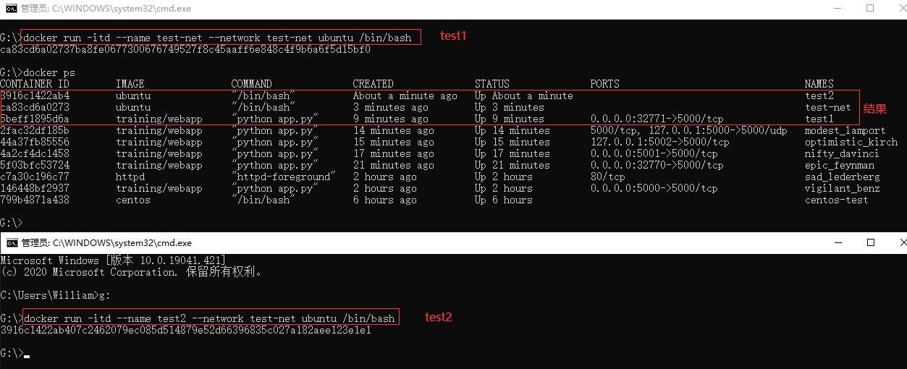

## **环境说明**

#### 准备工作

- Windows 10 x64 专业版(版本 2004)
- Docker version 19.03.12, build 48a66213fe

## **步骤说明**

**1. 网络端口映射，创建一个 python 应用的容器**

```cmd
docker run -d -P training/webapp python app.py    #-P :是容器内部端口随机映射到主机的高端口。
docker ps  #查看
docker run -d -p 5001:5000 training/webapp python app.py   #-p : 是容器内部端口绑定到指定的主机端口(5001)。
docker run -d -p 127.0.0.1:5002:5000 training/webapp python app.py  #指定容器绑定的网络地址，比如绑定 127.0.0.1
docker run -d -p 127.0.0.1:5000:5000/udp training/webapp python app.py #如果要绑定 UDP 端口，可以在端口后面加上 /udp
docker port optimistic_kirch 5000  #快速查看端口绑定情况，optimistic_kirch:容器名称
```

**2. Docker 容器互联**

- 容器命名：使用 --name 标识来命名容器

```cmd
docker run -d -P --name test1 training/webapp python app.py
decker ps -l  #列出所有容器信息
```

- 新建网络：-d：参数指定 Docker 网络类型，有 bridge、overlay。

```cmd
docker network create -d bridge test-net  #创建一个新的docker网络
docker network ls  #查看docker网络
```

- 连接容器：test-net：网络 name;

```cmd
docker run -itd --name test-net --network test-net ubuntu /bin/bash
docker run -itd --name test2 --network test-net ubuntu /bin/bash  #在另一个终端运行容器并加入到 test-net 网络
```



- 分别在 test1 和 test2 容器中执行如下代码：

```cmd
# test1容器执行如下代码
docker exec -it test1 /bin/bash
apt-get update
apt install iputils-ping
ping test2
# test2容器执行如下代码
docker exec -it test2 /bin/bash
apt-get update
apt install iputils-ping
ping test1
```

**3. 配置 DNS**

```cmd
docker run -it --rm ubuntu  cat etc/resolv.conf   #查看容器的 DNS 是否生效
```

#### 注意事项
