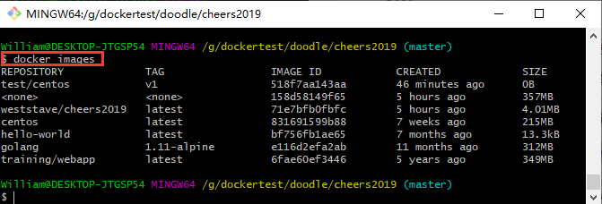
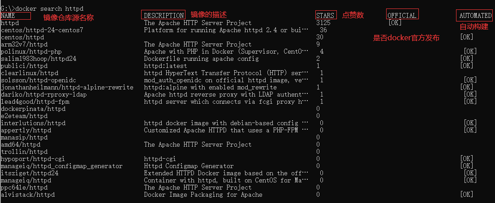
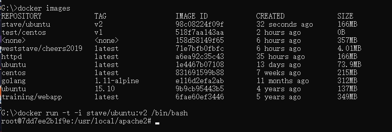
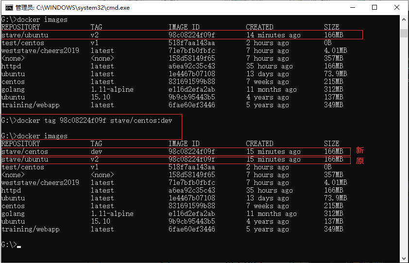

## **环境说明**

#### 准备工作

- Windows 10 x64 专业版(版本 2004)
- Docker version 19.03.12, build 48a66213fe
- [Docker Hub](https://hub.docker.com/)

## **步骤说明**

**1. 执行 docker images 命令，列出镜像列表**

```bash
docker images
```



- 参数说明：
  - REPOSITORY：表示镜像的仓库源
  - TAG：镜像的标签
  - IMAGE ID：镜像 ID
  - CREATED：镜像创建时间
  - SIZE：镜像大小

**2. 获取一个新的镜像**

- 获取镜像：如果我们本地没有 centos 镜像，我们可以使用 docker pull 命令来载入 centos 镜像

```cmd
docker pull centos
winpty docker run -t -i ubuntu:15.10 /bin/bash  #-i: 交互式操作。-t: 终端。ubuntu:15.10: 这是指用 ubuntu 15.10 版本镜像为基础来启动容器。/bin/bash：放在镜像名后的是命令，这里我们希望有个交互式 Shell，因此用的是 /bin/bash。
winpty docker run -t -i ubuntu /bin/bash #只使用 ubuntu，docker 将默认使用 ubuntu:latest 镜像
```

- 查找镜像:可以使用 docker search 命令来搜索镜像，或在 Docker Hub 官网查找

```cmd
docker search httpd  #用httpd的镜像来作为web服务
```



- 拖取镜像

```cmd
docker pull httpd   #httpd:镜像仓库源的名称
docker run httpd    #使用httpd镜像
```

- 删除镜像：使用 docker rmi [镜像名]

```cmd
docker rmi hello-world  #删除hello-world镜像
```

**3. 创建镜像**

- 3.1 从已经创建的容器中更新镜像，并且提交这个镜像

```cmd
docker run -t -i ubuntu /bin/bash   #创建容器
apt-get update  #更新容器，在容器内执行
exit  #退出容器
docker commit -m="提交的描述信息" -a="镜像作者" <容器 ID> stave/ubuntu:v2 #stave/ubuntu:v2:指定要创建的目标镜像名
docker images #查看我们的新镜像
docker run -t -i stave/ubuntu:v2 /bin/bash #使用stave/ubuntu:v2来启动容器
```



- 3.2 设置镜像标签

```cmd
docker tag [镜像ID] [用户名]/centos:dev  #centos:dev:镜像源名(repository name)和新的标签名(tag)
docker images   #查看
```



#### 注意事项
