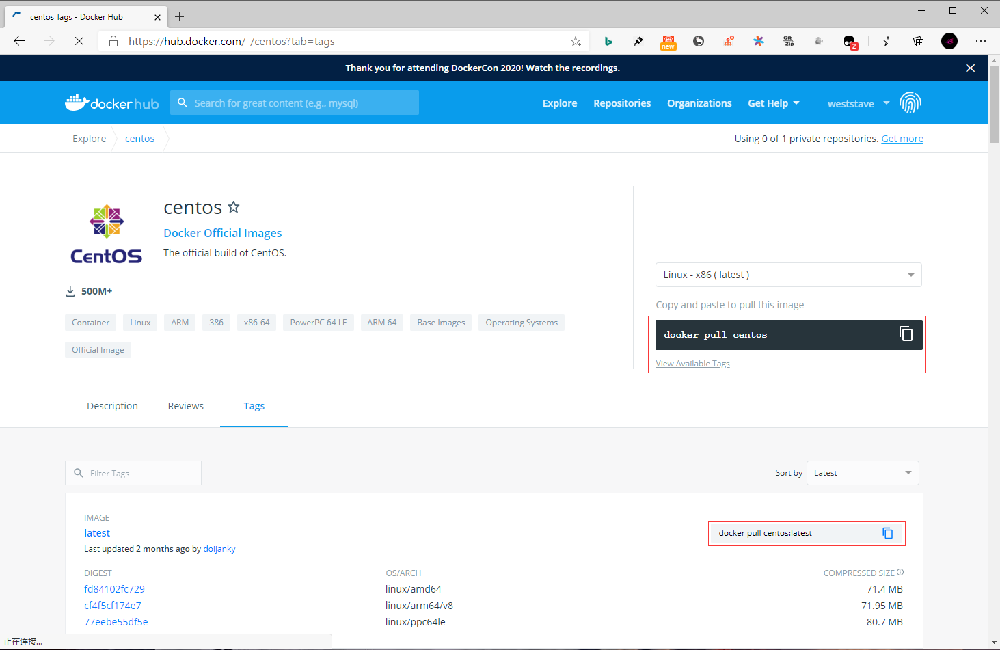
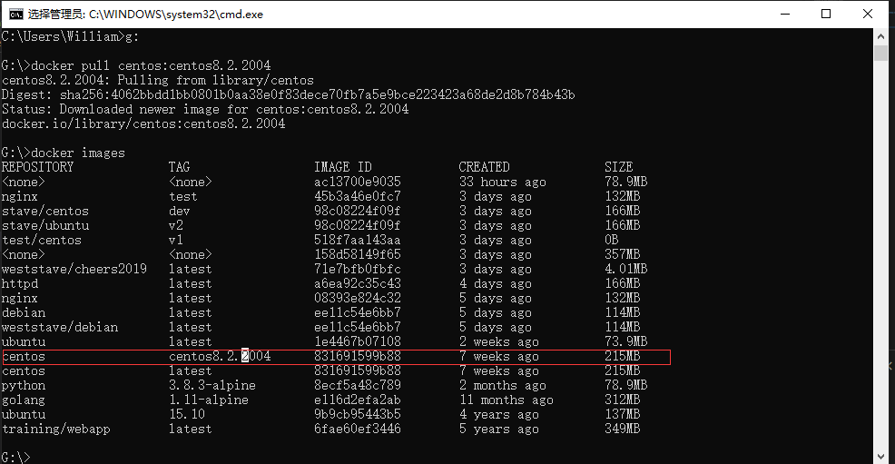

## **环境说明**

#### 准备工作

- Windows 10 x64 专业版(版本 2004)
- Docker version 19.03.12, build 48a66213fe
- [Docker Hub](https://hub.docker.com/)
- [CentOS 镜像库地址](https://hub.docker.com/_/centos?tab=tags&page=1)

## **步骤说明**

**1. 访问 CentOS 镜像库地址，可以通过 Sort by 查看其他版本的 CentOS 。默认是最新版本 centos:latest 。**



**2. 拉取指定版本的 CentOS 镜像，这里我们安装指定版本为例(centos8)**

```cmd
docker pull centos:centos8.2.2004
docker images   #查看本地镜像
```



**3. 运行容器，并且可以通过 exec 命令进入 CentOS 容器**

```cmd
docker run -itd --name centos centos:centos8.2.2004
docker exec -it centos /bin/bash   #进入容器
exit  #退出容器
```

**4. 安装成功**

- 通过 docker ps 查看容器的运行信息

```
docker ps  #查看容器
```

#### 注意事项
