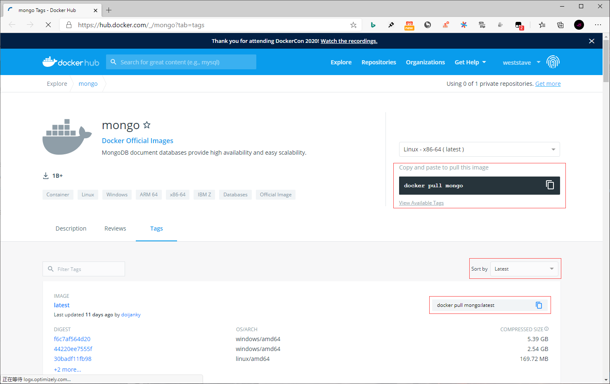

## **环境说明**

#### 准备工作

- Windows 10 x64 专业版(版本 2004)
- Docker version 19.03.12, build 48a66213fe
- [Docker Hub](https://hub.docker.com/)
- [mongo 镜像库地址](https://hub.docker.com/_/mongo?tab=tags)

## **步骤说明**

**1. 访问 mongo 镜像库地址，可以通过 Sort by 查看其他版本的 mongo 。默认是最新版本 mongo:latest 。**



**2. 拉取最新版本的 mongo 镜像，这里我们拉去官方最新的版本为例**

```cmd
docker search mongo   #查看mongo可用版本
docker pull mongo:latest    #拉去最新版本
docker images   #查看本地镜像
```

**3. 运行容器**

```cmd
docker run -itd --name mongo -p 27017:27017 mongo --auth
```

- 参数说明：
  - -p 27017:27017 ：映射容器服务的 27017 端口到宿主机的 27017 端口。外部可以直接通过 宿主机 ip:27017 访问到 mongo 的服务。
  - --auth：需要密码才能访问容器服务。

**4. 安装成功**

- 通过以下命令查看容器运行的 mongo 版本

```cmd
docker ps #查看是否安装成功
docker exec -it mongo mongo admin   #添加用户和设置密码，并且尝试连接
> db.createUser({ user:'admin',pwd:'123456',roles:[ { role:'userAdminAnyDatabase', db: 'admin'}]});
> db.auth('admin', '123456')
```

#### 注意事项
