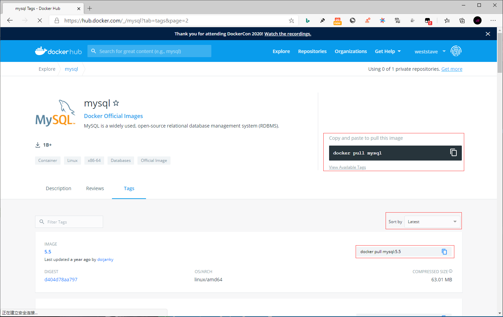

## **环境说明**

#### 准备工作

- Windows 10 x64 专业版(版本 2004)
- Docker version 19.03.12, build 48a66213fe
- [Docker Hub](https://hub.docker.com/)
- [mysql 镜像库地址](https://hub.docker.com/_/mysql?tab=tags)

## **步骤说明**

**1. 访问 mysql 镜像库地址，可以通过 Sort by 查看其他版本的 mysql 。默认是最新版本 mysql:latest 。**



**2. 拉取最新版本的 mysql 镜像，这里我们拉去官方的8.0.15版本为例**

```cmd
docker search mysql   #查看mysql可用版本
docker pull mysql:8.0.15    #拉去最新版本
docker images   #查看本地镜像
```

**3. 运行容器**

```cmd
docker run -itd --name mysql -p 3306:3306 -e MYSQL_ROOT_PASSWORD=123456 mysql
```

- 参数说明：
  - -p 3306:3306 ：映射容器服务的 3306 端口到宿主机的 3306 端口，外部主机可以直接通过 宿主机ip:3306 访问到 MySQL 的服务。
  - MYSQL_ROOT_PASSWORD=123456：设置 MySQL 服务 root 用户的密码。

**4. 安装成功**

- 通过以下命令查看容器运行的 mysql 版本

```cmd
docker PS #查看是否安装成功
mysql -h localhost -u root -p   #本机访问MYSQL服务
```

#### 注意事项
