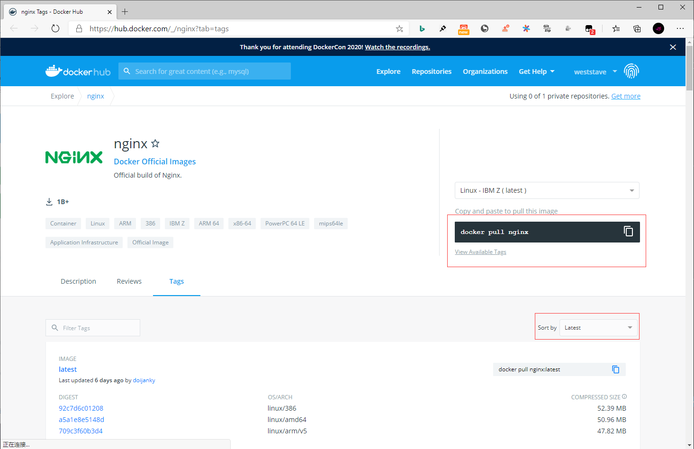
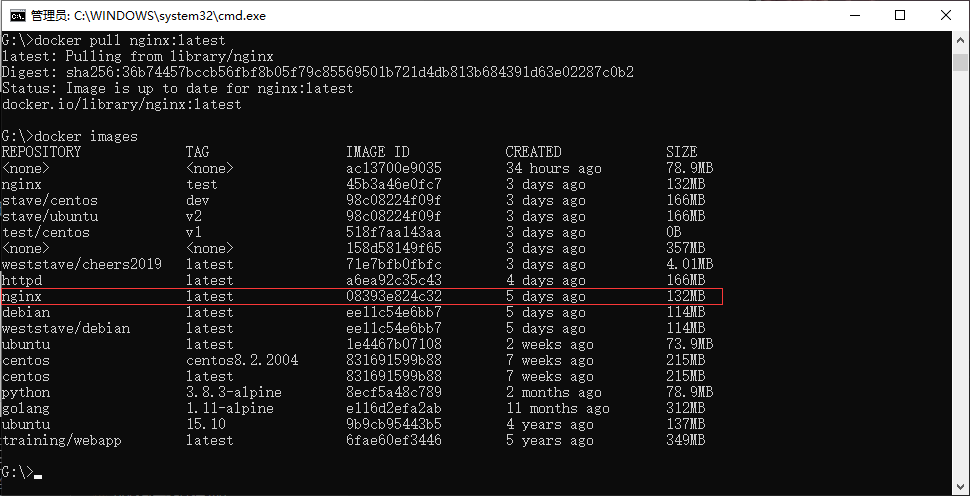
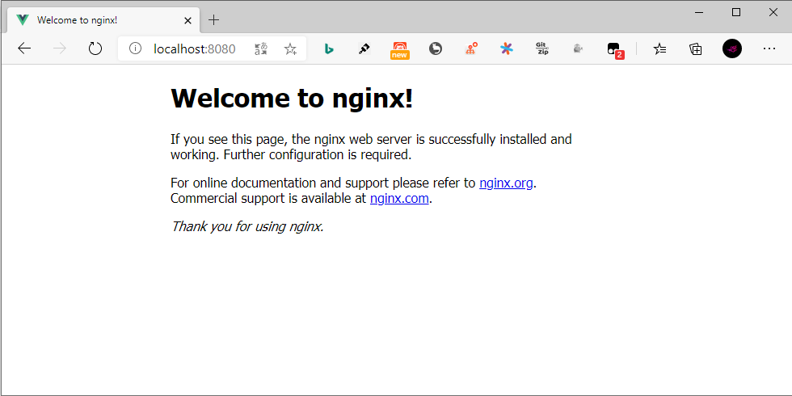

## **环境说明**

#### 准备工作

- Windows 10 x64 专业版(版本 2004)
- Docker version 19.03.12, build 48a66213fe
- [Docker Hub](https://hub.docker.com/)
- [Nginx 镜像库地址](https://hub.docker.com/_/nginx?tab=tags)

## **步骤说明**

**1. 访问 Nginx 镜像库地址，可以通过 Sort by 查看其他版本的 Nginx 。默认是最新版本 nginx:latest 。**



**2. 拉取最新版本的 Nginx 镜像，这里我们拉去官方的最新版本为例**

```cmd
docker search nginx   #查看nginx可用版本
docker pull nginx:latest    #拉去最新版本
docker images   #查看本地镜像
```



**3. 运行容器**

```cmd
docker run --name nginx -p 8080:80 -d nginx
```

- 参数说明：
  - --name nginx：容器名称。
  - -p 8080:80： 端口进行映射，将本地 8080 端口映射到容器内部的 80 端口。
  - -d nginx： 设置容器在在后台一直运行

**4. 安装成功**

- 通过浏览器可以直接访问 8080 端口的 nginx 服务



#### 注意事项
