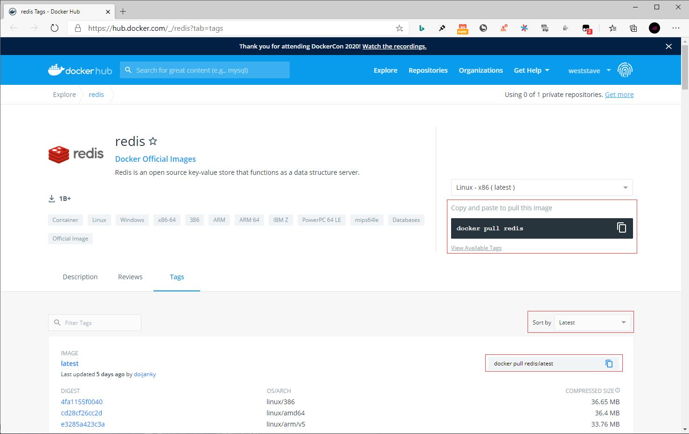

## **环境说明**

#### 准备工作

- Windows 10 x64 专业版(版本 2004)
- Docker version 19.03.12, build 48a66213fe
- [Docker Hub](https://hub.docker.com/)
- [redis 镜像库地址](https://hub.docker.com/_/redis?tab=tags)

## **步骤说明**

**1. 访问 redis 镜像库地址，可以通过 Sort by 查看其他版本的 redis 。默认是最新版本 redis:latest 。**



**2. 拉取最新版本的 redis 镜像，这里我们拉去官方最新的版本为例**

```cmd
docker search redis   #查看redis可用版本
docker pull redis:latest    #拉去最新版本
docker images   #查看本地镜像
```

**3. 运行容器**

```cmd
docker run -itd --name redis -p 6379:6379 redis
```

- 参数说明：
  - -p 6379:6379：映射容器服务的 6379 端口到宿主机的 6379 端口。外部可以直接通过宿主机 ip:6379 访问到 Redis 的服务。

**4. 安装成功**

- 通过以下命令查看容器运行的 redis 版本

```cmd
docker ps #查看是否安装成功
docker exec -it redis /bin/bash   #通过 redis-cli 连接测试使用 redis 服务
```

#### 注意事项
