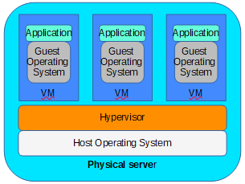
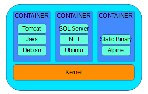
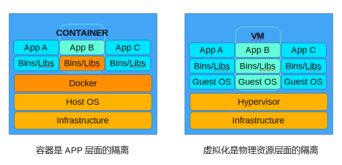
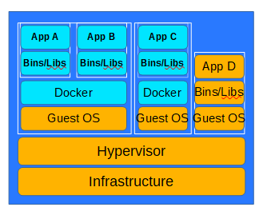

## **环境说明**

#### 准备工作

## **步骤说明**

**1. 传统项目部署**

- Physical server+Operation System+Application
- 优缺点：
  - 部署非常慢
  - 成本非常高
  - 资源浪费
  - 难于迁移和扩展 
  - 可能会被硬件厂商限定

**2. 虚拟化技术**

- 一个物理机可以部署多个app
- 每一个app独立运行在一个VM里

- 优点：
  - 资源池--一个物理机的资源分配到了不同的虚拟机里
  - 易扩展--加物理机器or加虚拟机
  - 易云化--亚马逊AWS、阿里云等

- 缺点：
  - 每一个虚拟机都是一个完整的操作系统，要给其分配资源，当虚拟机数量增多时，操作系统本身消耗的资源势必增加

**3. 容器解决的问题**

- 解决了开发和运维之间的矛盾
- 在开发和运维之间搭建了一个桥梁，是实现devops的最佳解决方案

**4. 什么是容器**

- 对软件和其依赖的标准化打包
- 应用之间相互隔离
- 共享同一个OS Kernel
- 可以运行在很多主流操作系统上

**5. 容器和虚拟机的区别**

**6. 虚拟化+容器**

