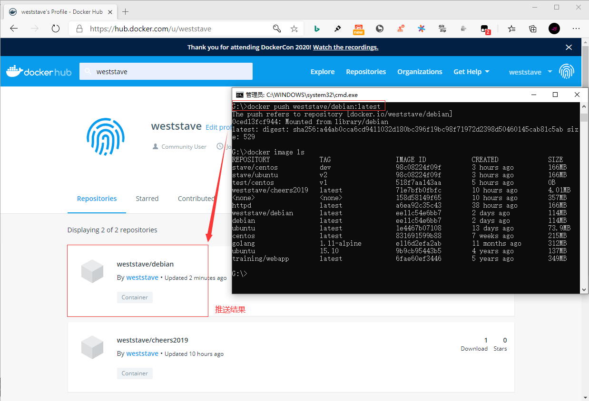

## **环境说明**

#### 准备工作

- Windows 10 x64 专业版(版本 2004)
- Docker version 19.03.12, build 48a66213fe
- [Docker Hub](https://hub.docker.com/)

## **步骤说明**

**1. 注册一个 Docker Hub 账号**

```cmd
docker login    #登录docker hub
docker logout   #退出登录
docker search <镜像名>  #查找官方仓库中的镜像
docker pull <镜像名>    #将镜像下载到本地
```

**2. 推送镜像**

- 用户登录后，可以通过 docker push 命令将自己的镜像推送到 Docker Hub

```cmd
docker tag debian weststave/debian:latest  #weststave:你的Docker账号用户名
docker push weststave/debian:latest  #将存储库推送到由其名称或标记指定的注册表
docker image ls   #列出所有容器信息
```



#### 注意事项
