## **环境说明**

#### 准备工作

- Windows 10 2004 版本（Windows 系统）
- [mariadb 官网下载](https://downloads.mariadb.org/)

## **步骤说明**

**1. 下载安装包后双击运行，安装过程如下：**

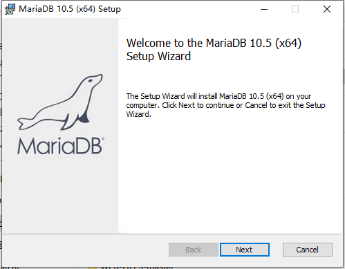
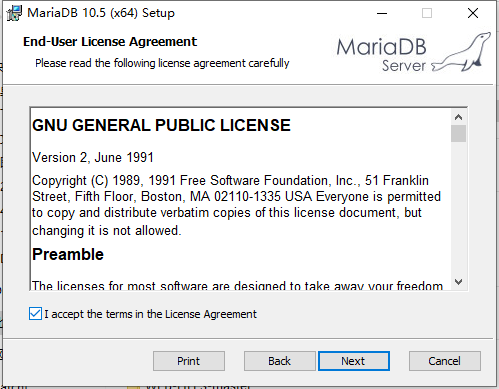
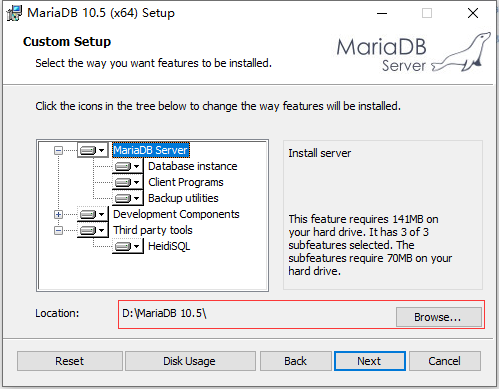
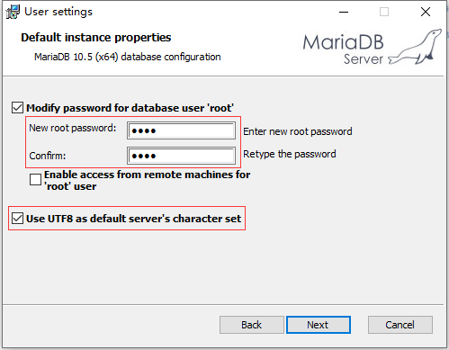
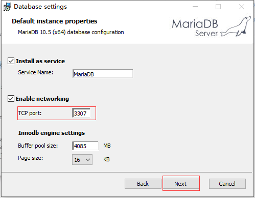
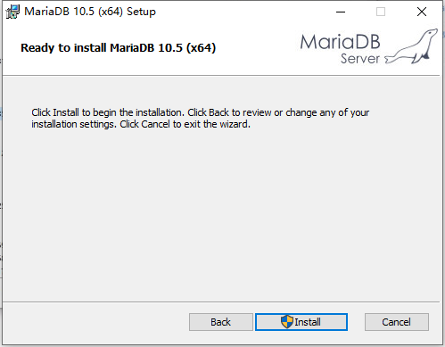

- 添加环境变量

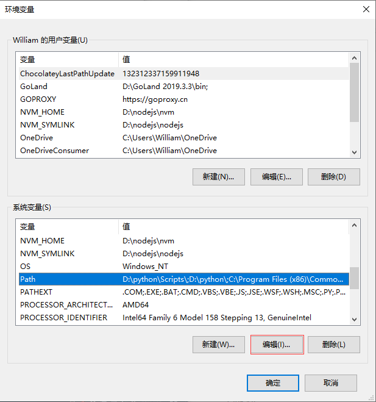
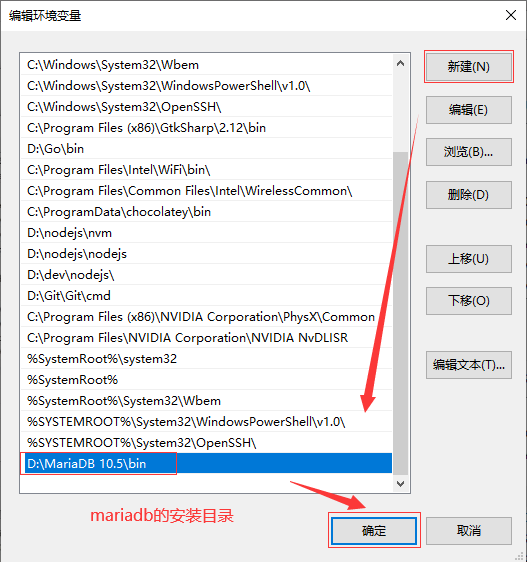

**2. 查看版本号,在命令行窗口运行如下代码：**

```@cmd
mysql -V
```

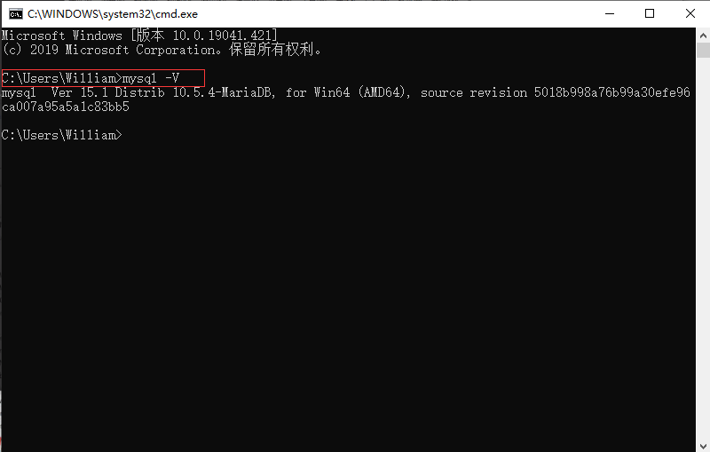

**3. 使用 Navicat 管理 Mariadb 数据库**

```@cmd
mysql -u root -p  #使用root用户连接数据库
show databases; #查看所有数据库
use db_name   #use+数据库名
```

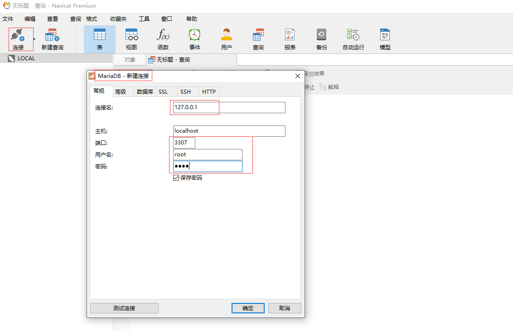
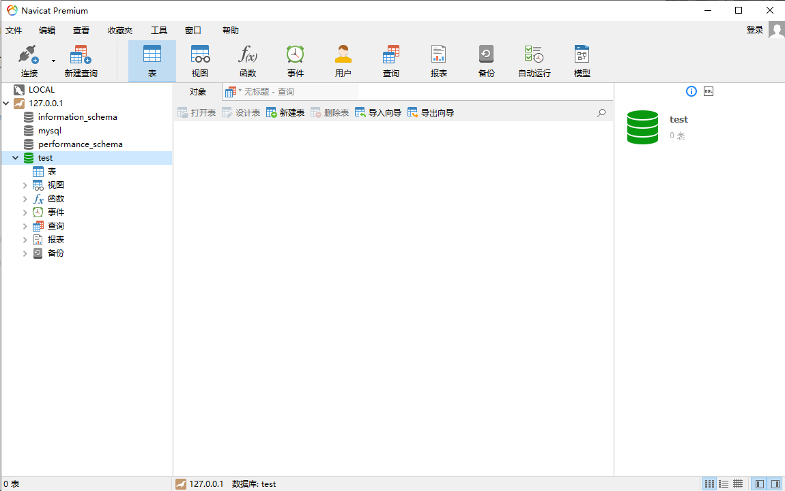
