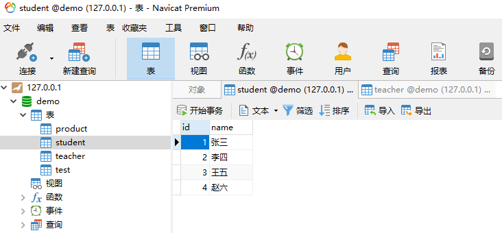
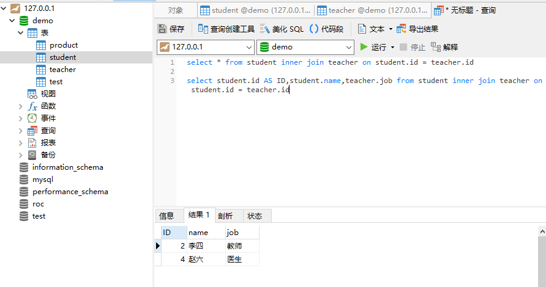
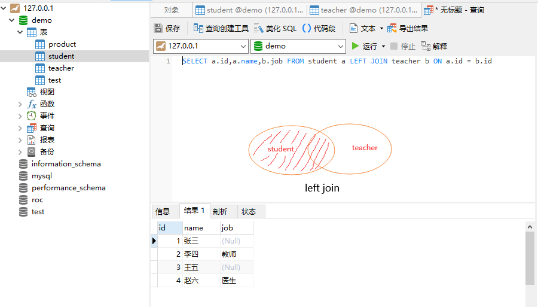
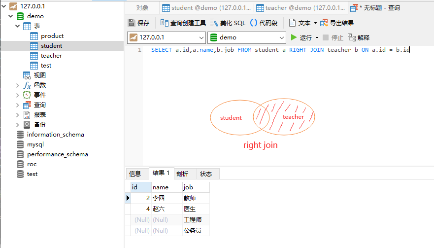
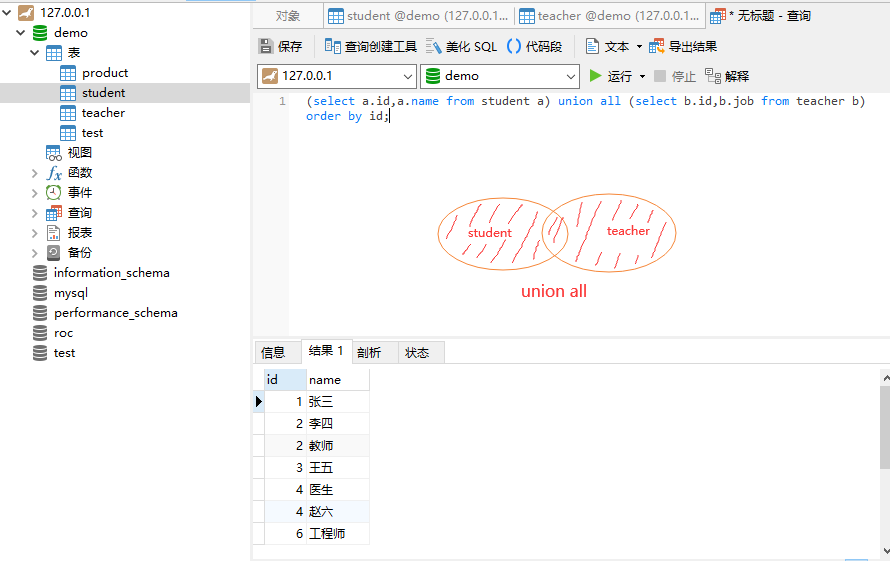

## **环境说明**

#### 准备工作

- Windows 10 2004 版本（Windows 系统）
- MySQL 8.0.19

## **步骤说明**

**1. 假如两张表数据如下：**

```sql
-- 创建名为test的数据库
CREATE DATABASE IF NOT EXISTS test CHARACTER SET = 'utf8';
-- student表
CREATE TABLE student (
  id INT NOT NULL AUTO_INCREMENT,
  name VARCHAR(30) NOT NULL,
  PRIMARY KEY (id)
) ENGINE=InnoDB DEFAULT CHARSET=utf8;

--插入数据
INSERT INTO student (id, name) VALUES( 1, "张三");
INSERT INTO student (id, name) VALUES( 2, "李四");
INSERT INTO student (id, name) VALUES( 3, "王五");
INSERT INTO student (id, name) VALUES( 4, "赵六");

-- teacher表
CREATE TABLE teacher (
  id INT NOT NULL AUTO_INCREMENT,
  job VARCHAR(30) NOT NULL,
  PRIMARY KEY (id)
) 
ENGINE=InnoDB DEFAULT CHARSET=utf8;

--插入数据
INSERT INTO teacher (id, job) VALUES( 2, "教师");
INSERT INTO teacher (id, job) VALUES( 4, "医生");
INSERT INTO teacher (id, job) VALUES( 6, "工程师");
INSERT INTO teacher (id, job) VALUES( 7, "公务员");
```




**2. inner join(内连接)**

- 内连接返回的是两个表的交集部分(即阴影部分)
- 两张表都有主键id,内连接的查询就是找出相同的主键以及主键附带的字段信息

```sql
-- 语法 table_left_name：左表名  table_right_name：右表名
select * from table_left_name inner join table_right_name on table_left_name.id = table_right_name.id
-- 实例
select * from student inner join teacher on student.id = teacher.id
--or
select student.id AS ID,student.name,teacher.job from student inner join teacher on student.id = teacher.id
```



**3. left join(左连接)**

- 左连接/左外连接查询，左表的信息全部展示出来，右表只会展示符合搜索条件的信息，不足的地方记为NULL

```sql
-- 语法：table_left_name：左表名  table_left_name：右表名
SELECT * from table_left_name RIGHT JOIN table_right_name ON table_left_name.id = table_right_name.id
-- 实例：a代表student表，b代表teacher表
SELECT a.id,a.name,b.job FROM student a LEFT JOIN teacher b ON a.id = b.id
```



**4. right join(右连接)**

- 右连接/右外连接查询，右表的信息全部展示出来，左表只会展示符合搜索条件的信息，不足的地方记为NULL

```sql
-- 语法：table_left_name：左表名  table_left_name：右表名
SELECT * from table_left_name RIGHT JOIN table_right_name ON table_left_name.id = table_right_name.id
-- 实例：
SELECT a.id,a.name,b.job FROM student a RIGHT JOIN teacher b ON a.id = b.id
```



**5. union/union all(全连接)**

- 实际上就是把两张表合并，不管有的没的，都先给整上来
- union会自动将完全重复的数据去除掉；union all会保留那些重复的数据；

- 注意事项：
  - 用union 时，完全相等的行，将会被合并，由于合并比较耗时，一般不直接使用 union 进行合并；通常用union all 进行合并；
　
  - 被union 连接的sql 子句，单个子句中不用写order by ，因为不会有排序的效果。但可以对最终的结果集进行排序；

```sql
-- 语句： 有排序效果
(select colum1,colum2... from A) union all (select colum1,colum2... from B) order by id;
-- 实例： 
(select a.id,a.name from student a) union all (select b.id,b.job from teacher b) order by id;
```




　　　　　　 