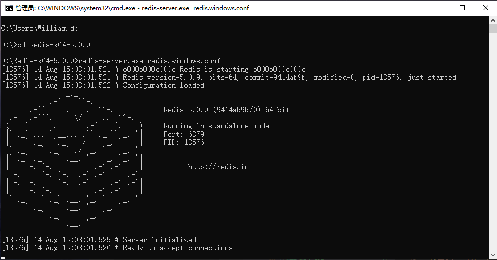
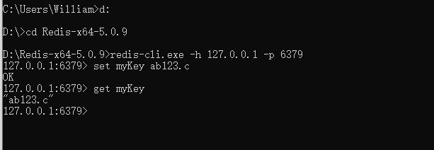

## **环境说明**

#### 准备工作

- Windows 10 2004 版本（Windows 系统）
- [Redis 官网下载](https://github.com/tporadowski/redis/releases)

## **步骤说明**

#### Redis 简介

- 特点：

  - Redis 支持数据的持久化，可以将内存中的数据保存在磁盘中，重启的时候可以再次加载进行使用。
  - Redis 不仅仅支持简单的 key-value 类型的数据，同时还提供 list，set，zset，hash 等数据结构的存储。
  - Redis 支持数据的备份，即 master-slave 模式的数据备份。

- 优势：

  - 性能极高 – Redis 能读的速度是 110000 次/s,写的速度是 81000 次/s 。
  - 丰富的数据类型 – Redis 支持二进制案例的 Strings, Lists, Hashes, Sets 及 Ordered Sets 数据类型操作。
  - 原子 – Redis 的所有操作都是原子性的，意思就是要么成功执行要么失败完全不执行。单个操作是原子性的。多个操作也支持事务，即原子性，通过 MULTI 和 EXEC 指令包起来。
  - 丰富的特性 – Redis 还支持 publish/subscribe, 通知, key 过期等等特性。

- 与其他 key-value 存储有何不同：
  - Redis 有着更为复杂的数据结构并且提供对他们的原子性操作，这是一个不同于其他数据库的进化路径。Redis 的数据类型都是基于基本数据结构的同时对程序员透明，无需进行额外的抽象。
  - Redis 运行在内存中但是可以持久化到磁盘，所以在对不同数据集进行高速读写时需要权衡内存，因为数据量不能大于硬件内存。在内存数据库方面的另一个优点是，相比在磁盘上相同的复杂的数据结构，在内存中操作起来非常简单，这样 Redis 可以做很多内部复杂性很强的事情。同时，在磁盘格式方面他们是紧凑的以追加的方式产生的，因为他们并不需要进行随机访问。

#### Redis 安装

**1. 解压下载好的安装包后，打开命令行工具，进到 redis 所在目录,运行如下代码：**

```cmd
redis-server.exe redis.windows.conf
```



**2. 另外打开一个命令行窗口,运行如下代码：**

```@cmd
redis-cli.exe -h 127.0.0.1 -p 6379
```

- 设置键值对

```cmd
set myKey ab123.c
```

- 取出键值对

```cmd
get myKey
```



#### Linux 安装 Redis

**1. [下载 Redis](https://redis.io/download)并安装**

```terminal
wget http://download.redis.io/releases/redis-6.0.6.tar.gz
tar xzf redis-6.0.6.tar.gz
cd redis-6.0.6
sudo apt install make  #安装make
sudo apt install gcc  #安装gcc,若编译出错先使用gcc -v查看是否安装了gcc
make   #编译
```

**2. 启动 Redis 服务**

```terminal
cd src
./redis-server
```

**3. 查看 Redis 是否启动**

```terminal
./redis-cli
```

**4. 使用测试客户端程序 redis-cli 和 redis 服务交互**

```terminal
src/redis-cli
redis> set foo bar
OK
redis> get foo
"bar"
```

#### Redis 配置

**1. Redis 的配置文件在 Redis 安装目录下，文件名为 redis.conf(Windows 名为 redis.windows.conf)**

- 配置命令格式如下：

```cmd
CONFIG GET CONFIG_SETTING_NAME   #配置示例
CONFIG GET *   #获取所有配置项
```

- 实例：

```cmd
redis 127.0.0.1:6379> CONFIG GET loglevel

1) "loglevel"
2) "notice"
```

**2. 实例**

```cmd
127.0.0.1:6379> CONFIG GET *
  1) "dbfilename"
  2) "dump.rdb"
  3) "requirepass"
  4) ""
  5) "masterauth"
  6) ""
  7) "cluster-announce-ip"
  8) ""
  9) "unixsocket"
 10) ""
 11) "logfile"
 12) ""
 13) "pidfile"
 14) ""
 15) "slave-announce-ip"
 16) ""
 17) "replica-announce-ip"
 18) ""
 19) "maxmemory"
 20) "0"
 21) "proto-max-bulk-len"
 22) "536870912"
 23) "client-query-buffer-limit"
 24) "1073741824"
 25) "maxmemory-samples"
 26) "5"
 27) "lfu-log-factor"
 28) "10"
 29) "lfu-decay-time"
 30) "1"
 31) "timeout"
 32) "0"
 33) "active-defrag-threshold-lower"
 34) "10"
 35) "active-defrag-threshold-upper"
 36) "100"
 37) "active-defrag-ignore-bytes"
 38) "104857600"
 39) "active-defrag-cycle-min"
 40) "5"
 41) "active-defrag-cycle-max"
 42) "75"
 43) "active-defrag-max-scan-fields"
 44) "1000"
 45) "auto-aof-rewrite-percentage"
 46) "100"
 47) "auto-aof-rewrite-min-size"
 48) "67108864"
 49) "hash-max-ziplist-entries"
 50) "512"
 51) "hash-max-ziplist-value"
 52) "64"
 53) "stream-node-max-bytes"
 54) "4096"
 55) "stream-node-max-entries"
 56) "100"
 57) "list-max-ziplist-size"
 58) "-2"
 59) "list-compress-depth"
 60) "0"
 61) "set-max-intset-entries"
 62) "512"
 63) "zset-max-ziplist-entries"
 64) "128"
 65) "zset-max-ziplist-value"
 66) "64"
 67) "hll-sparse-max-bytes"
 68) "3000"
 69) "lua-time-limit"
 70) "5000"
 71) "slowlog-log-slower-than"
 72) "10000"
 73) "latency-monitor-threshold"
 74) "0"
 75) "slowlog-max-len"
 76) "128"
 77) "port"
 78) "6379"
 79) "cluster-announce-port"
 80) "0"
 81) "cluster-announce-bus-port"
 82) "0"
 83) "tcp-backlog"
 84) "511"
 85) "databases"
 86) "16"
 87) "repl-ping-slave-period"
 88) "10"
 89) "repl-ping-replica-period"
 90) "10"
 91) "repl-timeout"
 92) "60"
 93) "repl-backlog-size"
 94) "1048576"
 95) "repl-backlog-ttl"
 96) "3600"
 97) "maxclients"
 98) "10000"
 99) "watchdog-period"
100) "0"
101) "slave-priority"
102) "100"
103) "replica-priority"
104) "100"
105) "slave-announce-port"
106) "0"
107) "replica-announce-port"
108) "0"
109) "min-slaves-to-write"
110) "0"
111) "min-replicas-to-write"
112) "0"
113) "min-slaves-max-lag"
114) "10"
115) "min-replicas-max-lag"
116) "10"
117) "hz"
118) "10"
119) "cluster-node-timeout"
120) "15000"
121) "cluster-migration-barrier"
122) "1"
123) "cluster-slave-validity-factor"
124) "10"
125) "cluster-replica-validity-factor"
126) "10"
127) "repl-diskless-sync-delay"
128) "5"
129) "tcp-keepalive"
130) "0"
131) "cluster-require-full-coverage"
132) "yes"
133) "cluster-slave-no-failover"
134) "no"
135) "cluster-replica-no-failover"
136) "no"
137) "no-appendfsync-on-rewrite"
138) "no"
139) "slave-serve-stale-data"
140) "yes"
141) "replica-serve-stale-data"
142) "yes"
143) "slave-read-only"
144) "yes"
145) "replica-read-only"
146) "yes"
147) "slave-ignore-maxmemory"
148) "yes"
149) "replica-ignore-maxmemory"
150) "yes"
151) "stop-writes-on-bgsave-error"
152) "yes"
153) "daemonize"
154) "no"
155) "rdbcompression"
156) "yes"
157) "rdbchecksum"
158) "yes"
159) "activerehashing"
160) "yes"
161) "activedefrag"
162) "no"
163) "protected-mode"
164) "yes"
165) "repl-disable-tcp-nodelay"
166) "no"
167) "repl-diskless-sync"
168) "no"
169) "aof-rewrite-incremental-fsync"
170) "yes"
171) "rdb-save-incremental-fsync"
172) "yes"
173) "aof-load-truncated"
174) "yes"
175) "aof-use-rdb-preamble"
176) "yes"
177) "lazyfree-lazy-eviction"
178) "no"
179) "lazyfree-lazy-expire"
180) "no"
181) "lazyfree-lazy-server-del"
182) "no"
183) "slave-lazy-flush"
184) "no"
185) "replica-lazy-flush"
186) "no"
187) "dynamic-hz"
188) "yes"
189) "maxmemory-policy"
190) "noeviction"
191) "loglevel"
192) "notice"
193) "supervised"
194) "no"
195) "appendfsync"
196) "everysec"
197) "appendonly"
198) "no"
199) "dir"
200) "D:\\Redis-x64-5.0.9"
201) "save"
202) "900 1 300 10 60 10000"
203) "client-output-buffer-limit"
204) "normal 0 0 0 slave 268435456 67108864 60 pubsub 33554432 8388608 60"
205) "unixsocketperm"
206) "0"
207) "slaveof"
208) ""
209) "notify-keyspace-events"
210) ""
211) "bind"
212) "127.0.0.1"
```

**3. 编辑配置**

- 通过修改 redis.conf 文件或使用 CONFIG SET 命令来修改配置

```cmd
redis 127.0.0.1:6379>CONFIG SET CONFIG_SETTING_NAME NEW_CONFIG_VALUE
eg:CONFIG SET loglevel "notice"
```

**4. redis.config 配置项说明**
