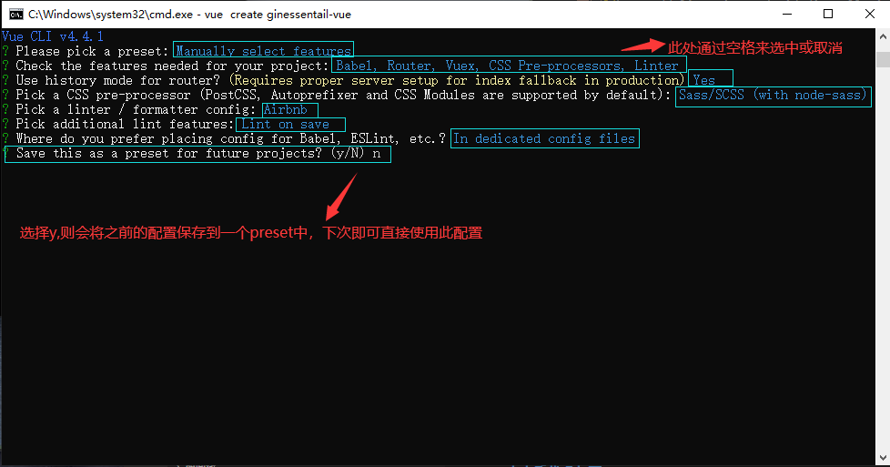
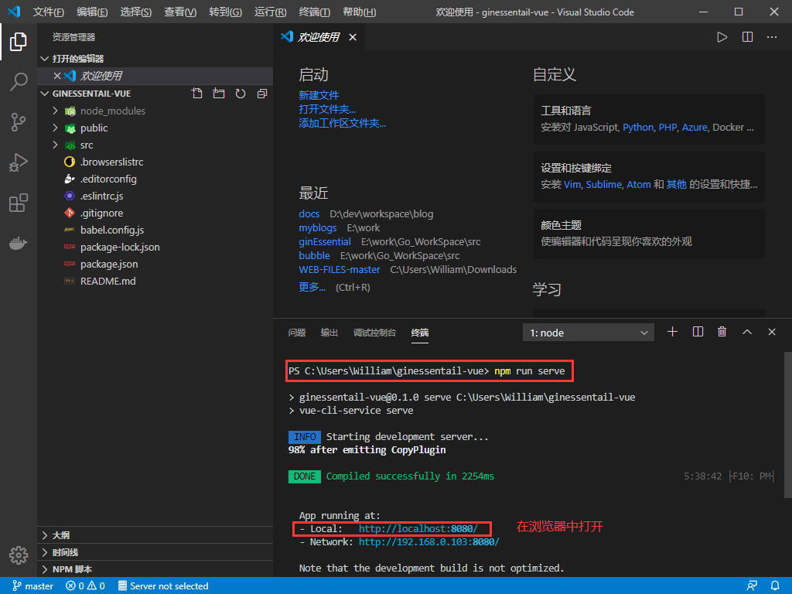
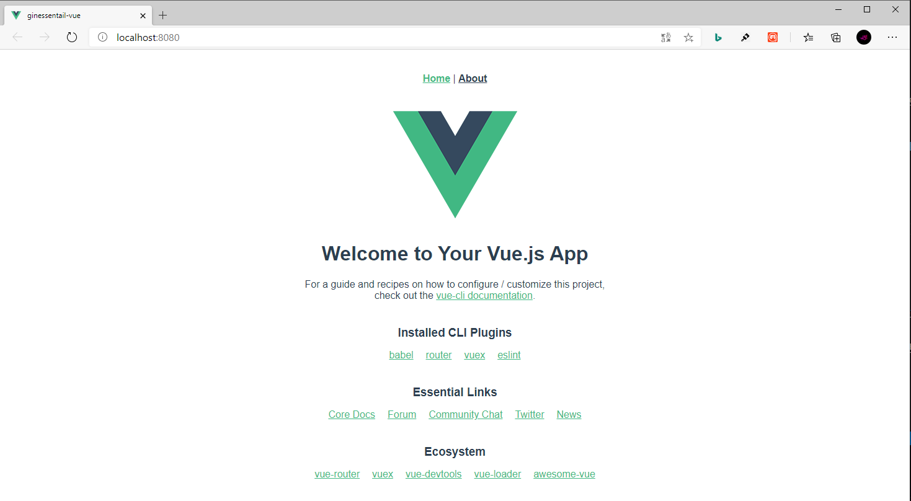

## **环境说明**
#### 准备工作
* Windows 10 1909版本（Windows系统）/Linux/MAC OS
* postman调试工具、
* [eslint官网](https://eslint.org/docs/user-guide/getting-started)

## **步骤说明**
**1. 打开终端，使用vue -h命令，查看vue的帮助文档，并创建一个新的项目，代码如下：**
``` @cmd.exe
vue -h                            //查看帮助
vue create ginessentail-vue       //创建项目
//其他配置如下图,等待安装完成，再执行如下命令
cd ginessentail-vue               //进入到项目文件夹
code .                            //用vs code打开该项目
npm run serve                     //在vs code内的终端执行此代码
```




**2. 配置main.js文件，并安装eslint扩展插件，步骤如下：**
``` @main.js
import Vue from 'vue';
import App from './App.vue';
import router from './router';
import store from './store';

Vue.config.productionTip = false;

// 配置yarn 1.检查语法错误  2.检查代码规范
const name = 'hayden';

function sayHello(who) {
  console.log(`hello ${who}`);
}
sayHello(name);

new Vue({
  router,
  store,
  render: (h) => h(App),
}).$mount('#app');
```


**3. eslint配置（其他配置可参照eslint的官方文档进行设置），打开.eslintrc.js文件，配置代码如下：**
``` @.eslintrc.js
module.exports = {
  root: true,
  env: {
    node: true,
  },
  extends: [
    'plugin:vue/essential',
    '@vue/airbnb',
  ],
  parserOptions: {
    parser: 'babel-eslint',
  },
  rules: {
    'indent': ['error', 4],  //代码缩进，第一个参数为错误级别，第二个参数为缩进值
    "semi": ["error", "never"],  //此参数代表是否使用分号结束语句，never表示无需分号结束语句
    'no-console': process.env.NODE_ENV === 'production' ? 'warn' : 'off',
    'no-debugger': process.env.NODE_ENV === 'production' ? 'warn' : 'off',
  },
};
```