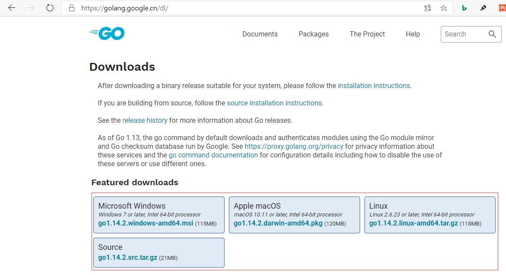
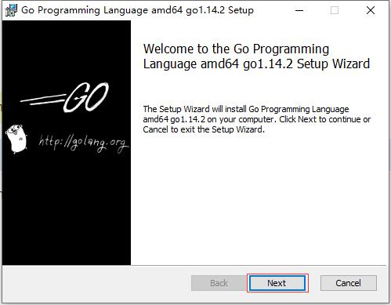
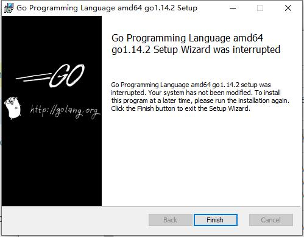
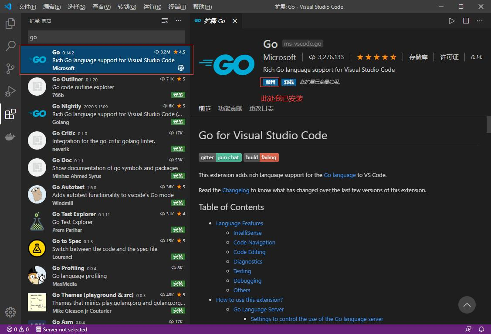
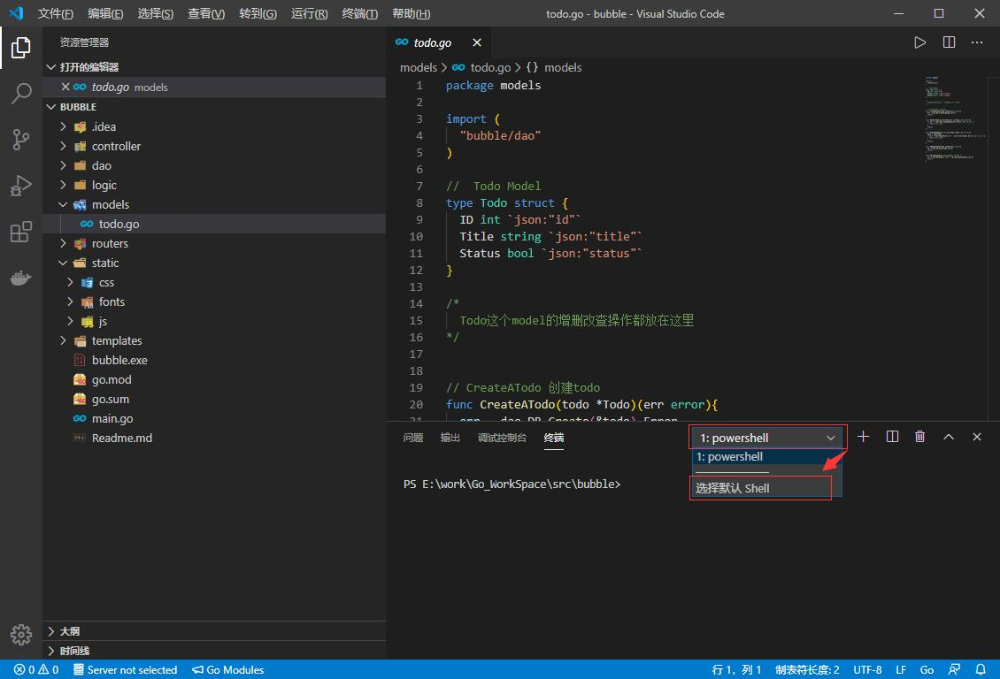
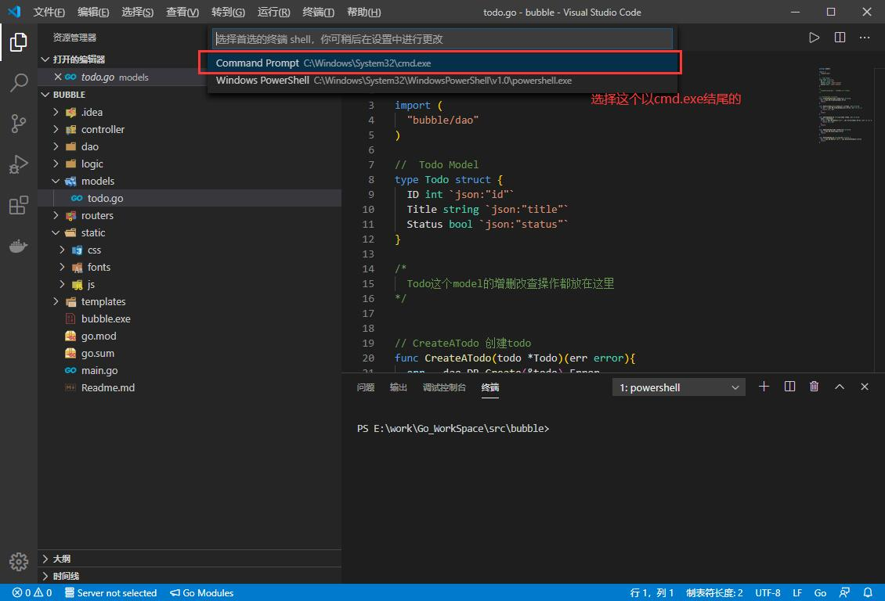

## **环境说明**
#### 准备工作
* Windows 10 1909版本（Windows系统）/Linux/MAC OS

## **步骤说明**
**1. 下载go语言安装包**
* [Go官网](https://golang.org/dl/)
* [Go官方镜像站](https://golang.google.cn/dl/)
* [Postman官网](https://www.postman.com/)

1.1 版本选择
* Windows平台和Mac平台推荐下载可执行文件版，Linux平台下载压缩文件版。


**2. 安装在Windows系统上**

2.1 双击下载好的文件，然后按照下图的步骤安装即可。



2.2 检查是否安装成功，在终端上输入go version命令，查看安装的Go版本：
``` @cmd
go version
```

2.3 配置GoPROXY来管理依赖环境，在终端上输入如下命令：
``` @cmd
go env -w GOPROXY=https://goproxy.cn,direct
```

**3. 安装在Liunx系统上**

3.1  选择并下载好go1.14.2.linux-amd64.tar.gz文件,在终端执行以下命令：
``` @linux
wget https://dl.google.com/go/go1.14.2.linux-amd64.tar.gz
```

3.2 将下载好的文件解压到/user/local目录下，执行如下命令：
* 如果提示没有权限，加上sudo以root用户的身份再运行下面的命令
``` @linux
tar -C /usr/local -xzvf go1.14.2.linux-amd64.tar.gz
```

3.3 配置环境变量
* Linux下有两个文件可以配置环境变量，其中/etc/profile是对所有用户生效的；$HOME/.profile是对当前用户生效的，根据自己的情况自行选择一个文件打开，添加如下两行代码，保存退出。
``` @linux
export GOROOT=/usr/local/go
export PATH=$PATH:$GOROOT/bin
```
* 修改/etc/profile后要重启生效，修改$HOME/.profile后使用source命令加载$HOME/.profile文件即可生效。 检查：
``` @linux
~ go version
go version go1.14.2 linux/amd64
```

**4. 安装在MAC系统上**
* 下载可执行文件版，直接点击下一步安装即可，默认会将go安装到/usr/local/go目录下


4.1 检查是否安装成功，在终端上输入go version命令，查看安装的Go版本：
``` @cmd
go version
```

4.2 配置GoPROXY来管理依赖环境，在终端上输入如下命令：
``` @cmd
go env -w GO111MODULE=on  //开启go module
go env -w GOPROXY=https://goproxy.cn,direct
```
* 默认GoPROXY配置是：GOPROXY=https://proxy.golang.org,direct，由于国内访问不到https://proxy.golang.org，所以我们需要换一个PROXY，这里推荐使用https://goproxy.io或https://goproxy.cn。

4.3 安装多版本，在终端上输入如下命令：
``` @cmd
go get golang.google.cn/dl/go1.14.1
go1.14.1 download
```

**5. VS Code配置Go**
* 在VS Code中搜索Go扩展插件并安装


5.1 Windows下VSCode切换cmd.exe作为默认终端


* 最后重启VS Code中已经打开的终端或者直接重启VS Code就可以了

**6. 常用命令**
* 在VS Code中搜索Go扩展插件并安装
``` @terminal
go bulid  //编译成二进制文件
go bulid -o hello.exe  //指定编译后得到的可执行文件的名字（hello）
go env  //查看所有go的环境变量
go mod inin 模块名称（一般由公司名称和项目名称组成）  //初始化项目模块
```

**7. 跨平台编译**
* Windows下编译Linux下可执行文件，只需要指定目标操作系统的平台和处理器架构即可：
``` @terminal
SET CGO_ENABLED=0  // 禁用CGO
SET GOOS=linux  // 目标平台是linux
SET GOARCH=amd64  // 目标处理器架构是amd64
go bulid
```
> 使用了cgo的代码是不支持跨平台编译的

然后再执行go build命令，得到的就是能够在Linux平台运行的可执行文件了。

* Mac 下编译 Linux 和 Windows平台 64位 可执行程序:
``` @terminal
CGO_ENABLED=0 GOOS=linux GOARCH=amd64 go build
CGO_ENABLED=0 GOOS=windows GOARCH=amd64 go build
go build
```

* Linux 下编译 Mac 和 Windows 平台64位可执行程序:
``` @terminal
CGO_ENABLED=0 GOOS=darwin GOARCH=amd64 go build
CGO_ENABLED=0 GOOS=windows GOARCH=amd64 go build
go build
```

* Windows下编译Mac平台64位可执行程序：
``` @terminal
SET CGO_ENABLED=0
SET GOOS=darwin
SET GOARCH=amd64
go build
```