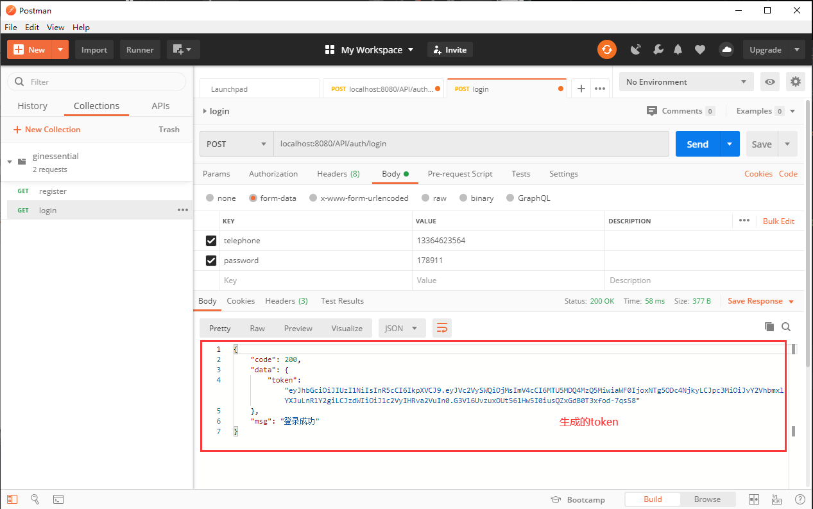
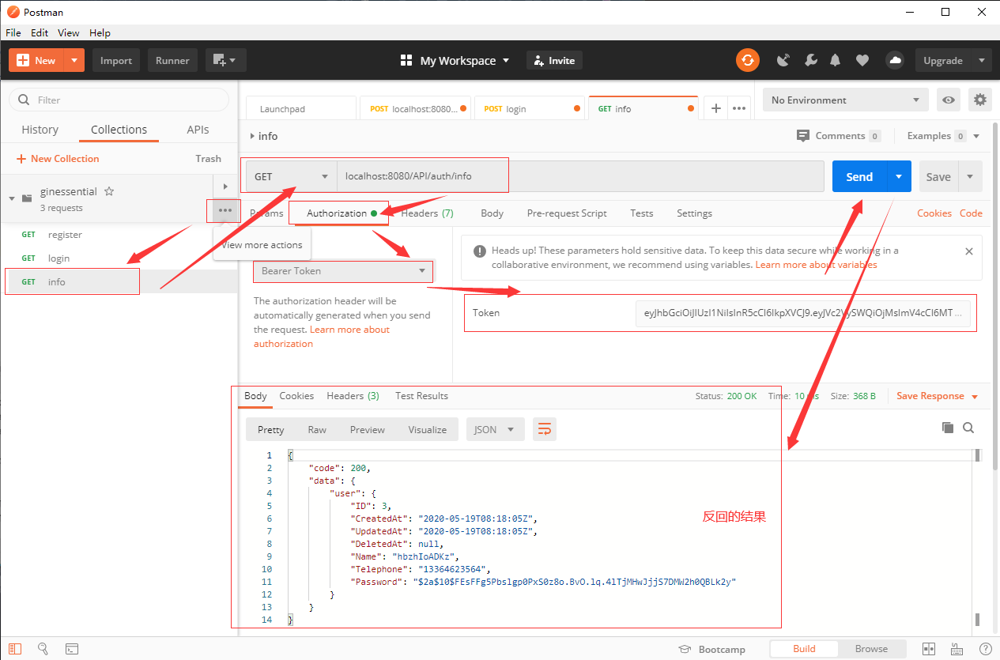

## **环境说明**
#### 准备工作
* Windows 10 1909版本（Windows系统）/Linux/MAC OS
* postman调试工具
* jwt包

## **步骤说明**
**1. 安装jwt包，在终端执行以下命令**
``` @Terminal
go get github.com/dgrijalva/jwt-go
```

**2. 在common文件夹下新建一个名为jwt.go的文件，内容如下：**
``` @jwt.go
package common

import (
	"github.com/dgrijalva/jwt-go"
	"time"
	"unic.org/ginessential/model"
)

// 定义一个jwt加密的密钥
var jwtKey = []byte("a_secret_crect")

type Claims struct {
	UserId uint
	jwt.StandardClaims
}

func ReleaseToken(user model.User) (string, error) {
	//设置token的有效期为7天
	expirationTime := time.Now().Add(7 * 24 * time.Hour)
	Claims := &Claims{
		UserId: user.ID,
		StandardClaims: jwt.StandardClaims{
			Audience:  "",
			ExpiresAt: expirationTime.Unix(),
			Id:        "",
			IssuedAt:  time.Now().Unix(),
			Issuer:    "oceanlearn.tech",
			NotBefore: 0,
			Subject:   "user token",
		},
	}

	token := jwt.NewWithClaims(jwt.SigningMethodHS256, Claims)
	tokenString, err := token.SignedString(jwtKey)

	if err != nil {
		return "", err
	}

	return tokenString, nil
}
```

2.1 在UserController.go文件中设置token，内容如下：
``` @UserController.go
package controller

import (
	"github.com/gin-gonic/gin"
	"github.com/jinzhu/gorm"
	"golang.org/x/crypto/bcrypt"
	"log"
	"net/http"
	"unic.org/ginessential/common"
	"unic.org/ginessential/model"
	"unic.org/ginessential/util"
)

func Register(c *gin.Context) {
	DB := common.GetDB()
	// 获取参数
	name := c.PostForm("name")
	telephone := c.PostForm("telephone")
	password := c.PostForm("password")
	// 数据验证
	if len(telephone) != 11 {
		c.JSON(http.StatusUnprocessableEntity, gin.H{"code": 422, "msg": "手机号必须为11位"})
		return
	}
	if len(password) < 6 {
		c.JSON(http.StatusUnprocessableEntity, gin.H{"code": 422, "msg": "密码不能少于6位"})
		return
	}

	// 如果名称没有传，给一个10位的随机字符串
	if len(name) == 0 {
		name = util.RandomString(10)
	}
	log.Println(name, telephone, password)

	// 判断手机号是否存在
	if isTelephoneExist(DB, telephone) {
		c.JSON(http.StatusUnprocessableEntity, gin.H{"code": 422, "msg": "用户已存在"})
		return
	}

	// 创建用户
	// 加密密码
	hasedPassword, err := bcrypt.GenerateFromPassword([]byte(password), bcrypt.DefaultCost)
	if err != nil {
		c.JSON(http.StatusInternalServerError, gin.H{"code": 500, "msg": "加密错误"})
		return
	}
	newUser := model.User{
		Name:      name,
		Telephone: telephone,
		Password:  string(hasedPassword),
	}
	DB.Create(&newUser)

	// 返回结果
	c.JSON(200, gin.H{
		"code": 200,
		"msg": "注册成功",
	})
}

//添加登录的控制器
func Login(c *gin.Context) {
	DB := common.GetDB()
	// 获取参数
	telephone := c.PostForm("telephone")
	password := c.PostForm("password")
	// 数据验证
	if len(telephone) != 11 {
		c.JSON(http.StatusUnprocessableEntity, gin.H{"code": 422, "msg": "手机号必须为11位"})
		return
	}
	if len(password) < 6 {
		c.JSON(http.StatusUnprocessableEntity, gin.H{"code": 422, "msg": "密码不能少于6位"})
		return
	}
	// 判断手机号是否存在
	var user model.User
	DB.Where("telephone = ?", telephone).First(&user)
	if user.ID == 0 {
		c.JSON(http.StatusUnprocessableEntity, gin.H{"code": 422, "msg": "用户不存在"})
		return
	}
	// 判断密码是否正确
	if err := bcrypt.CompareHashAndPassword([]byte(user.Password), []byte(password)); err != nil {
		c.JSON(http.StatusBadRequest, gin.H{"code": 400, "msg": "密码错误"})
		return
	}
	// 发放token
	token, err := common.ReleaseToken(user)
	if err != nil {
		c.JSON(http.StatusInternalServerError, gin.H{"code": 500, "msg": "系统异常"})
		log.Printf("token generate error: %v", err)
		return
	}
	// 返回结果
	c.JSON(200, gin.H{
		"code": 200,
		"data": gin.H{"token": token},
		"msg": "登录成功",
	})
}

// 验证手机号函数
func isTelephoneExist(db *gorm.DB, telephone string) bool {
	var user model.User
	db.Where("telephone = ?", telephone).First(&user)
	if user.ID != 0 {
		return true
	}
	return false
}
```

2.2 测试，内容如下：


2.3 分析token，执行以下代码：
``` @Terminal
echo eyJhbGciOiJIUzI1NiIsInR5cCI6IkpXVCJ9 | base64 -D    //使用base64解密
```

**3. 创建中间件**

3.1 在项目中新建middleware文件夹，并在该文件夹下新建AuthMiddleware.go文件，代码如下:
``` @AuthMiddleware.go
package middleware

import (
	"github.com/gin-gonic/gin"
	"net/http"
	"strings"
	"unic.org/ginessential/common"
	"unic.org/ginessential/model"
)

func AuthMiddleware() gin.HandlerFunc {
	return func(c *gin.Context) {
		// 获取authorization header
		tokenString := c.GetHeader("Authorization")

		// validate token formate
		if tokenString == "" || !strings.HasPrefix(tokenString, "Bearer") {
			c.JSON(http.StatusUnauthorized, gin.H{"code": 401, "msg": "权限不足"})
			c.Abort()
			return
		}

		tokenString = tokenString[7:]

		token, claims, err := common.ParseToken(tokenString)
		if err != nil || !token.Valid {
			c.JSON(http.StatusUnauthorized, gin.H{"code": 401, "msg": "权限不足"})
			c.Abort()
			return
		}

		// 验证通过后获取claim中的userId
		userId := claims.UserId
		DB := common.GetDB()
		var user model.User
		DB.First(&user, userId)

		// 用户
		if user.ID == 0 {
			c.JSON(http.StatusUnauthorized, gin.H{"code": 401, "msg": "权限不足"})
			c.Abort()
			return
		}

		// 用户存在，将user的信息写入上下文
		c.Set("user", user)

		c.Next()
	}
}
```

3.2 在jwt.go文件中定义函数，用来,代码如下：
``` @jwt.go
package common

import (
	"github.com/dgrijalva/jwt-go"
	"time"
	"unic.org/ginessential/model"
)

// 定义一个jwt加密的密钥
var jwtKey = []byte("a_secret_crect")

type Claims struct {
	UserId uint
	jwt.StandardClaims
}

func ReleaseToken(user model.User) (string, error) {
	//设置token的有效期为7天
	expirationTime := time.Now().Add(7 * 24 * time.Hour)
	Claims := &Claims{
		UserId: user.ID,
		StandardClaims: jwt.StandardClaims{
			Audience:  "",
			ExpiresAt: expirationTime.Unix(),
			Id:        "",
			IssuedAt:  time.Now().Unix(),
			Issuer:    "oceanlearn.tech",
			NotBefore: 0,
			Subject:   "user token",
		},
	}

	token := jwt.NewWithClaims(jwt.SigningMethodHS256, Claims)
	tokenString, err := token.SignedString(jwtKey)

	if err != nil {
		return "", err
	}

	return tokenString, nil
}

// 定义函数
func ParseToken(tokenString string) (*jwt.Token, *Claims, error) {
	claims := &Claims{}

	token, err := jwt.ParseWithClaims(tokenString, claims, func(token *jwt.Token) (i interface{}, err error) {
		return jwtKey, nil
	})

	return token, claims, err
}
```

3.3 在routes.go文件中创建用户信息的路由,并将中间件引入，代码如下：
``` @routes.go
package main

import (
	"github.com/gin-gonic/gin"
	"unic.org/ginessential/controller"
	"unic.org/ginessential/middleware"
)

func CollectRoute(r *gin.Engine) *gin.Engine {
	r.POST("/API/auth/register", controller.Register)
	r.POST("API/auth/login", controller.Login)
	r.GET("API/auth/info", middleware.AuthMiddleware(), controller.Info)
	return r
}
```

3.4 在UserController.go文件中创建获取用户信息的函数，代码如下：
``` @UserController.go
package controller

import (
	"github.com/gin-gonic/gin"
	"github.com/jinzhu/gorm"
	"golang.org/x/crypto/bcrypt"
	"log"
	"net/http"
	"unic.org/ginessential/common"
	"unic.org/ginessential/model"
	"unic.org/ginessential/util"
)

func Register(c *gin.Context) {
	DB := common.GetDB()
	// 获取参数
	name := c.PostForm("name")
	telephone := c.PostForm("telephone")
	password := c.PostForm("password")
	// 数据验证
	if len(telephone) != 11 {
		c.JSON(http.StatusUnprocessableEntity, gin.H{"code": 422, "msg": "手机号必须为11位"})
		return
	}
	if len(password) < 6 {
		c.JSON(http.StatusUnprocessableEntity, gin.H{"code": 422, "msg": "密码不能少于6位"})
		return
	}

	// 如果名称没有传，给一个10位的随机字符串
	if len(name) == 0 {
		name = util.RandomString(10)
	}
	log.Println(name, telephone, password)

	// 判断手机号是否存在
	if isTelephoneExist(DB, telephone) {
		c.JSON(http.StatusUnprocessableEntity, gin.H{"code": 422, "msg": "用户已存在"})
		return
	}

	// 创建用户
	// 加密密码
	hasedPassword, err := bcrypt.GenerateFromPassword([]byte(password), bcrypt.DefaultCost)
	if err != nil {
		c.JSON(http.StatusInternalServerError, gin.H{"code": 500, "msg": "加密错误"})
		return
	}
	newUser := model.User{
		Name:      name,
		Telephone: telephone,
		Password:  string(hasedPassword),
	}
	DB.Create(&newUser)

	// 返回结果
	c.JSON(200, gin.H{
		"code": 200,
		"msg": "注册成功",
	})
}

//添加登录的控制器
func Login(c *gin.Context) {
	DB := common.GetDB()
	// 获取参数
	telephone := c.PostForm("telephone")
	password := c.PostForm("password")
	// 数据验证
	if len(telephone) != 11 {
		c.JSON(http.StatusUnprocessableEntity, gin.H{"code": 422, "msg": "手机号必须为11位"})
		return
	}
	if len(password) < 6 {
		c.JSON(http.StatusUnprocessableEntity, gin.H{"code": 422, "msg": "密码不能少于6位"})
		return
	}
	// 判断手机号是否存在
	var user model.User
	DB.Where("telephone = ?", telephone).First(&user)
	if user.ID == 0 {
		c.JSON(http.StatusUnprocessableEntity, gin.H{"code": 422, "msg": "用户不存在"})
		return
	}
	// 判断密码是否正确
	if err := bcrypt.CompareHashAndPassword([]byte(user.Password), []byte(password)); err != nil {
		c.JSON(http.StatusBadRequest, gin.H{"code": 400, "msg": "密码错误"})
		return
	}
	// 发放token
	token, err := common.ReleaseToken(user)
	if err != nil {
		c.JSON(http.StatusInternalServerError, gin.H{"code": 500, "msg": "系统异常"})
		log.Printf("token generate error: %v", err)
		return
	}
	// 返回结果
	c.JSON(200, gin.H{
		"code": 200,
		"data": gin.H{"token": token},
		"msg": "登录成功",
	})
}

//用户信息对应的函数
func Info(c *gin.Context){
	user, _ := c.Get("user")

	c.JSON(http.StatusOK, gin.H{"code": 200, "data": gin.H{"user": user}})

}

// 验证手机号函数
func isTelephoneExist(db *gorm.DB, telephone string) bool {
	var user model.User
	db.Where("telephone = ?", telephone).First(&user)
	if user.ID != 0 {
		return true
	}
	return false
}
```

**4. 调用接口，进行调试**
* 打开Postman,其他操作如图：
