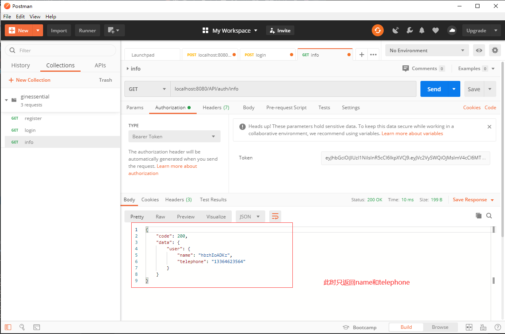

## **环境说明**
#### 准备工作
* Windows 10 1909版本（Windows系统）/Linux/MAC OS
* postman调试工具
* [Viper组件](https://github.com/spf13/viper)

## **步骤说明**
**1. 安装Viper组件，在终端上运行以下代码：**
``` @Terminal
go get github.com/spf13/viper
```

**2. 在项目中创建一个config文件夹，在该文件夹下新建一个application.yml文件，代码如下：**
``` @application.yml
server:
  port: 1060
datasource:
  driverName: mysql
  host: 127.0.0.1
  port: 3306
  database: ginessential
  username: root
  password: ROOT
  chartset: utf8
```

2.2 在main.go文件中实现对配置文件的调用，代码如下：
``` @main.go
package main

import (
	"github.com/gin-gonic/gin"
	_ "github.com/go-sql-driver/mysql"
	"github.com/spf13/viper"
	"os"
	"unic.org/ginessential/common"
)

func main(){
	InitConfig()
	db := common.InitDB()
	defer db.Close()

	r := gin.Default()
	r = CollectRoute(r)
	// 监听端口
	port := viper.GetString("server.port")
	if port != "" {
		panic(r.Run(":" + port))
	}
	panic(r.Run())	//listen and serve on 0.0.0.0:8080
}

// 读取配置文件的函数
func InitConfig() {
	workDir, _ := os.Getwd()
	viper.SetConfigName("application")
	viper.SetConfigType("yml")
	viper.AddConfigPath(workDir + "/config")
	err := viper.ReadInConfig()
	if err != nil {
		panic(err)
	}
}
```

2.3 在database.go文件中对配置文件进行调用，代码如下：
``` @database.go
package common

import (
	"fmt"
	"github.com/jinzhu/gorm"
	"github.com/spf13/viper"
	"unic.org/ginessential/model"
)

var DB *gorm.DB

// 通过GORM连接数据库
func InitDB() *gorm.DB {
	driverName := viper.GetString("datasource.driverName")
	host := viper.GetString("datasource.host")
	port := viper.GetString("datasource.port")
	database := viper.GetString("datasource.database")
	username := viper.GetString("datasource.username")
	password := viper.GetString("datasource.password")
	charset := viper.GetString("datasource.charset")
	args := fmt.Sprintf("%s:%s@tcp(%s:%s)/%s?charset=%s&parseTime=true",
		username,
		password,
		host,
		port,
		database,
		charset)
	db, err := gorm.Open(driverName, args)
	if err != nil {
		panic("failed to connect database, err: " + err.Error())
	}
	// 自动创建数据表
	db.AutoMigrate(&model.User{})
	DB = db
	return db
}

// 定义一个方法，用来获取DB实例
func GetDB() *gorm.DB {
	return DB
}
```

**3. 测试配置文件是否正确，结果如下：**

