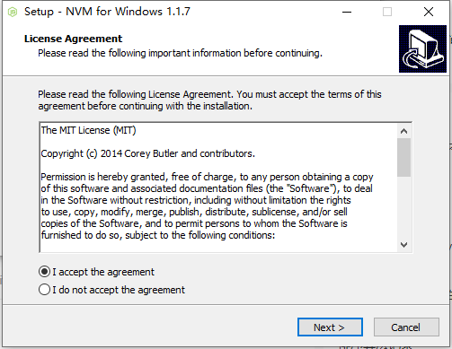
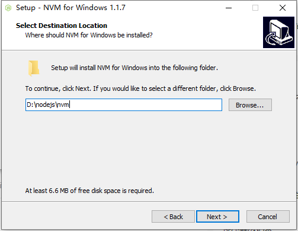
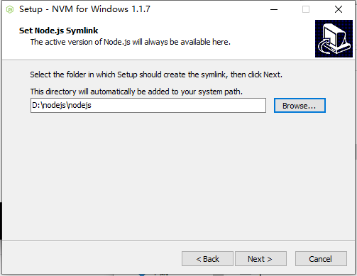
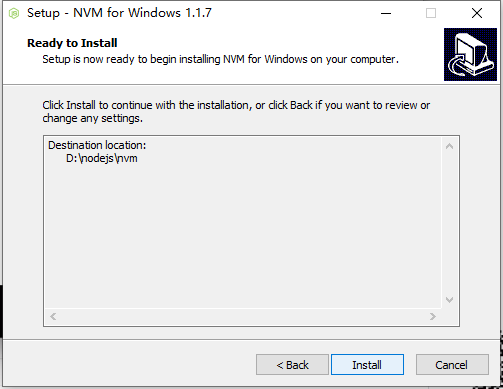
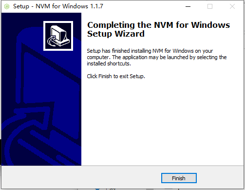
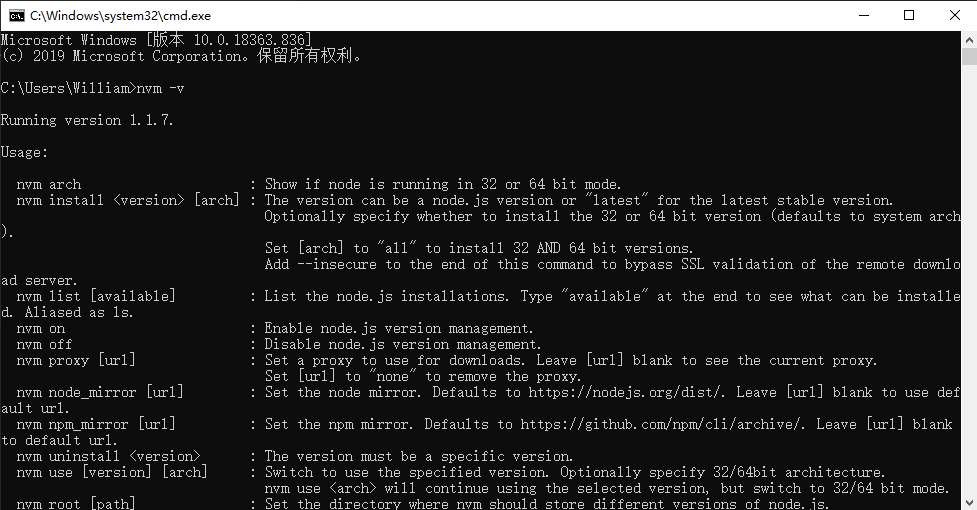
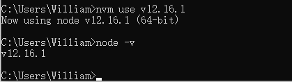
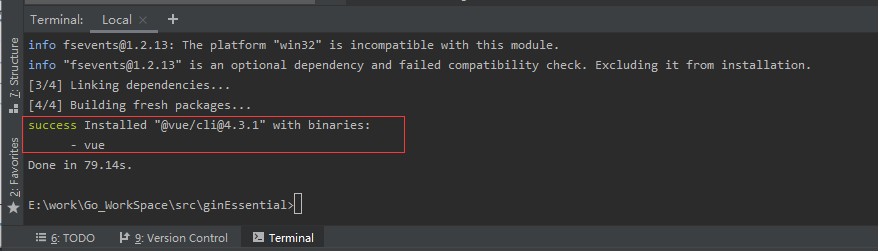

## **环境说明**
#### 准备工作
* Windows 10 1909版本（Windows系统）/Linux/MAC OS
* postman调试工具、
* [NVM工具](https://github.com/nvm-sh/nvm)
* [Node.js安装](../../../Web/Nodejs/node_js安装教程.md)
* [yarn官网](https://yarn.bootcss.com/docs/install/#windows-stable)
* [Vue CLI官网](https://cli.vuejs.org/guide/installation.html)

## **步骤说明**
**1. 使用nvm安装Node.js，方便多个node版本管理**

1.1 MAC系统安装nvm，在终端内执行以下命令
``` @Terminal
curl -o- https://raw.githubusercontent.com/nvm-sh/nvm/v0.35.3/install.sh | bash
```

1.2 Windows系统安装nvm，打开[nve-windows](https://github.com/coreybutler/nvm-windows/releases)项目，点击nvm-setup.zip下载到本地，解压并配置






1.3 按下WIN+R组合键，在运行中输入cmd命令并回车，再在命令行窗口中输入nvm -v命令，查看当前所安装的版本


**2. 通过命令行窗口执行以下两条命令，将nvm的下载镜像指向淘宝，添加成功后可在nvm文件夹下的settings.txt文件内查看代码如下：**
``` @cmd.exe
nvm node_mirror https://npm.taobao.org/mirrors/node/
nvm npm_mirror https://npm.taobao.org/mirrors/npm/
```

**3. 使用nvm**

3.1 使用nvm --help命令来查看nvm的帮助文档，在命令行窗口执行以下命令：
``` @cmd.exe
nvm --help
```

3.2 nvm常用命令和安装额外的node.js版本
``` @cmd.exe
nvm list   //列出所有已安装的node版本
nvm install v10.14.2  //安装指定版本的node
nvm install node   //安装最新版的node
nvm install --lts node  //下载最新的长期维护的版本
```

3.3 切换node版本，操作如下：
``` @cmd.exe
nvm use v12.16.1   //使用nvm use加版本号命令，即可切换到任意版本
```


**4. yarn安装(node的包管理工具)**

4.1 打开yarn的官网，选择对应的操作系统和版本号，根据官方提供的安装文档操作即可,或者直接执行以下命令
``` @cmd.exe
npm i yarn -g   //全局安装yarn
yarn -version   //查看yarn版本号
npm uninstall yarn -g  //卸载yarn
```


**5. 安装Vue CLI**

5.1 打开Vue CLI官网，点击Installation菜单，复制如下代码并在终端上执行：
``` @Terminal
yarn global add @vue/cli
```
