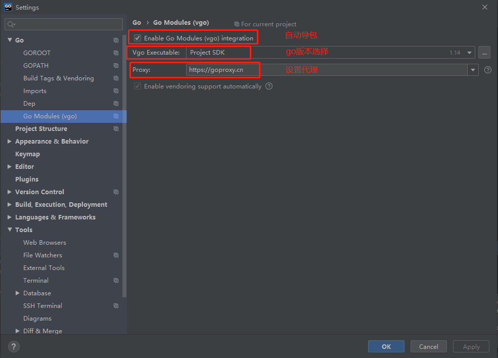
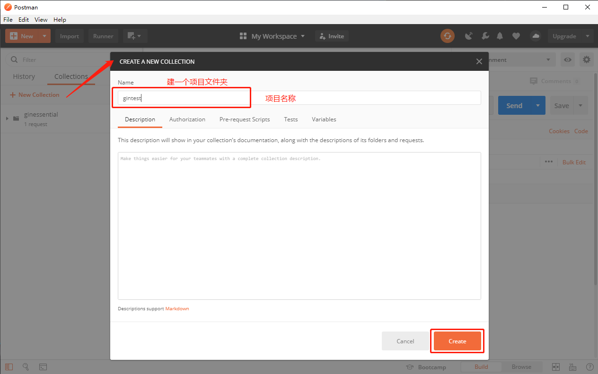
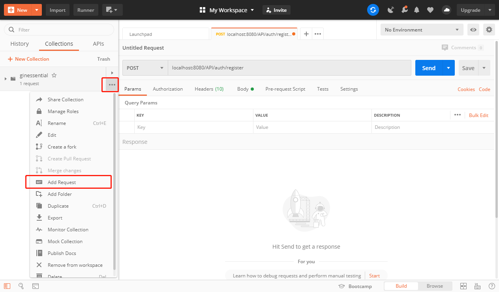
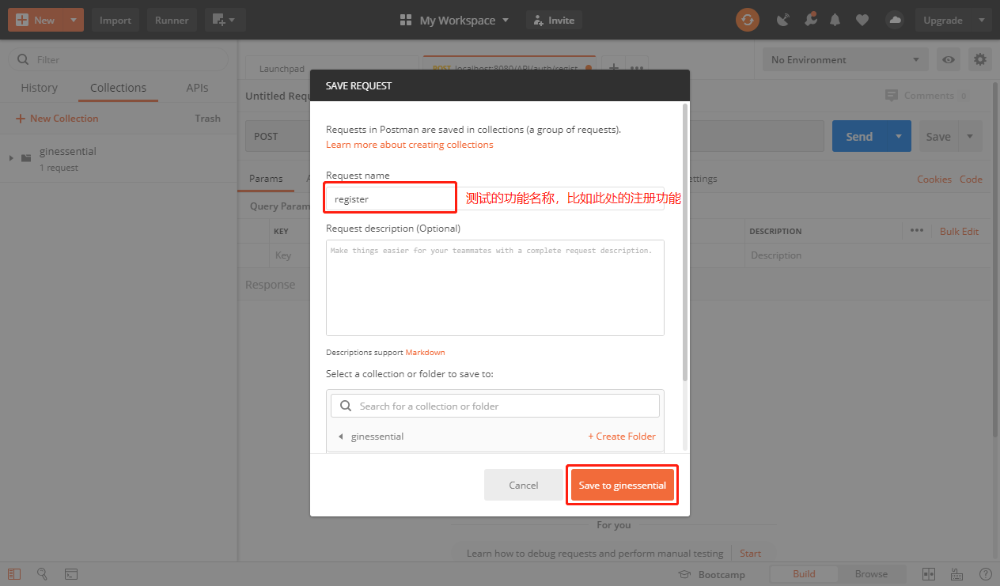
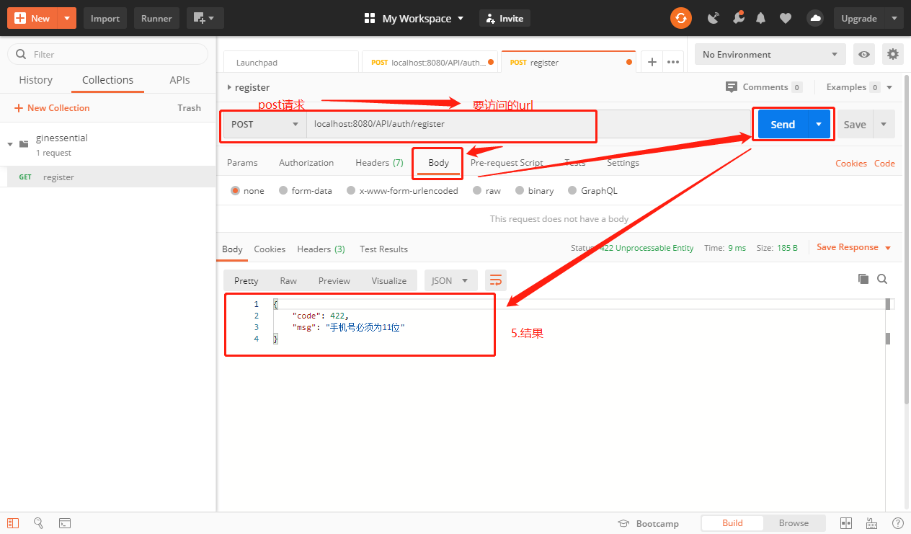
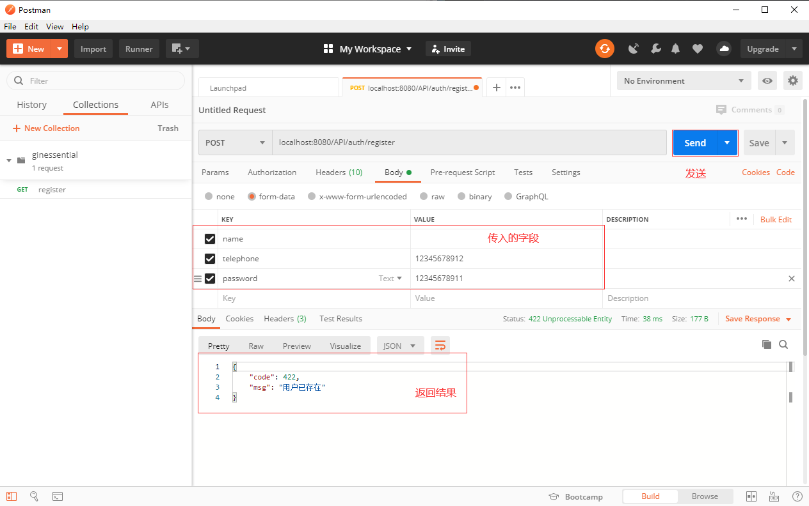
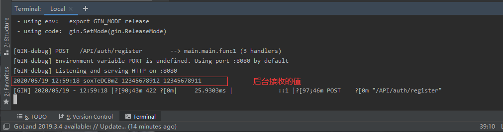
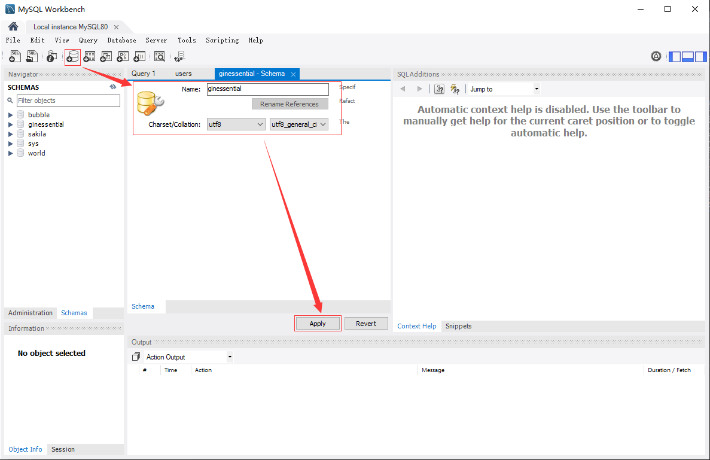
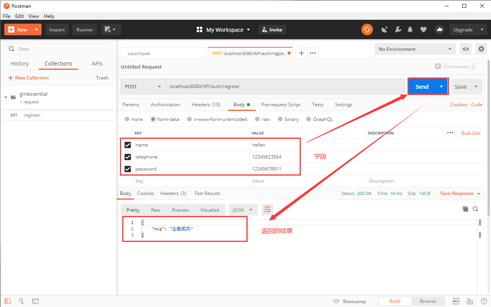
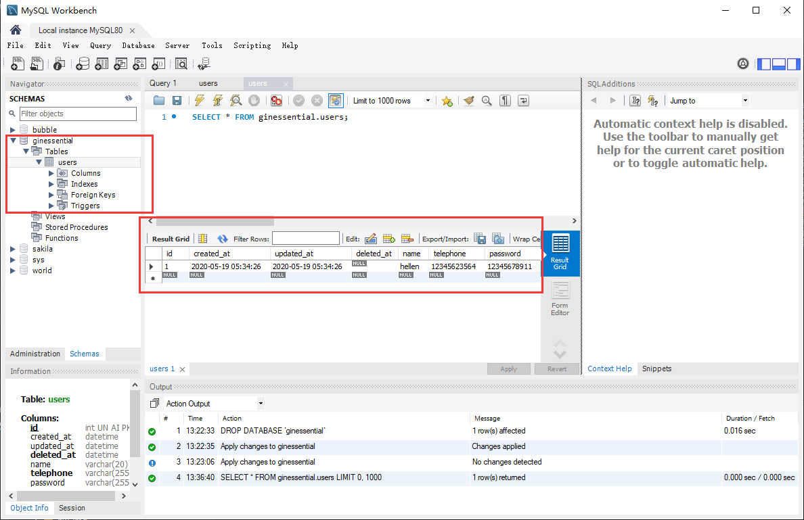

## **环境说明**
#### 准备工作
* Windows 10 1909版本（Windows系统）/Linux/MAC OS
* go1.14.1版本

## **步骤说明**
**1. 创建一个项目文件夹，并用代码编辑工具打开**
``` @cmd
mkdir 文件夹名称
```

**2. 创建main.go文件，编写第一个程序**
``` @main.go
package main

import "fmt"

func main(){
  fmt.Println("helloworld!")
}
```
2.1 在编译器终端中输入go run main.go命令运行程序，可以看到运行结果
``` @Terminal
go run main.go
```

2.2 在编译器终端中输入“go mod init 模块名称”命令来初始化项目模块，模块名称可以自定义，一般以公司名称和项目名称组合；执行完后项目会多一个go.mod文件，里面包含了此项目包含的依赖
``` @Terminal
go mod init unic.org/ginessential
```

2.3 下载gin依赖，打开<a href="https://gin-gonic.com/docs/quickstart/">Gin官网</a>，在终端上输入如下命令：
``` @Terminal
go get -u github.com/gin-gonic/gin
```

2.4 在项目中引入gin依赖
``` @main.go
package main

import "github.com/gin-gonic/gin"

func main() {
	r := gin.Default()
	r.GET("/ping", func(c *gin.Context) {
		c.JSON(200, gin.H{
			"message": "pong",
		})
	})
	r.Run() // listen and serve on 0.0.0.0:8080
}
```

2.5 goland配置go,打开goland编辑器-》file-》settings,设置如下：


**3. 编写注册代码**

3.1  main函数代码如下：
``` @main.go
package main

import (
	"fmt"
	"github.com/gin-gonic/gin"
	"github.com/jinzhu/gorm"
	"log"
	"math/rand"
	"net/http"
	"time"
	_ "github.com/go-sql-driver/mysql"
)

// 定义一个model
type User struct {
	gorm.Model
	Name string `gorm:"type:varchar(20);not null"`
	Telephone string `gorm:"varchar(110);not null;unique"`
	Password string `gorm:"size:255;not null"`
}

func main(){
	db := InitDB()
	defer db.Close()

	r := gin.Default()
	r.POST("/API/auth/register", func(c *gin.Context) {
		// 获取参数
		name := c.PostForm("name")
		telephone := c.PostForm("telephone")
		password := c.PostForm("password")
		// 数据验证
		if len(telephone) != 11 {
			c.JSON(http.StatusUnprocessableEntity, gin.H{"code": 422, "msg": "手机号必须为11位"})
			return
		}
		if len(password) < 6 {
			c.JSON(http.StatusUnprocessableEntity, gin.H{"code": 422, "msg": "密码不能少于6位"})
			return
		}

		// 如果名称没有传，给一个10位的随机字符串
		if len(name) == 0 {
			name = RandomString(10)
		}
		log.Println(name, telephone, password)

		// 判断手机号是否存在
		if isTelephoneExist(db, telephone) {
			c.JSON(http.StatusUnprocessableEntity, gin.H{"code": 422, "msg": "用户已存在"})
			return
		}

		// 创建用户
		newUser := User{
			Name:      name,
			Telephone: telephone,
			Password:  password,
		}
		db.Create(&newUser)

		// 返回结果
		c.JSON(200, gin.H{
			"msg": "注册成功",
		})
	})
	panic(r.Run())	//listen and serve on 0.0.0.0:8080
}

// 验证手机号函数
func isTelephoneExist(db *gorm.DB, telephone string) bool {
	var user User
	db.Where("telephone = ?", telephone).First(&user)
	if user.ID != 0 {
		return true
	}
	return false
}

// 创建一个随机的字符串
func RandomString(n int) string {
	var letters  = []byte("asdfghjklzxcvbnmqwertyuiopASDFGHJKLZXCVBNMQWERTYUIOP")
	result := make([]byte, n)

	rand.Seed(time.Now().Unix())
	for i := range result {
		result[i] = letters[rand.Intn(len(letters))]
	}

	return string(result)
}

// 通过GORM连接数据库
func InitDB() *gorm.DB {
	driverName := "mysql"
	host := "localhost"
	port := "3306"
	database := "ginessential"
	username := "root"
	password := "ROOT"
	charset := "utf8"
	args := fmt.Sprintf("%s:%s@tcp(%s:%s)/%s?charset=%s&parseTime=true",
		username,
		password,
		host,
		port,
		database,
		charset)
	db, err := gorm.Open(driverName, args)
	if err != nil {
		panic("failed to connect database, err: " + err.Error())
	}
	// 自动创建数据表
	db.AutoMigrate(&User{})
	return db
}
```

3.2 运行代码，执行如下命令：
``` @Terminal
go run main.go
```

3.3 在浏览器中查看效果,在浏览器中输入localhost:8080或者127.0.0.1:8080并回车,即可查看效果：
``` @Browser
localhost:8080
```

**4. 用postman测试**
* 下载安装好postman后，打开Postman，点击New Collection,其他操作如图：







**5. 使用GORM连接数据库**
[GORM官网](https://gorm.io/zh_CN/)
* 在终端执行以下命令，安装GORM相关依赖
``` @Terminal
go get -u github.com/jinzhu/gorm
```

**6. 创建mysql数据库**
* 通过mysql创建名为ginessential的数据库，并通过以下代码功能自动创建数据表

``` @main.go
// 自动创建数据表
	db.AutoMigrate(&User{})
	return db
```
* 若编译提示缺少mysql驱动，则执行以下代码，并在import中引入即可：
``` @Terminal
go get github.com/go-sql-driver/mysql
```
* 使用postman测试，并在MySQL数据库中验证执行结果

