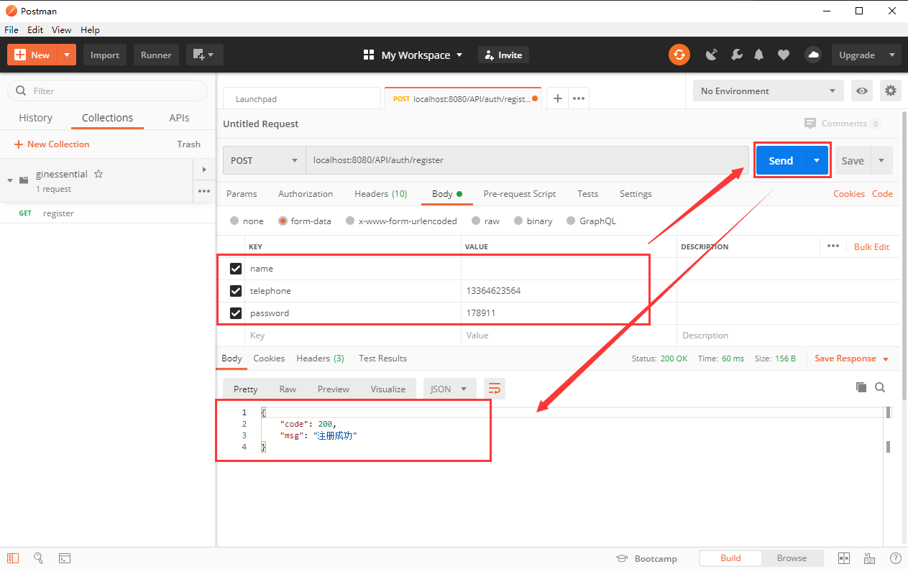
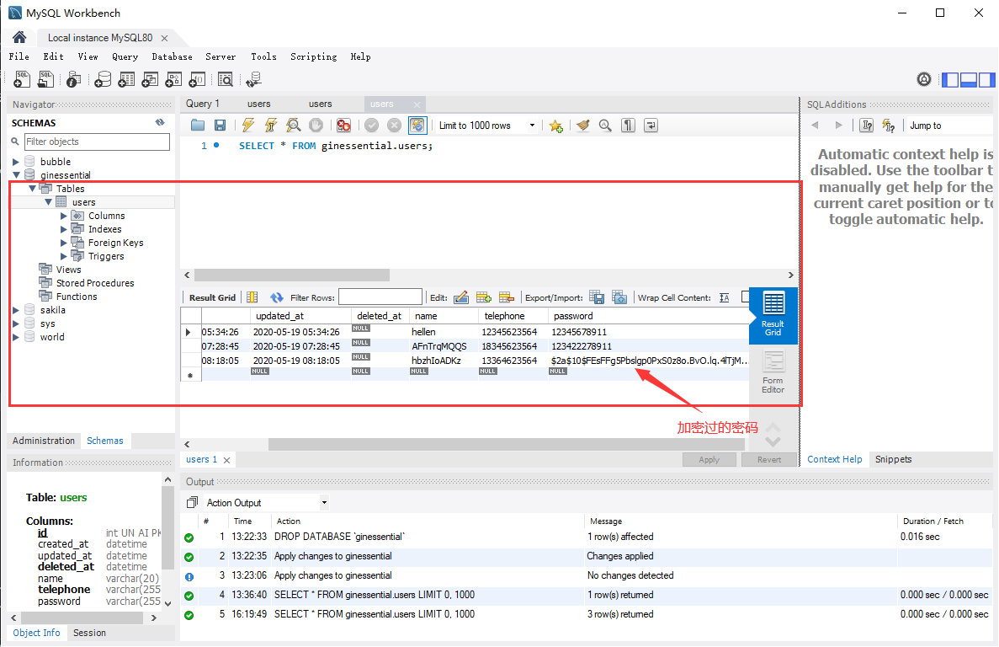
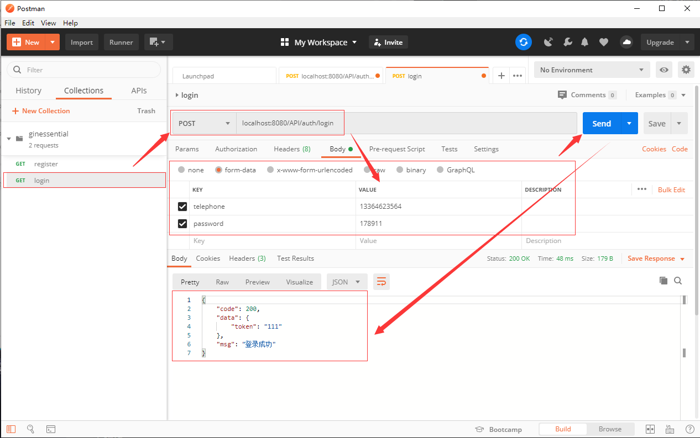

## **环境说明**
#### 准备工作
* Windows 10 1909版本（Windows系统）/Linux/MAC OS
* git版本控制
* postman调试
* MySQL数据库

## **步骤说明**
**1. 提交代码修改后的代码，在项目所在目录右键->Git Bash Here打开Git Bash，并执行以下命令**
``` @Git Bash
git status //查看当前状态
git push -f https://github.com/willasas/Go_Pro_Practice.git master //将本地代码推送到远程
```

**2. 实现用户登录功能**

2.1 在routes.go文件中定义一个登录的路由，内容如下：
``` @routes.go
package main

import (
	"github.com/gin-gonic/gin"
	"unic.org/ginessential/controller"
)

func CollectRoute(r *gin.Engine) *gin.Engine {
	r.POST("/API/auth/register", controller.Register)
	r.POST("API/auth/login", controller.Login)
	return r
}
```

2.2 在UserController.go文件中添加控制器，内容如下：
``` @UserController.go
package controller

import (
	"github.com/gin-gonic/gin"
	"github.com/jinzhu/gorm"
	"golang.org/x/crypto/bcrypt"
	"log"
	"net/http"
	"unic.org/ginessential/common"
	"unic.org/ginessential/model"
	"unic.org/ginessential/util"
)

func Register(c *gin.Context) {
	DB := common.GetDB()
	// 获取参数
	name := c.PostForm("name")
	telephone := c.PostForm("telephone")
	password := c.PostForm("password")
	// 数据验证
	if len(telephone) != 11 {
		c.JSON(http.StatusUnprocessableEntity, gin.H{"code": 422, "msg": "手机号必须为11位"})
		return
	}
	if len(password) < 6 {
		c.JSON(http.StatusUnprocessableEntity, gin.H{"code": 422, "msg": "密码不能少于6位"})
		return
	}

	// 如果名称没有传，给一个10位的随机字符串
	if len(name) == 0 {
		name = util.RandomString(10)
	}
	log.Println(name, telephone, password)

	// 判断手机号是否存在
	if isTelephoneExist(DB, telephone) {
		c.JSON(http.StatusUnprocessableEntity, gin.H{"code": 422, "msg": "用户已存在"})
		return
	}

	// 创建用户
	// 加密密码
	hasedPassword, err := bcrypt.GenerateFromPassword([]byte(password), bcrypt.DefaultCost)
	if err != nil {
		c.JSON(http.StatusInternalServerError, gin.H{"code": 500, "msg": "加密错误"})
		return
	}
	newUser := model.User{
		Name:      name,
		Telephone: telephone,
		Password:  string(hasedPassword),
	}
	DB.Create(&newUser)

	// 返回结果
	c.JSON(200, gin.H{
		"code": 200,
		"msg": "注册成功",
	})
}

//添加登录的控制器
func Login(c *gin.Context) {
	DB := common.GetDB()
	// 获取参数
	telephone := c.PostForm("telephone")
	password := c.PostForm("password")
	// 数据验证
	if len(telephone) != 11 {
		c.JSON(http.StatusUnprocessableEntity, gin.H{"code": 422, "msg": "手机号必须为11位"})
		return
	}
	if len(password) < 6 {
		c.JSON(http.StatusUnprocessableEntity, gin.H{"code": 422, "msg": "密码不能少于6位"})
		return
	}
	// 判断手机号是否存在
	var user model.User
	DB.Where("telephone = ?", telephone).First(&user)
	if user.ID == 0 {
		c.JSON(http.StatusUnprocessableEntity, gin.H{"code": 422, "msg": "用户不存在"})
		return
	}
	// 判断密码是否正确
	if err := bcrypt.CompareHashAndPassword([]byte(user.Password), []byte(password)); err != nil {
		c.JSON(http.StatusBadRequest, gin.H{"code": 400, "msg": "密码错误"})
		return
	}
	// 发放token
	token := "111"
	// 返回结果
	c.JSON(200, gin.H{
		"code": 200,
		"data": gin.H{"token": token},
		"msg": "登录成功",
	})
}

// 验证手机号函数
func isTelephoneExist(db *gorm.DB, telephone string) bool {
	var user model.User
	db.Where("telephone = ?", telephone).First(&user)
	if user.ID != 0 {
		return true
	}
	return false
}
```

2.3 编译项目，执行以下代码：
```
go build   //编译成exe程序
ginessential.exe //执行该程序
```

**3. 用postman测试**
* 打开Postman,其他操作如图：


* 创建一个登录的测试，操作如下图：
