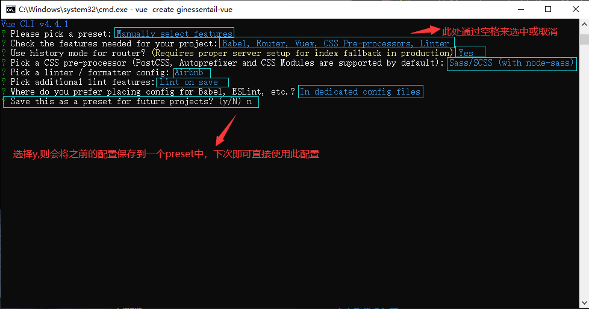

## **环境说明**
#### 准备工作
* Windows 10 1909版本（Windows系统）/Linux/MAC OS
* postman调试工具、
* [bootstrap官网](https://bootstrap-vue.org/)

## **步骤说明**
**1. 打开项目后，删除之前的配置，打开bootstrop官网，依次点击Docs->Getting started,复制如下代码，并在编辑器终端执行**
``` @Termnial
# With npm
npm install vue bootstrap-vue bootstrap
// 如果是yarn则用下面这个命令安装
# With yarn
yarn add vue bootstrap-vue bootstrap
```


1.2 将bootstrap引入到项目中，此时main.js的配置如下：
``` @main.js
import Vue from 'vue';
import { BootstrapVue, IconsPlugin } from 'bootstrap-vue';
import App from './App.vue';
import router from './router';
import store from './store';

Vue.config.productionTip = false;

// Install BootstrapVue
Vue.use(BootstrapVue);
// Optionally install the BootstrapVue icon components plugin
Vue.use(IconsPlugin);

new Vue({
  router,
  store,
  render: (h) => h(App),
}).$mount('#app');
```

1.3 在项目的assets文件夹下新建scss文件夹，并在其内部新建index.scss文件,如果是Webpack项目，则使用如下代码：
``` @index.scss
// import bootstrop
@import '~bootstrap';
@import '~bootstrap-vue';
```

1.4 在main.js中将index.scss文件引入，此时main.js文件内容如下：
``` @main.js
import Vue from 'vue';
import { BootstrapVue, IconsPlugin } from 'bootstrap-vue';
import App from './App.vue';
import router from './router';
import store from './store';

// scss style
import './assets/scss/index.scss';

Vue.config.productionTip = false;

// Install BootstrapVue
Vue.use(BootstrapVue);
// Optionally install the BootstrapVue icon components plugin
Vue.use(IconsPlugin);

new Vue({
  router,
  store,
  render: (h) => h(App),
}).$mount('#app');
```

1.5 测试是否引入成功，在views文件夹下新建login和register文件夹，并在其内分别新建Login.vue和Register.vue文件,并在index.js文件中将其引入，文件内容如下：
``` @Login.vue

```

``` @Register.vue

```

``` @index.js
import Vue from 'vue';
import VueRouter from 'vue-router';
import Home from '../views/Home.vue';

Vue.use(VueRouter);

const routes = [
  {
    path: '/',
    name: 'Home',
    component: Home,
  },
  {
    path: '/about',
    name: 'About',
    // route level code-splitting
    // this generates a separate chunk (about.[hash].js) for this route
    // which is lazy-loaded when the route is visited.
    component: () => import(/* webpackChunkName: "about" */ '../views/About.vue'),
  },
  {
    path: '/register',
    name: 'register',
    component: () => import('../views/register/Register.vue'),  //使用惰性加载
  },
  {
    path: '/login',
    name: 'login',
    component: () => import('../views/login/Login.vue'),
  },
];

const router = new VueRouter({
  mode: 'history',
  base: process.env.BASE_URL,
  routes,
});

export default router;
```

``` @Home.vue
<template>
  <div class="home">
    <div>
      <b-button>Button</b-button>
      <b-button variant="danger">Button</b-button>
      <b-button variant="success">Button</b-button>
      <b-button variant="outline-primary">Button</b-button>
    </div>
    
    <HelloWorld msg="Welcome to Your Vue.js App"/>
  </div>
</template>

<script>
// @ is an alias to /src
import HelloWorld from '@/components/HelloWorld.vue';

export default {
  name: 'Home',
  components: {
    HelloWorld,
  },
};
</script>
```

**2. 步骤如下：**
