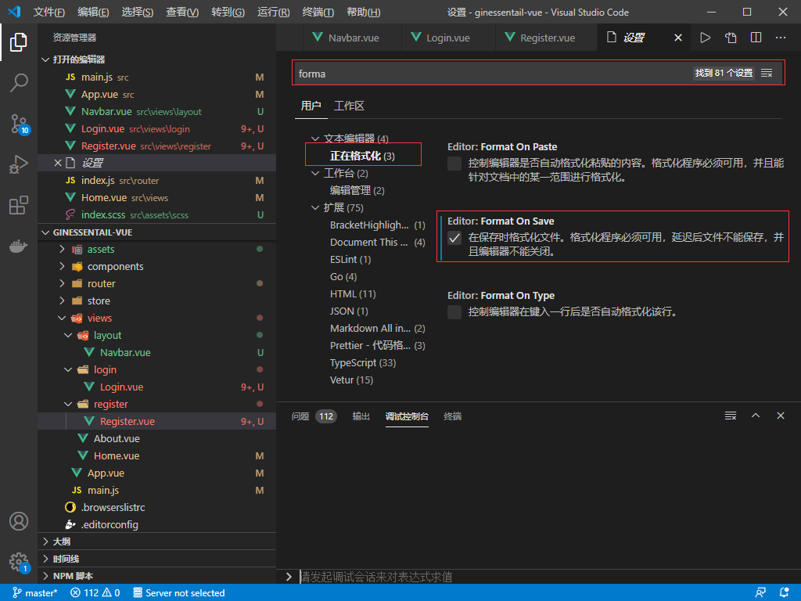
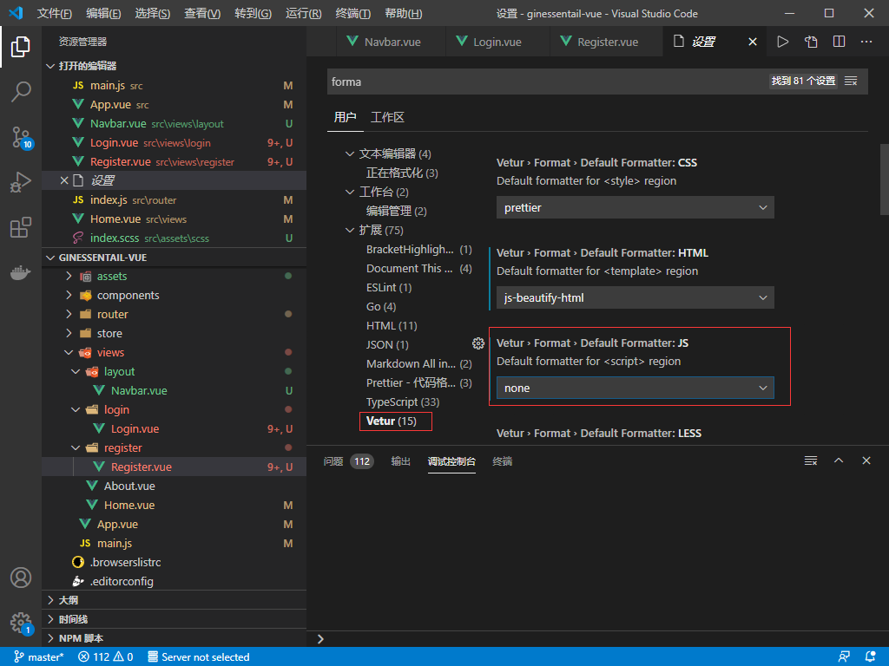

## **环境说明**

#### 准备工作

- Windows 10 1909 版本（Windows 系统）/Linux/MAC OS
- postman 调试工具、
- [bootstrap 官网](https://bootstrap-vue.org/)
- [vuelidate 插件](https://vuelidate.js.org/)

## **步骤说明**

**1. 打开项目后，删除之前的配置，打开 bootstrop 官网，依次点击 Docs->Getting started,复制如下代码，并在编辑器终端执行**

```@Termnial
# With npm
npm install vue bootstrap-vue bootstrap
// 如果是yarn则用下面这个命令安装
# With yarn
yarn add vue bootstrap-vue bootstrap
```


1.2 将 bootstrap 引入到项目中，此时 main.js 的配置如下：

```@main.js
import Vue from 'vue';
import { BootstrapVue, IconsPlugin } from 'bootstrap-vue';
import App from './App.vue';
import router from './router';
import store from './store';

Vue.config.productionTip = false;

// Install BootstrapVue
Vue.use(BootstrapVue);
// Optionally install the BootstrapVue icon components plugin
Vue.use(IconsPlugin);

new Vue({
  router,
  store,
  render: (h) => h(App),
}).$mount('#app');
```

1.3 在项目的 assets 文件夹下新建 scss 文件夹，并在其内部新建 index.scss 文件,如果是 Webpack 项目，则使用如下代码：

```@index.scss
// import bootstrop
@import '~bootstrap';
@import '~bootstrap-vue';
```

1.4 在 main.js 中将 index.scss 文件引入，此时 main.js 文件内容如下：

```@main.js
import Vue from 'vue';
import { BootstrapVue, IconsPlugin } from 'bootstrap-vue';
import App from './App.vue';
import router from './router';
import store from './store';

// scss style
import './assets/scss/index.scss';

Vue.config.productionTip = false;

// Install BootstrapVue
Vue.use(BootstrapVue);
// Optionally install the BootstrapVue icon components plugin
Vue.use(IconsPlugin);

new Vue({
  router,
  store,
  render: (h) => h(App),
}).$mount('#app');
```

1.5 测试是否引入成功，在 views 文件夹下新建 login 和 register 文件夹，并在其内分别新建 Login.vue 和 Register.vue 文件,并在 index.js 文件中将其引入，文件内容如下：

```@Login.vue
<template>
  <div class="login">
      login
  </div>
</template>

<script>
export default {

};
</script>

<style lang="scss" scoped>

</style>
```

```@Register.vue
<template>
  <div class="register">
      register
  </div>
</template>

<script>
export default {

};
</script>

<style lang="scss" scoped>

</style>
```

```@index.js
import Vue from 'vue';
import VueRouter from 'vue-router';
import Home from '../views/Home.vue';

Vue.use(VueRouter);

const routes = [
  {
    path: '/',
    name: 'Home',
    component: Home,
  },
  {
    path: '/about',
    name: 'About',
    // route level code-splitting
    // this generates a separate chunk (about.[hash].js) for this route
    // which is lazy-loaded when the route is visited.
    component: () => import(/* webpackChunkName: "about" */ '../views/About.vue'),
  },
  {
    path: '/register',
    name: 'register',
    component: () => import('../views/register/Register.vue'),  //使用惰性加载
  },
  {
    path: '/login',
    name: 'login',
    component: () => import('../views/login/Login.vue'),
  },
];

const router = new VueRouter({
  mode: 'history',
  base: process.env.BASE_URL,
  routes,
});
export default router;
```

```@Home.vue
<template>
  <div class="home">
    <div>
      <b-button>Button</b-button>
      <b-button variant="danger">Button</b-button>
      <b-button variant="success">Button</b-button>
      <b-button variant="outline-primary">Button</b-button>
    </div>
    
    <HelloWorld msg="Welcome to Your Vue.js App"/>
  </div>
</template>

<script>
// @ is an alias to /src
import HelloWorld from '@/components/HelloWorld.vue';

export default {
  name: 'Home',
  components: {
    HelloWorld,
  },
};
</script>
```

1.6 更换导航，在 views 文件夹下新建 layout 文件夹，并在此文件夹下新建 Navbar.vue 文件，文件内容如下：

```@App.vue
<template>
  <div id="app">
      <navbar/>
      <b-container>
        <router-view/>
      </b-container>
  </div>
</template>

<script>
import Navbar from './views/layout/Navbar.vue';

export default {
  components: { Navbar },
  data() {

  },
};

</script>

<style lang="scss">

</style>
```

```@Navbar.vue
<template>
  <div>
  <b-navbar toggleable="lg" type="dark" variant="info">
    <b-container>
    <b-navbar-brand href="#">LOGO</b-navbar-brand>
    <b-navbar-toggle target="nav-collapse"></b-navbar-toggle>
    <b-collapse id="nav-collapse" is-nav>
      <!-- Right aligned nav items -->
      <b-navbar-nav class="ml-auto">
        <!--<b-nav-form>
          <b-form-input size="sm" class="mr-sm-2" placeholder="Search"></b-form-input>
          <b-button size="sm" class="my-2 my-sm-0" type="submit">Search</b-button>
        </b-nav-form> -->
        <b-nav-item-dropdown right>
          <!-- Using 'button-content' slot -->
          <template v-slot:button-content>
            <em>User</em>
          </template>
          <b-dropdown-item href="#">Profile</b-dropdown-item>
          <b-dropdown-item href="#">Sign Out</b-dropdown-item>
        </b-nav-item-dropdown>
        <b-nav-item @click="$router.replace({name: 'login'})">登录</b-nav-item>
        <b-nav-item @click="$router.replace({name: 'regidter'})">注册</b-nav-item>
      </b-navbar-nav>
    </b-collapse>
    </b-container>
  </b-navbar>
</div>
</template>

<script>
export default {

};
</script>

<style lang="scss">

</style>
```

1.7 创建登录/注册表单,安装 Vetur 扩展插件

```@login.vue

```

```@register

```




**2. 使用 vuelidate 插件实现表单验证**

2.1 安装 vuelidate 插件，使用如下代码：

```@git Bash
npm install vuelidate --save
```

2.2 将插件引入到项目中，此时文件内容如下：

```@main.js
import Vue from 'vue';
import { BootstrapVue, IconsPlugin } from 'bootstrap-vue';
import Vuelidate from 'vuelidate';
import App from './App.vue';
import router from './router';
import store from './store';

// scss style
import './assets/scss/index.scss';

Vue.config.productionTip = false;

// Install BootstrapVue
Vue.use(BootstrapVue);
// Optionally install the BootstrapVue icon components plugin
Vue.use(IconsPlugin);
Vue.use(Vuelidate);

new Vue({
  router,
  store,
  render: (h) => h(App),
}).$mount('#app');
```

```@register.vue

```
