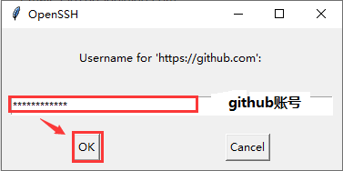
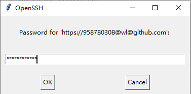
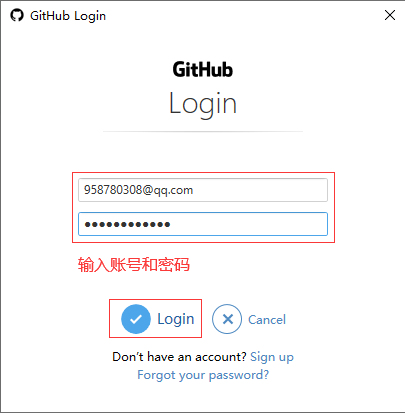
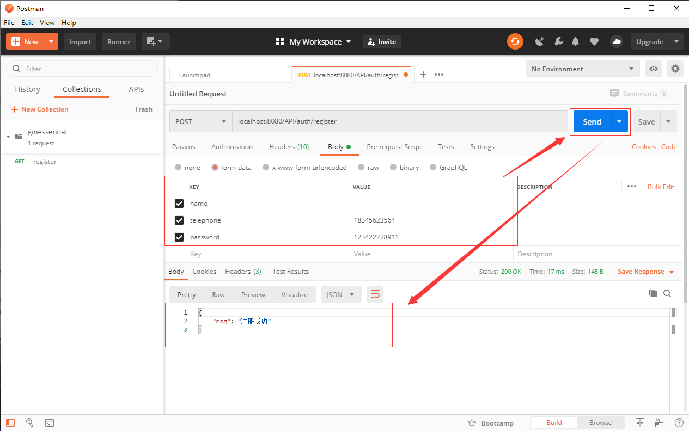
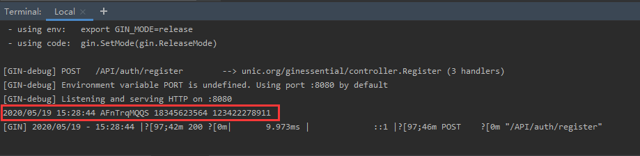

## **环境说明**
#### 准备工作
* Windows 10 1909版本（Windows系统）/Linux/MAC OS
* git版本控制
* postman调试
* MySQL数据库

## **步骤说明**
**1. 创建一个.gitignore的文件，在项目所在目录右键->Git Bash Here打开Git Bash，并执行以下命令**
``` @Git Bash
git init //初始化git同步
git status //查看当前状态
git add . //提交代码
git commit -m "备注信息"
git pull https://github.com/willasas/Go_Pro_Practice.git master //合并分支
git push -f https://github.com/willasas/Go_Pro_Practice.git master //将本地代码推送到远程
```




**2. 重构代码**

2.1 在项目中新建一个model文件夹，并在该文件夹下新建一个user.go文件，内容如下：
``` @user.go
package model

import "github.com/jinzhu/gorm"

// 定义一个model
type User struct {
	gorm.Model
	Name string `gorm:"type:varchar(20);not null"`
	Telephone string `gorm:"varchar(110);not null;unique"`
	Password string `gorm:"size:255;not null"`
}
```

2.2 在项目中新建一个controller文件夹，并在该文件夹下新建一个UserController.go文件，内容如下：
``` @UserController.go
package controller

import (
	"github.com/gin-gonic/gin"
	"github.com/jinzhu/gorm"
	"log"
	"net/http"
	"unic.org/ginessential/common"
	"unic.org/ginessential/model"
	"unic.org/ginessential/util"
)

func Register(c *gin.Context) {
	DB := common.GetDB()
	// 获取参数
	name := c.PostForm("name")
	telephone := c.PostForm("telephone")
	password := c.PostForm("password")
	// 数据验证
	if len(telephone) != 11 {
		c.JSON(http.StatusUnprocessableEntity, gin.H{"code": 422, "msg": "手机号必须为11位"})
		return
	}
	if len(password) < 6 {
		c.JSON(http.StatusUnprocessableEntity, gin.H{"code": 422, "msg": "密码不能少于6位"})
		return
	}

	// 如果名称没有传，给一个10位的随机字符串
	if len(name) == 0 {
		name = util.RandomString(10)
	}
	log.Println(name, telephone, password)

	// 判断手机号是否存在
	if isTelephoneExist(DB, telephone) {
		c.JSON(http.StatusUnprocessableEntity, gin.H{"code": 422, "msg": "用户已存在"})
		return
	}

	// 创建用户
	newUser := model.User{
		Name:      name,
		Telephone: telephone,
		Password:  password,
	}
	DB.Create(&newUser)

	// 返回结果
	c.JSON(200, gin.H{
		"msg": "注册成功",
	})
}

// 验证手机号函数
func isTelephoneExist(db *gorm.DB, telephone string) bool {
	var user model.User
	db.Where("telephone = ?", telephone).First(&user)
	if user.ID != 0 {
		return true
	}
	return false
}
```

2.3 在项目中新建一个util文件夹，并在该文件夹下新建一个util.go文件，内容如下：
``` @util.go
package util

import (
	"math/rand"
	"time"
)

// 创建一个随机的字符串
func RandomString(n int) string {
	var letters  = []byte("asdfghjklzxcvbnmqwertyuiopASDFGHJKLZXCVBNMQWERTYUIOP")
	result := make([]byte, n)

	rand.Seed(time.Now().Unix())
	for i := range result {
		result[i] = letters[rand.Intn(len(letters))]
	}

	return string(result)
}
```

2.4 在项目中新建一个routes.go文件，内容如下：
``` @routes.go
package main

import (
	"github.com/gin-gonic/gin"
	"unic.org/ginessential/controller"
)

func CollectRoute(r *gin.Engine) *gin.Engine {
	r.POST("/API/auth/register", controller.Register)

	return r
}
```

2.5 在项目中新建一个common文件夹，并在该文件夹下新建一个database.go文件，内容如下：
``` @database.go
package common

import (
	"fmt"
	"github.com/jinzhu/gorm"
	"unic.org/ginessential/model"
)

var DB *gorm.DB

// 通过GORM连接数据库
func InitDB() *gorm.DB {
	driverName := "mysql"
	host := "localhost"
	port := "3306"
	database := "ginessential"
	username := "root"
	password := "ROOT"
	charset := "utf8"
	args := fmt.Sprintf("%s:%s@tcp(%s:%s)/%s?charset=%s&parseTime=true",
		username,
		password,
		host,
		port,
		database,
		charset)
	db, err := gorm.Open(driverName, args)
	if err != nil {
		panic("failed to connect database, err: " + err.Error())
	}
	// 自动创建数据表
	db.AutoMigrate(&model.User{})
	DB = db
	return db
}

// 定义一个方法，用来获取DB实例
func GetDB() *gorm.DB {
	return DB
}
```

2.6 此时main.go文件内容如下：
``` @main.go
package main

import (
	"github.com/gin-gonic/gin"
	_ "github.com/go-sql-driver/mysql"
	"unic.org/ginessential/common"
)

func main(){
	db := common.InitDB()
	defer db.Close()

	r := gin.Default()
	r = CollectRoute(r)
	panic(r.Run())	//listen and serve on 0.0.0.0:8080
}
```

2.7 编译项目，执行以下代码：
```
go build   //编译成exe程序
ginessential.exe //执行该程序
```

**3. 用postman测试**
* 打开Postman,其他操作如图：


