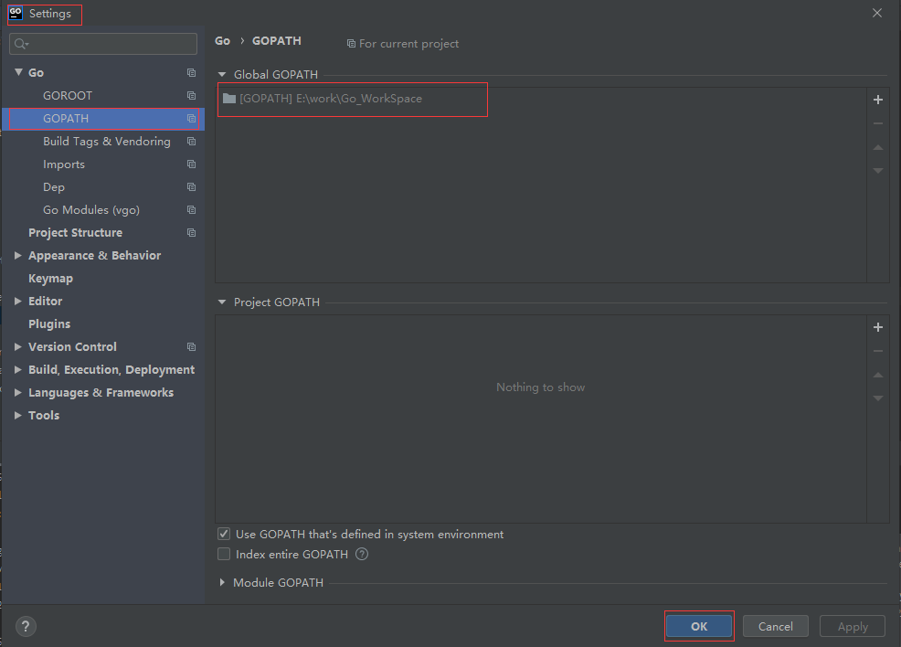

## **环境说明**

#### 准备工作

- golang 版本 >= 1.11,go mod 包管理，代理
- [goframe 官网](https://github.com/gogf/gf)
- [gf-cli 下载](https://github.com/gogf/gf-cli)

## **步骤说明**

**1. 安装 goframe,执行如下命令**

```@cmd
go get -u -v github.com/gogf/gf
```

- 使用 gomod 新建项目执行如上命令后，go.mod 文件内容如下：

```@go.mod
module ProjectName    //项目名

go 1.14     //版本号

require github.com/gogf/gf v1.13.2 // indirect
```

**2. 安装 gf-cli 工具，直接双击运行应用程序，输入 y 后，选择安装路径（最好放在 go 安装路径下的 bin 文件夹下）**

```@cmd
gf  //查看gf命令
gf -v  //查看当前gf版本
```


**3. 项目初始化**

- 在项目目录下，执行以下命令：

```@cmd
gf init GFProject #在当前目录生成一个示例的GF空框架项目，GFProject为项目名
```

> GF 框架开发推荐统一使用官方的 go module 特性进行依赖包管理，因此空项目根目录下也有一个 go.mod 文件。

**4. 编译项目,执行如下代码：**

```@Terminal
gf build GFProject
```

**5. 配置 go mod 代理和 goroot 和 gopath**

- 配置代理，打开 goland 编辑器，依次点击 File-》Settings-》GO-》Go Modules(vgo),配置如图：

```
# proxy可选值如下：
https://goproxy.cn
https://goproxy.io
https://mirrors.aliyun.com/goproxy/
```


- 配置 GOROOT(go 的安装目录)和 GOPATH(go 项目在本地的开发环境的的项目根路径),依次点击 File-》Settings-》GO-》GOROOT/GOPATH,配置如图：




- 配置完成后保存即可

**6. 私有依赖管理**

- 通过 GOPRIVATE 的方式设置私有包有效域名,以命令行方式（需要 Go v1.13 以上版本支持）

```cmd
export GOPROXY=https://goproxy.cn
export GOPRIVATE=git.xxx.com
CGO_ENABLED=0 GOOS=linux GOARCH=amd64 go build -o main main.go
```

- 在 Goland 中设置


#### 注意事项
