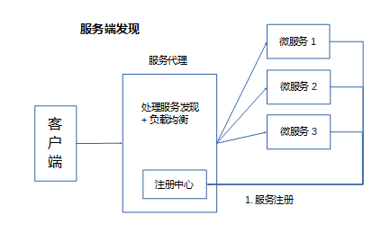

## **环境说明**

#### 准备工作

## **步骤说明**

**1. RPC 简介**

- 远程过程调用（Remote Procedure Call）是一个计算机通讯协议

**2. 流行 RPC 框架**

- Dubbo(java)、Motan(java)、Thrift(跨语言)、Grpc(跨语言)

**3. Golang 中如何实现 RPC(必须符合以下 4 个条件)**

- 结构体字段首字母要大写，要跨域访问，所以大写
- 函数名必须首字母大写（可以序列化导出的）
- 函数第一个参数是接收参数，第二个参数是返回给客户端参数，必须是指针类型
- 函数必须有一个返回值 error

**4. RPC 调用流程**

**5. 微服务部署/更新/扩容**

- 微服务部署到 docker 容器
- 涉及服务编排：K8S、swarm

**6. RPC 调用流程**

**7. 网络传输数据格式**

- 网络字节流： header uint32 + data []byte 组成

**8. RPC 实现**

8.1 服务端实现：

- 收到的数据包括：
  - 调用的函数名、参数列表
  - 一般会约定函数的第二个返回值是 error 类型
  - 通过反射实现
- 服务端需要解决的问题：
  - Client 调用时只传过来函数名，需要维护函数名到函数之间的 map 映射
- 服务端的核心功能：

  - 维护函数名到函数反射值的 map
  - client 端传函数名、参数列表后，服务端要解析为反射值，调用执行
  - 函数的返回值打包，并通过网络放回给客户端

8.2 客户端实现：

- 客户端只有函数原型，使用 reflect.MakeFunc()可以完成原型到函数的调用
- reflect.MakeFunc()是 Client 从函数原型到网络调用的关键

8.3 实现 RPC 通讯测试：

- 给服务端注册一个查询用户的方法，客户端去 RPC 调用
