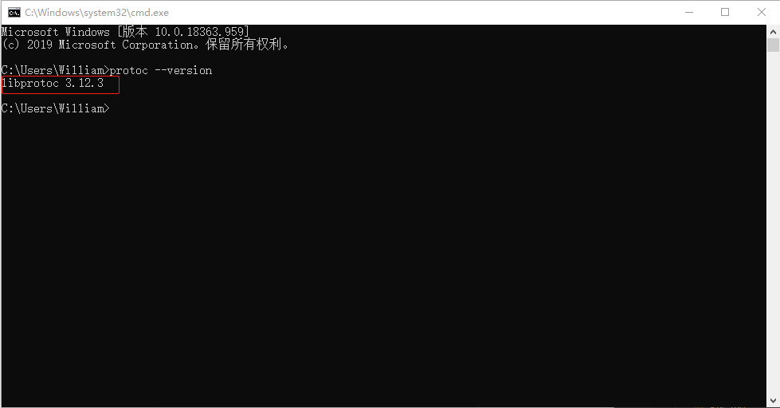

## **环境说明**

#### 准备工作

- go 语言环境
- [gRPC 官网](https://www.grpc.io/)
- [protobuf 下载](https://github.com/protocolbuffers/protobuf/releases/tag/v3.12.3)

## **步骤说明**

**1. 下载 protoc 后并解压（例如：3.12.2 版本）文件后，将其目录下的 bin 目录下的 protoc.exe 程序复制到 go 安装目录下的 bin 目录下**


- 注意：前提是环境变量已经配置了 GOBIN 环境变量。

**2. 打开 cmd 命令行工具，运行 protoc --version 命令，成功打印当前版本则证明安装成功**

```@cmd
protoc --version
```



**3. 安装相关包**

- 安装 goalng 的 proto 编译支持和其他依赖包，创建的文件夹最好在项目目录下的 src 内，执行以下命令：

```@cmd
## 同样不能访问google.golang.org是采用的方法
mkdir -p src/google.golang.org
cd src/google.golang.org
git clone https://github.com/grpc/grpc-go grpc
cd -
## 另外， grpc依赖的其他包需要一并下载
mkdir -p src/golang.org/x
cd src/golang.org/x
git clone https://github.com/golang/net
git clone https://github.com/golang/text
cd -
```

**4. 创建并编译 proto 文件**

- 参照官网案例

**5. VSCode-proto3 插件介绍**

- 扩展程序中搜索 VSCode-proto3，然后点击安装。


- 在设置中找到 setting.json 文件，添加 vscode-proto3 插件配置如下：

```@json
// vscode-proto3插件设置
     "protoc": {
        // protoc.exe所在目录
        "path": "D:\\Go\\bin\\protoc.exe",
        // 保存时自动编译
        "compile_on_save": true,
        "options": [
            // go编译输出指令
            "--go_out=plugins=grpc:."
        ]
     },
```

- 每次编辑完 proto 文件后，只需要保存，它就会自动帮助完成编译。而且代码有高亮显示，代码自动补全，代码格式化等功能。
