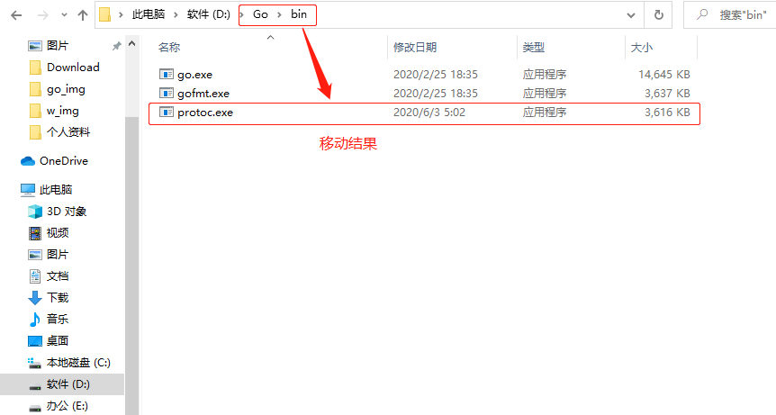

## **环境说明**

#### 准备工作

- go 语言环境
- [go-micro官网](https://github.com/micro/go-micro)

## **步骤说明**

**1. 下**



**2. 打**

```@cmd
protoc --version
```


**3. 安**


**4. 创建并编译 proto 文件**

- 生成.go文件

```@cmd
protoc -I . --micro_out=. --go_out=. ./filename.proto
```

**5. V**

