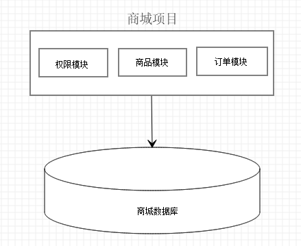
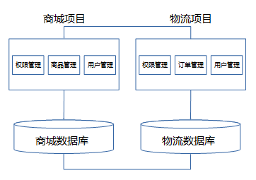
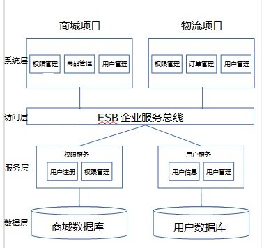
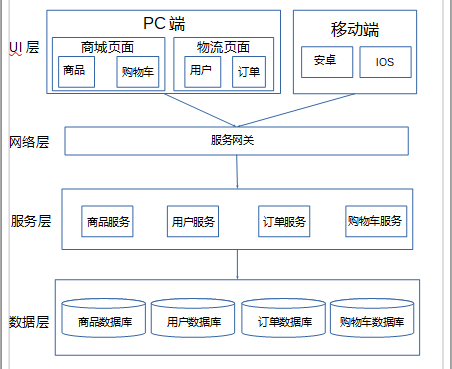
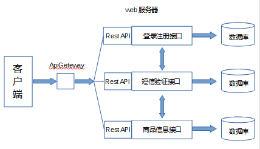
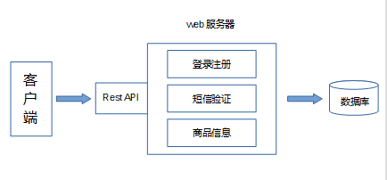
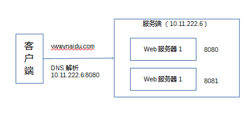
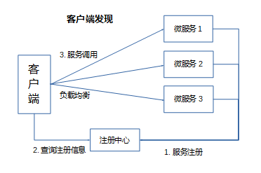
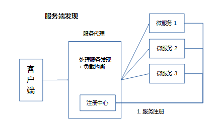

## **环境说明**

#### 准备工作

- go 语言基础
- 网路通讯技术
- 服务架构

## **步骤说明**

**1. 微服务特点**

- 单一职责
- 轻量级的通讯
- 隔离性
- 有自己的数据
- 技术多样性

**2. 架构演进**
单体架构 -> 垂直架构 -> SOA 架构 -> 微服务架构

2.1 单体架构：

- 所有功能集成在一个项目中
- 项目整个打包，可以部署到服务器运行
- 应用与数据库可以分开部署，提高性能
- 优点：
  - 小项目的首选，开发成本低，架构简单
- 缺点：
  - 项目复杂之后，很难扩展和维护
  - 扩展成本高，有瓶颈
  - 技术栈受限

2.2 垂直架构：

- 对于单体项目的拆分，大项目拆成单个的项目结构
- 存在数据冗余
- 项目之间要处理数据同步，通过数据库同步
- 优点：
  - 小项目的首选，架构简单
  - 避免了单体架构的无限扩大
  - 技术不在受限了
- 缺点：
  - 很多功能放在一个工程中，有一定瓶颈
  - 系统性能扩展要通过集群节点扩展，成本较高

2.3 SOA 架构（面向服务的架构）：

- 将重复性的功能进行抽取，抽取成对应的服务
- 通过 ESB 服务总线访问
- 优点：
  - 提高系统可重用性
  - ESB 减少系统接口耦合问题
- 缺点：
  - 系统与服务界限模糊，不利于开发
  - ESB 服务接口协议不固定，不利于系统维护
  - 抽取力度较大，有一些耦合性

2.4 微服务架构：

- 将服务层一个一个抽取为微服务
- 遵循单一原则
- 微服务之间采用一些轻量协议传输数据
- 优点：
  - 服务拆分力度非常细，利于开发
  - 提高系统可维护性
  - 比 ESB 更轻量
  - 适用于互联网更新换代快的情况
- 缺点：
  - 服务过多，服务治理成本高
  - 开发技术要求更高

**3. 微服务架构图**

- 微服务架构访问方式：
- 添加 ApiGeteway,对客户端暴露一套 API,方便调用

- 传统架构访问方式：
- Rest API：通过 url 定位资源，HTTP 描述操作（GET POST DELETE UPDATE 等）
  例如：
  获取商品，使用 GET/xxx/product
  添加商品，使用 POST/xxx/product
  修改商品，使用 PUT/xxx/product
  删除商品，使用 DELETE/xxx/product

**4. 微服务需要考虑的问题**
4.1 微服务如何通讯

- 从通讯模式考虑

|      | 一对一             | 一对多                 |
| ---- | ------------------ | ---------------------- |
| 同步 | 最常见             |                        |
| 异步 | 通知\-请求异步响应 | 发布点阅\-发布异步响应 |

- 从通讯协议考虑
  RPC

  4.2 微服务发现

- 传统服务一般通过 IP:端口号访问

- 微服务服务发现有 2 种方式（客户端发现和服务端发现）
- 客户端发现：微服务启动后，将自己的 IP 和端口进行注册，客户端查询注册，得到提供服务的 IP 和端口，通过负载均衡，访问微服务

- 服务端发现：客户端访问时，通过服务发现代理去直接访问

**5. 微服务部署/更新/扩容**

- 微服务部署到 docker 容器
- 涉及服务编排：K8S、swarm
