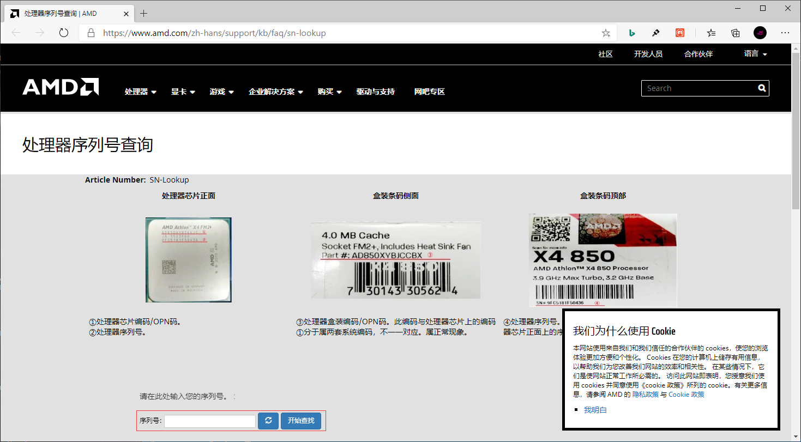
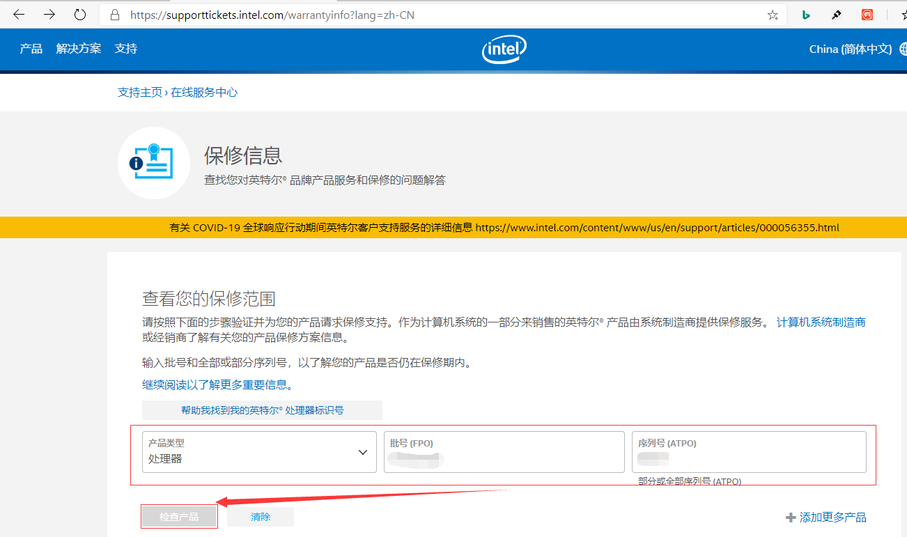
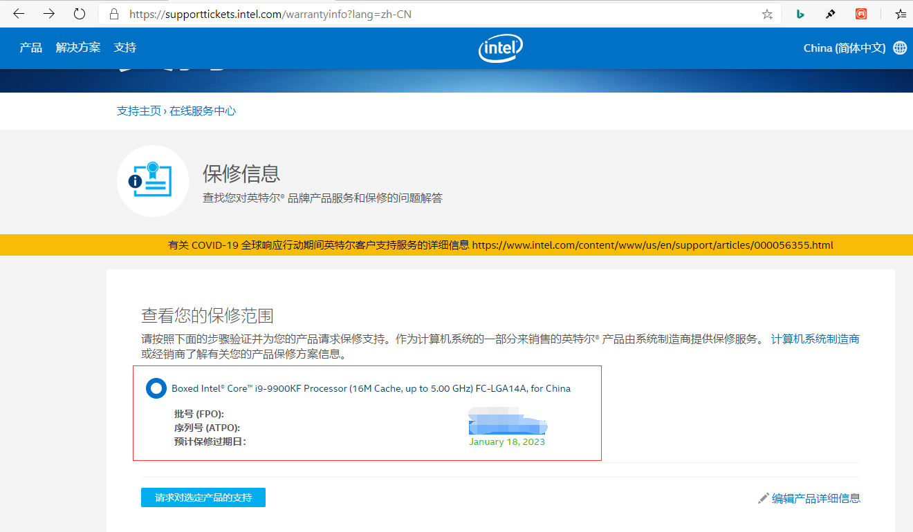

## **环境说明**
#### 准备工作
* [AMD处理器序列号查询官网](https://www.amd.com/zh-hans/support/kb/faq/sn-lookup)
* [Intel处理器序列号查询官网](https://supporttickets.intel.com/warrantyinfo?lang=zh-CN)
* [英特尔中国盒装处理器正版验证官网](http://cbaa.intel.com/)
* [序列号或ULT号查询方法](http://cbaa.intel.com/hint.aspx)

## **步骤说明**
#### AMD处理器
**1. 在浏览器中输入AMD SMS,或点击上面给的链接，进入后网站如下，直接输入CPU上的序列号点击查询即可**

#### Intel处理器
**1. 点击intel处理器序列号查询官网链接，填写对应的FPO和ATPO号，点击检测产品按钮即可**

#### 注意事项
