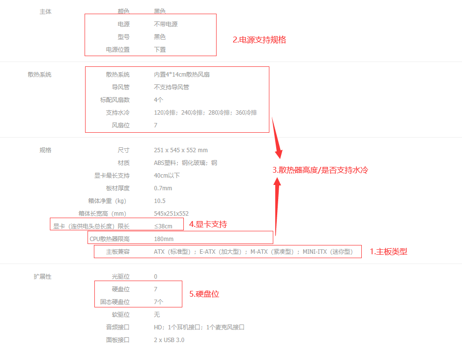
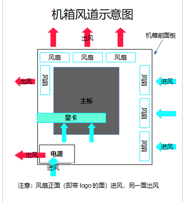

## 官网

- 
- 
- 

## 机箱选购

### 1.  机箱分类

| 分类 | 特点                                               | 其他 |
| ---- | -------------------------------------------------- | ---- |
| 全塔 | 体积特别大、比较贵、兼容主流消费级几乎所有配件     |      |
| 中塔 | 市场主流机箱、兼容主流消费级配件、大小适中         |      |
| mini | 比较小、只能兼容体积小的配件（itx 主板、sfx 电源） |      |

### 2. 机箱兼容性查看

- 以华硕（ASUS）TUF GAMING GT501 机箱参数为例：

### 3.  机箱用料

| 名称       | 参数                                   | 说明                                   |
| ---------- | -------------------------------------- | -------------------------------------- |
| 板材厚度   | 0.7mmSPCC                              | 比较合理/够用                          |
| 侧透用料   | 亚克力、钢化玻璃、钢化玻璃保护（防爆） | 价格对比：亚克力<钢化玻璃<钢化玻璃保护 |
| 接口扩展性 | usb 3.0\*2、Type-C                     | 一般有两个 usb 接口                    |
| 开机键位置 | 前顶部、右顶部                         | 看个偏好                               |

### 4. 散热风道

- CPU 散热风扇一般朝内存方向，电源风扇一般都是吸风的

### 5. 其他考虑因素

- 独立电源仓
- 机箱走线设计
- 显卡竖装
- 静音
- 防尘
