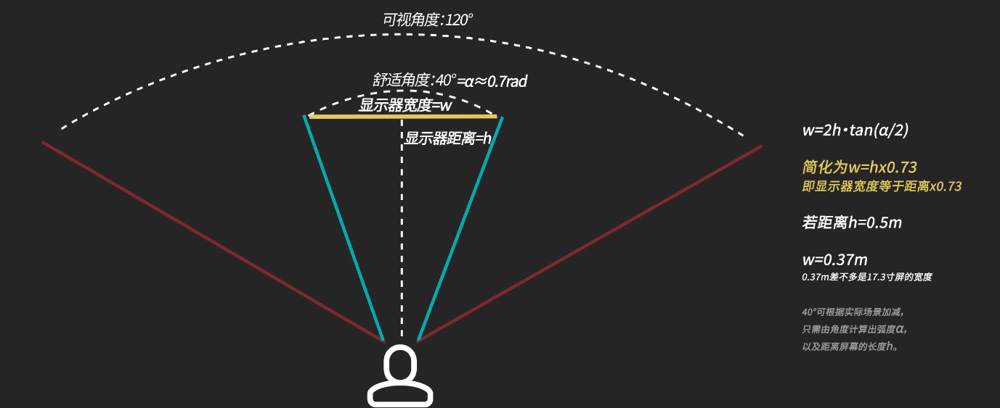
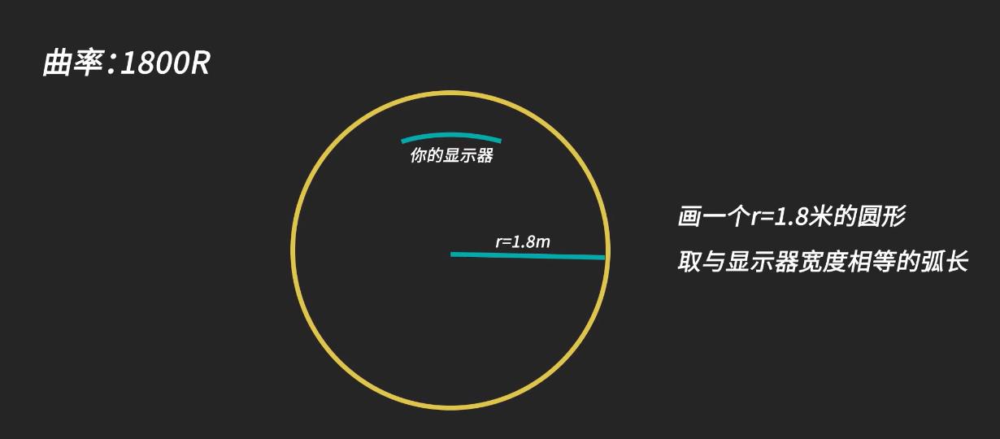
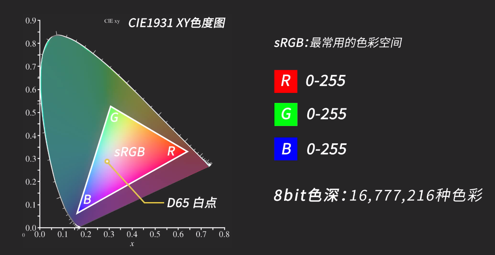
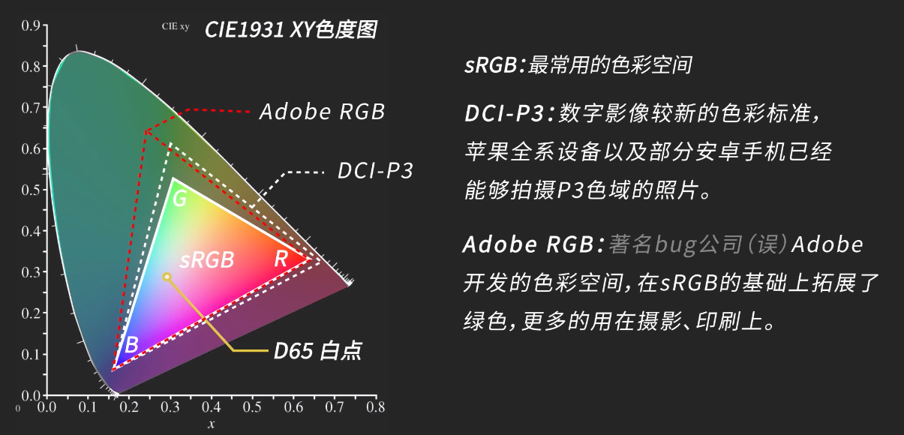
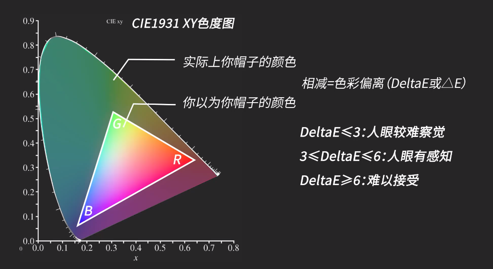
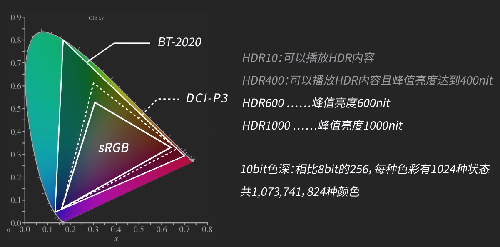

## 官网

[HDR 认证查询](https://displayhdr.org/certified-products/)

[面板查询](https://www.panelook.com/)

[显示器技术指标](https://www.displayspecifications.com/)

## 用途

### **1.  轻度使用**

电影、办公、休闲、MOBA、大部分单机大作、主机游戏等、色彩舒服画面清晰的场景

### 2.**专业用途**

设计、修图、绘画、剪辑、特效、建模（需要上色的，CAD 等图纸软件通常不需要）

### **3.  电子竞技游戏**

CS：：GO、彩虹六号、绝地求生、使命召唤等（FPS 类和部分 ACT 动作游戏为主）

## 尺寸和比例

### 1.比例参考

| 英寸  | 大小（cm）                     | 画面比例 |
| ----- | ------------------------------ | -------- |
| 15\.6 | 34x19                          | 16：9    |
| 17\.3 | 38x21                          | 16：9    |
| 19    | 42x24                          | 16：9    |
| 21    | 46x26                          | 16：9    |
| 24    | 53x30                          | 16：9    |
| 27    | 62x37                          | 16：9    |
| 32    | 70x40                          | 16：9    |
| <29   | 比 16：9 的小，不如买 Xperia 1 | 21：9    |
| 29    | 70x32                          | 21：9    |
| 34    | 80x34                          | 21：9    |
| 38    | 89x38                          | 21：9    |

注：特殊比例如 5：4/4：3（已过时）、16：10、32：9 的自行计算。

### 2.优缺点

16：9 兼容性最好，产品选择多，最便宜

16：10 单页文档、修图更舒适,mosOS 很多产品就是这个比例

21：9 大部分电影更爽、游戏沉浸、多窗口，视频与老游戏有黑边

32：9 预算多且不考虑兼容性问题，否则不建议

### 3.如何选择合适的显示器

计算方式如下图：

| 桌面尺寸（m）    | 建议显示器尺寸（寸）            | 说明                      |
| ---------------- | ------------------------------- | ------------------------- |
| 长度 ≤1          | ≤24 或 15\.6、17\.3 便携显示器  | 主要取决于桌子的宽度/深度 |
| >1\.2\(宽\)x0\.6 | 27 寸的 16：9 或 29 寸的 21：9  | 主要取决于桌子的宽度/深度 |
| ≥1\.4x0\.8       | 32 寸的 16：9 或 34 寸的 21：9⬆ | 主要取决于桌子的宽度/深度 |

## 显示器参数

### 1.分辨率与刷新率

| 名称      | 分辨率    | 优缺点                                                                                                                                                                  |
| --------- | --------- | ----------------------------------------------------------------------------------------------------------------------------------------------------------------------- |
| "1080P: " | 1920x1080 | 大部分笔记本电脑、手机的分辨率，够用，但时网页、文档的文字容易出现锯齿感，修图、剪辑的精细度不太好，显卡不是太好的情况下玩游戏比较合适，27 寸及以上建议 2K 或以上分辨率 |
| 2K/1440P  | 2560x1440 | "相比 1080P,是个折中的选择，可以不开启 Windows 的显示缩放，以避免文字渲染出现模糊，但比 1080P 会带来双倍的显卡压力"                                                     |
| 4K/2160P  | 3840x2160 | 对修图、建模有明显提升，需要开启 Windows 的显示缩放，价格比较贵，显卡要好（≥RTX2080TI）                                                                                 |
| 8K        | 7680x4320 | 目前较少                                                                                                                                                                |

### 2.刷新率：显示器一秒种内能显示多少幅画面（与帧数对应）

2K 144Hz: 大部分游戏的理想选择，大小金钢显示器都是这个组合

_2K 240Hz: 多为可视角度、色彩不理想的 TN 屏，也看不出多大区别（不建议）_

1080P 144Hz: 预算有限却又想玩 FPS 类游戏的不错选择

_4K 144Hz: 主机配置要好，显卡要 RXT 2080Ti 以上_

| 性价比（1000 元以下）                    | 主流（1500 元）                          | 中高端（2500 元）                                                          | 高端（3500\+元）                                                     |
| ---------------------------------------- | ---------------------------------------- | -------------------------------------------------------------------------- | -------------------------------------------------------------------- |
| 1080P 60Hz\(常见，做工用料一般【推荐】\) | 1080P 60Hz\(带鱼屏或做工优秀\)           | 2K 60Hz\(出厂校色、高色域、HDR、Type\-c 接口、升降支架或带鱼屏，做工优秀\) | 2K 144Hz\(通常为低延迟 IPS 屏，做工优秀\)                            |
| 2K 60Hz\(较少，做工用料较差\)            | 2K 60Hz\(常见，做工用料较好\)            | 2K 144Hz\(常见，做工用料较好\)                                             | 4K 60Hz\(通常有窄边框，Display HDR 认证、Type\-c 接口等，做工优秀\)  |
| 1080P 144Hz\(VA 或 TN 屏，做工差\)       | 1080P 144Hz\(做工用料一般\)              | 4K 60Hz\(常见，做工用料较好\)                                              | 2K 240Hz\(通常为高端 TN 屏，高色域，外形炫酷，做工优秀，可视角度差\) |
| 无                                       | 4K 60Hz/2K 144Hz\(做工用料一般或 VA 屏\) | 1080P 240Hz\(一般是 TN 屏，做工优秀，可视角度差\)                          | 4K 144Hz\(两者兼顾、价格太贵，另需 DP1\.4\\HDMI2\.1\)                |

注：橙色部分为该价位推荐

### 3.面板材质选择

| 面板类型           | IPS                            | VA                                   | TN（不推荐）             |
| ------------------ | ------------------------------ | ------------------------------------ | ------------------------ |
| 色彩               | 色彩准确 ⭐⭐⭐⭐⭐            | 色彩鲜艳 ⭐⭐⭐⭐                    | 色彩较差 ⭐⭐            |
| 可视角度           | 好 ⭐⭐⭐⭐⭐                  | 较好 ⭐⭐⭐⭐                        | 差 ⭐                    |
| 高刷新率（高帧率） | 一般 ⭐⭐⭐                    | 一般 ⭐⭐⭐                          | 好 ⭐⭐⭐⭐⭐            |
| 响应速度（拖影）   | 一般 ⭐⭐⭐                    | 较差 ⭐⭐                            | 好 ⭐⭐⭐⭐⭐            |
| 其他特点           | 会漏光，综合最好，做什么都合适 | 便宜，多为曲面屏，漏光少，适合看电影 | 高刷新，低响应，专业电竞 |

### 4.曲率

### 5.色彩亮度

注意：99% sRGB ≈ 72% NTSC,但 72% NTSC≠99% sRGB

### 6.色准(DeltaE)

### 7.亮度

计算方式：1 尼特（nit）=1 坎德拉/平方米（cd/m2）

建议保证显示器最大亮度在 300nit 或以上，最低 250nit

### 8.HDR(根据亮度来认证的)

### 9.接口

| 接口名称    | 包含类型                    | 说明                                                                          |
| ----------- | --------------------------- | ----------------------------------------------------------------------------- |
| Displayport | "DP, miniDP"                | "DP2\.0:16K 60;DP1\.4:8K 60,4K 144;DP1\.2:4K 60,2K 144"                       |
| HDMI        | "HDMI, miniHDMI, mircoHDMI" | "HDMI2\.1:10K 60,4K 120;HDMI2\.0:4K 60,2K 120;HDMI1\.4:4K 30,2K 60,1080P 120" |
| 过时        | "DVI, VGA"                  | "DVI:2K 60,1080P 120;VGA:1080P 60Hz\(效果差\)"                                |
| Type\-C     |                             | 未来主流（目前价格较贵）                                                      |

### 10.VRR（variable refresh rate）技术

| Name      | 开发商 | 作用                                                   |
| --------- | ------ | ------------------------------------------------------ |
| Free Sync | AMD    | 使显示器的刷新率和游戏帧数同步，防止画面撕裂           |
| GSync     | NVIDIA | 使显示器的刷新率和游戏帧数同步，防止画面撕裂【价格贵】 |

### 11.IPS 对比

P-IPS > H-IPS > S-IPS > AH-IPS > E-IPS

### 12.支架

| 分类           | 优缺点                                       |
| -------------- | -------------------------------------------- |
| 传统支架       | 看起来炫酷，不可调节高度，旋转，有的容易晃动 |
| 可升降旋转支架 | 可调高度，旋转，俯仰，带有收纳线缆功能       |
| 气动支架       | 显示器背面要有 VESA 孔位                     |

### 13.边框

越窄越好，指显示器可显示的画面到屏幕边缘的距离
