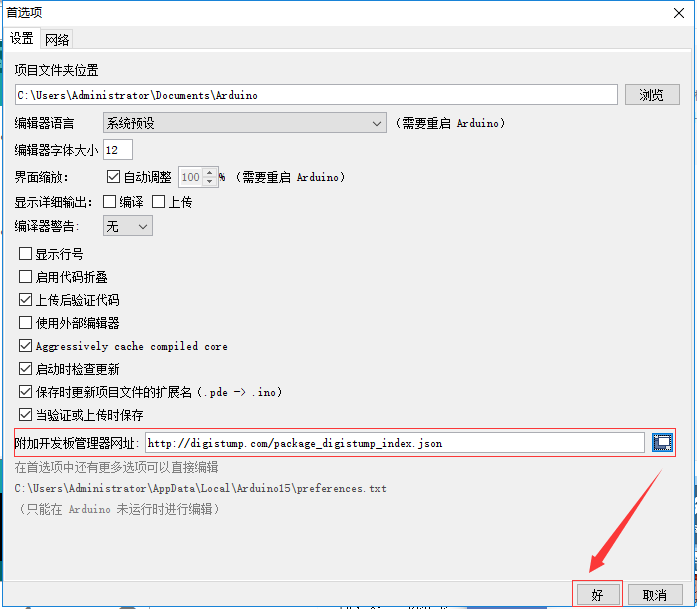
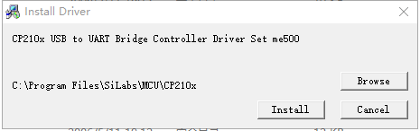
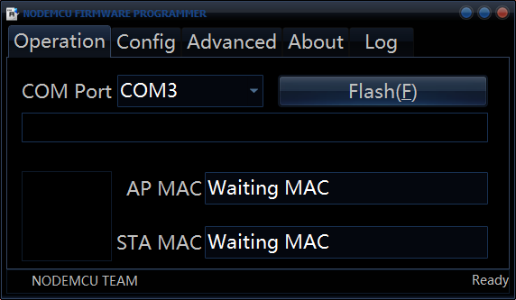
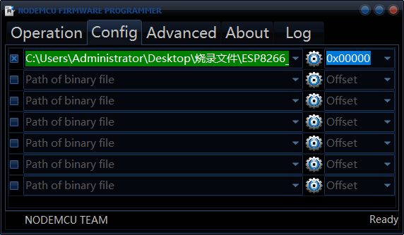
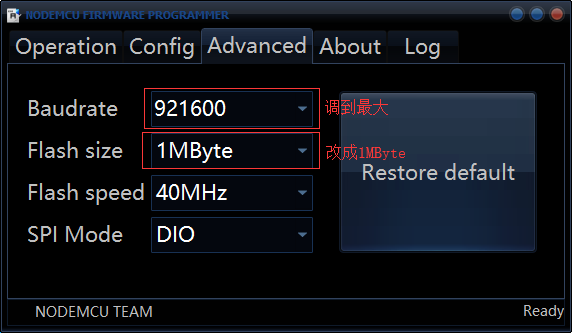
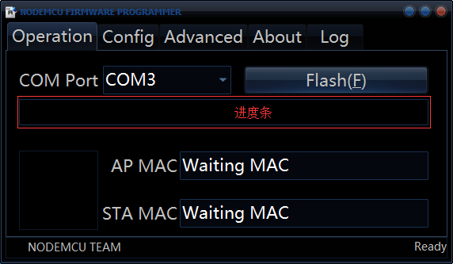

## **环境说明**
#### 准备工作
* Windows 10 1909版本（Windows系统）
* ESP8266开发板(硬件)
* USB数据线
* [开发工具(IDE)](https://www.arduino.cc/en/Main/Software)
* 驱动程序PreInstaller

## **步骤说明**
**1.下载arduino-1.8.9并添加badusb库，打开ArduinoIDE后，点击文件-->首选项，开发板的管理器网址如下：**
```
http://digistump.com/package_digistump_index.json
```


**2. 安装驱动程序，运行PreInstaller.exe程序，点击Install按钮**


**3. 烧录程序**
* 3.1 运行ESP8266Flasher.exe程序，将开发板连接USB线并连接到电脑上，它会自动识别端口，如COM3


* 3.2 点击Config按钮，选择配置程序（ESP8266_Deauther_v2.0.5_1MB.bin）所在目录


* 3.3 点击Advanced按钮，配置Baudrate和Flash size参数


* 3.4 再次点击Operation按钮，点击Flash按钮


**4. 配置管理程序**
* 4.1 将USB线从电脑拔下，再插入

* 4.2 打开网络连接，搜索名为pwned的wifi,输入密码（deauther）点击连接

* 4.3 打开浏览器，在地址栏输入192.168.4.1，进入配置页面

* 4.4 点击我已阅读此条款后，点击Scan菜单，再点击SCAN APS(扫描)，若页面没有加载出扫描结果，再点击Scan菜单，最上面的wifi即为自己的WiFi，点击勾选，即为选择要攻击哪个WiFi

* 4.5 点击Attacks菜单，点击Deauth后面的START按钮
（注意：若是Beacon攻击方式，需要先在SSIDs菜单中添加若干个WiFi）

**5. 测试**
* 手机连接被攻击的WiFi，看能不能上网，点击stop按钮后，可以正常上网

#### 注意事项