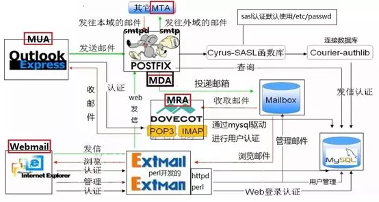

## **环境说明**

#### 准备工作

- Ubuntu 16.04.5 LTS
- Courier-authlib

## **步骤说明**

**1. Postfix 基于虚拟用户虚拟域的邮件架构**



- 用户可以基于 outlook 连接 postfix 然后通过 Courier-authlib 连接到 Mysql 进行认证，认证成功就可以发送邮件。前面我们也是用 Cyrus-sasl 进行 shadow 用户认证，其实 Cyrus-sasl 也同样支持 Mysql 认证。但是由于驱动比较底层配置起来比较繁琐，所以选用 Courier-authlib 进行认证，但是从上图可以看出我们是 postfix 还是借用 Cyrus-sasl 函数库与 Courier-authlib 进行连接。同样的道理 Postfix 也可以直接连接到 Courier-authlib 但是比较麻烦。
- 用户可以基于 outlook 连接 Dovecot 然后直接到 mysql 进行认证，认证成功就可以接收 Mailbox 中的邮件。这里比较简单，因为 Dovecot 自身支持到 Mysql 的认证。
- 用户可以基于 webmail 进行收发邮件，同样通过 Extmail/Extman 到 Mysql 中认证，认证成功。就可以基于 postfix 发邮件，基于 Dovecot 收邮件。但是 Extmail/Extman 自身就可以到 Mailbox 中收取邮件。

**2. Courier 介绍**

- Courier 是一个优秀的电子信件系统，拥有一个完整的邮件系统：其提供 MTA（Courier-MTA），MDA（Maildrop），MUA，MRA（Courier-IMAP），SASL（Courier-authlib）WebMail（sqwebmail）等这些组件。
- Courier-authlib 是 Courier 组件中的认证库，它是 courier 组件中一个独立的子项目，用于为 Courier 的其它组件提供认证服务。其认证功能通常包括验正登录时的帐号和密码、获取一个帐号相关的家目录或邮件目录等信息、改变帐号的密码等。而其认证的实现方式也包括基于 PAM 通过/etc/passwd 和/etc/shadow 进行认证，基于 GDBM 或 DB 进行认证，基于 LDAP/MySQL/PostgreSQL 进行认证等。因此，courier-authlib 也常用来与 courier 之外的其它邮件组件(如 postfix)整合为其提供认证服务。

**3. 虚拟用户虚拟域配置**

```@Terminal
yum install libtool-ltdl libtool-ltdl-devel   #安装ltdl动态模块加载器
yum install expect      #安装expect主机间通信
#创建用户
groupadd -g 1001 vmail
useradd vmail -u 1001 -g 1001
```

**4. 安装 Courier-authlib**

```@Terminal
tar xvf courier-authlib-0.66.1.tar.bz2 -C /usr/src/
cd /usr/src/courier-authlib-0.66.1
./configure \
--prefix=/usr/local/courier-authlib \
--sysconfdir=/etc \
--without-authpam \
--without-authshadow \
--without-authvchkpw \
--without-authpgsql \
  #以上without是不支持此类认证免得需要安装依赖的数据包
--with-authmysql \
  #基于mysql认证
--with-mysql-libs=/usr/lib64/mysql \
--with-mysql-includes=/usr/include/mysql \
  #需要mysql的头文件和库文件路径一定要正确
--with-redhat \
  #如果是redhat系统会实现自我优化；如果不是就不要加了
--with-authmysqlrc=/etc/authmysqlrc \
  #提供给mysql的配置文件，记录认证怎样跟数据进行交互
--with-authdaemonrc=/etc/authdaemonrc \
  #courier-authlib自身是一个服务进程所以也需要一个配置文件
--with-mailuser=vmail \
--with-mailgroup=vmail \
  #用户邮件收发管理的用户和组
make && make install
```

**5. 调整配置文件**

```@Terminal
chmod 755 /usr/local/courier-authlib/var/spool/authdaemon   #调整一下authdaemon的权限（存放进程套接字）
cp -p /etc/authdaemonrc.dist  /etc/authdaemonrc   #调整courier文件名,因--with-authdaemonrc=/etc/authdaemonrc指定了文件名
cp -p /etc/authmysqlrc.dist  /etc/authmysqlrc   #调整跟mysql交互文件名,因--with-authmysqlrc=/etc/authmysqlrc指定了文件名
```

**6. 调整 courier-authlib 配置文件**

```@Terminal
# vim /etc/authdaemonrc
authmodulelist="authmysql"    #指定认证模块为authmysql
authmodulelistorig="authmysql"    #认证的原始模块只保留authmysql
daemons=10    #修改默认开启进程
#DEBUT-LOGIN=2    #如果使用虚拟用户登录有问题就打开调试功能看看日志；不然不要打开
```

**7. 调整通过 MYSQL 进行邮件账号认证文件**

```@Terminal
vim /etc/authmysqlrc
MYSQL_SERVER localhost
  #指定Mysql服务器地址
MYSQL_USERNAME extmail
  #连接数据库的用户名(如果不使用extmail，那么在extman中需要重新指定账号)
MYSQL_PASSWORD extmail
  #用户密码
MYSQL_PORT 3306
  #指定你的mysql的端口(使用socket通信就不用端口)
MYSQL_SOCKET /var/lib/mysql/mysql.sock
  #Mysql的套接字文件
MYSQL_DATABASE  extmail
  #存储用户的库(如果不使用extmail，那么在extman中都要更改)
MYSQL_USER_TABLE  mailbox
  #存储用户的表（mailbox是extman帮我们自动生成的不能改）
MYSQL_CRYPT_PWFIELD  password
  #认证密码字段
MYSQL_UID_FIELD  '1001'
  #vmail用户的UID
MYSQL_GID_FIELD  '1001'
  #vmail用户的GID
MYSQL_LOGIN_FIELD  username
  #认证账号字段
MYSQL_HOME_FIELD  concat('/var/mailbox/',homedir)
  #concat是mysql的一个函数用来把/var/mailbox/跟homedir连接成一个路径(homedir是mysql的一个变量值为每一个用户名)
MYSQL_NAME_FIELD  name
  #用户全名字段，默认
MYSQL_MAILDIR_FIELD  concat('/var/mailbox/',maildir)
  #虚拟用户的邮件目录
```

**8. Courier-authlib 提供 SysV 服务脚本**

- 可以使用 pstree -a 可以看到 authdaemond 已经生成了 11 个进程，我们开启了 10 个，但是有一个主进程负责生成其他进程。

```@Terminal
cd /usr/src/courier-authlib-0.66.1/
cp courier-authlib.sysvinit /etc/rc.d/init.d/courier-authlib
chmod 755 /etc/init.d/courier-authlib
chkconfig --add courier-authlib
chkconfig courier-authlib on
service courier-authlib start
```

**9. 建立虚拟用户邮箱目录**

```@Terminal
mkdir -pv /var/mailbox
chown -R vmail /var/mailbox
```

**10. 更改 SASL 认证模式为 authdaemond**

- Postfix 的 SMTP 认证需要透过 Cyrus-SASL 连接到 authdaemon 获取认证信息

```@Terminal
vim /usr/lib64/sasl2/smtpd.conf
#pwcheck_method: saslauthd
#mech_list: PLAIN LOGIN
#注释前面实验使用SASL认证的参数
pwcheck_method: authdaemond
log_level: 3
mech_list:PLAIN LOGIN
authdaemond_path:/usr/local/courier-authlib/var/spool/authdaemon/socket
```

**11. 让 Postfix 支持虚拟用户及虚拟域**

```@Terminal
vim /etc/postfix/main.cf
#################Virtual Mailbox Settings###################
virtual_mailbox_base = /var/mailbox
  #用户邮箱目录（跟这个参数MYSQL_HOME_FIELD定义的要一致）
virtual_mailbox_maps = mysql:/etc/postfix/mysql_virtual_mailbox_maps.cf
  #用来查询用户账号信息（这个配置文件中定义了SQL语句，使用extmail用户）
virtual_mailbox_domains = mysql:/etc/postfix/mysql_virtual_domains_maps.cf
  #用来查询虚拟域
virtual_alias_domains =
virtual_alias_maps = mysql:/etc/postfix/mysql_virtual_alias_maps.cf
  #用来查询用户别名
virtual_uid_maps = static:1001
virtual_gid_maps = static:1001
  #每一个虚拟用户都映射为系统用户vmail
virtual_transport = virtual
  #指定MDA专门为虚拟用户投递代理
virtual_mailbox_limit = 20971520
  #磁盘配额
```

**12. 安装 Httpd**

```@Terminal
yum install httpd
```

**13. 安装 extman**

```@Terminal
tar zxvf extman-1.1.tar.gz -C /usr/src/
cd /usr/src/extman-1.1/docs
service mysqld restart
mysql -u root < extmail.sql
mysql -u root < init.sql
mysql -u root -B -e "show databases;"
```

**14. 从 Extman 中复制 Postfix 支持虚拟用户和虚拟域及连接 mysql 的文件**

```@Terminal
cd /usr/src/extman-1.1/docs
cp mysql_virtual_mailbox_maps.cf /etc/postfix/
cp mysql_virtual_domains_maps.cf /etc/postfix/
cp mysql_virtual_alias_maps.cf /etc/postfix/
cp mysql_virtual_limit_maps.cf /etc/postfix/
cat /etc/postfix/mysql_virtual_domains_maps.cf
```

**15. 取消前面配置的中心域**

- 使用虚拟域的时候，就需要取消中心域的使用，myhostname、mydomain、myorigin、mydestination，所以现在 main.cf 配置文件需要添加的参数如下所示：

```@Terminal
vim /etc/postfix/main.cf
#################Center Domain Settings###########
mynetworks = 127.0.0.0/8
#mydestination = $myhostname, localhost.$mydomain, localhost, $mydomain
#myhostname = smtp.ywnds.com
#mydomain = ywnds.com
#myorigin = $mydomain
#home_mailbox = Maildir/
```

**16. 配置 Dovecot 基于 MySQL 认证**

```@Terminal
vim /etc/dovecot/dovecot.conf
#Ssl = no
#disable_plaintext_auth = no
#mail_location = maildir:~/Maildir

#把dovecot主配置文件/etc/dovecot/dovecot.conf中刚开始添加的几行数据注释掉

[root@localhost ~]# vim /etc/dovecot/conf.d/10-mail.conf
mail_location = maildir:/var/mailbox/%d/%n/Maildir

  #添加此行指定邮件的提取位置
[root@localhost ~]# vim /etc/dovecot/conf.d/10-auth.conf
disable_plaintext_auth = no
  #开启明文验证（可以选择把dovecot.conf配置文件中的此参数关闭）
auth_mechanisms = plain login
  #支持验证方法
#!include auth-system.conf.ext
  #取消默认系统验证
!include auth-sql.conf.ext
  #开启mysql验证
#auth_verbose = yes
  #认证详细日志，调试可以打开
[root@localhost ~]# vim /etc/dovecot/conf.d/auth-sql.conf.ext
passdb {
  driver = sql
  #args = /etc/dovecot/dovecot-sql.conf.ext
  args = /etc/dovecot/dovecot-sql.conf
}
userdb {
  driver = sql
  #args = /etc/dovecot/dovecot-sql.conf.ext
  args = /etc/dovecot/dovecot-sql.conf
}
```

- 在这个 MySQL 验证文件中指定了用户的账号和密码需要通过/etc/dovecot/dovecot-sql.conf 这个文件去数据库中取。

```@Terminal
vim /etc/dovecot/dovecot-sql.conf
driver = mysql
connect = host=localhost dbname=extmail user=extmail password=extmail
default_pass_scheme = CRYPT
password_query = SELECT username AS user,password AS password FROM mailbox WHERE username = '%u'
user_query = SELECT maildir,uidnumber AS uid,gidnumber AS gid FROM mailbox WHERE username = '%u'

解释:
Driver
  #Dovecot使用自带的驱动连接MySQL

Connect
  #连接本地mysql；数据库extmail；用户extmail；密码extmail。
  #说明：如果mysql服务器是本地主机，即host=localhost时，如果mysql.sock文件不是默认的/var/lib/mysql/mysql.sock，可以使用host=“sock文件的路径”来指定新位置；
  #例如，使用通用二进制格式安装的MySQL，其sock文件位置为/tmp/mysql.sock，相应地，connect应按如下方式定义connect = host=/tmp/mysql.sock dbname=extmail user=extmail password=extmail。

Default_pass_scheme
  #表明我们的密码为加密存放

Password_query
  #找密码查询哪个字段

User_query
  #找账号查询哪个字段
 PS：dovecot其实也提供了这么一个配置文件模板，在/usr/share/doc/dovecot-2.0.9/example-config/dovecot-sql.conf.ext
```

**17. 启动所有服务**

```@Terminal
service dovecot restart
service postfix restart
service courier-authlib restart
service mysqld restart
```

**18. 测试虚拟用户**

```@Terminal
/usr/local/courier-authlib/sbin/authtest -s login postmaster@extmail.org extmail
```

## **注意事项**
