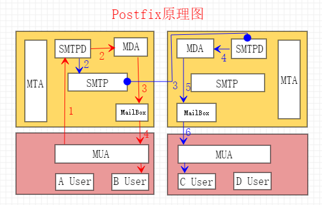

## **通讯协议**

#### 邮件相关协议

**1. SMTP（Simple Mail Transfer Protocol）：简单邮件传输协议**

- 工作在 TCP 的 25 端口。它是一组用于由源地址到目的地址传送邮件的规则，由它来控制信件的中转方式。跟名字一样 smtp 非常简单，无法做到认证，邮件存放等功能。

**2. POP3（Post Office Protocol）：邮局协议**

- 工作在 TCP 的 110 端口。本协议主要用于支持使用客户端远程管理在服务器上的电子邮件。POP 协议支持“离线”邮件处理。其具体过程是：邮件发送到服务器上，电子邮件客户端调用邮件客户机程序以连接服务器，并下载所有未阅读的电子邮件。这种离线访问模式是一种存储转发服务，将邮件从邮件服务器端送到个人终端机器上，一般是 PC 机或 MAC。一旦邮件发送到 PC 机或 MAC 上，邮件服务器上的邮件将会被删除。但目前的 POP3 邮件服务器大都可以“只下载邮件，服务器端并不删除”，也就是改进的 POP3 协议。

**3. IMAP4（Internet Mail Access Protocol）：因特网邮件访问协议**

- 工作在 TCP 的 143 端口。IMAP4 协议与 POP3 协议一样也是规定个人计算机如何访问网上的邮件的服务器进行收发邮件的协议，但是 IMAP4 协议同 POP3 协议相比更高级。IMAP4 支持协议客户机在线或者离开访问并阅读服务器上的邮件，还能交互式的操作服务器上的邮件。IMAP4 协议更人性化的地方是不需要像 POP3 协议那样把邮件下载到本地，用户可以通过客户端直接对服务器上的邮件进行操作（这里的操作是指：在线阅读邮件 在线查看邮件主题 大小 发件地址等信息)。用户还可以在服务器上维护自己邮件目录（维护是指移动）新建 删除 重命名 共享 抓取文本 等操作)。IMAP4 协议弥补了 POP3 协议的很多缺陷。

#### 相关名词

- 一般情况下，我们把电子邮件程序分解成传输代理，投递代理用户代理。用户代理用来接受用户的指令，将用户的信件传送至信件传输代理.而投递代理则从信件传输代理取得信件传送至最终用户的邮箱.当用户试图发送一封电子邮件的时候，他并不能直接将信件发送到对方的机器上，用户代理必须试图去寻找一个信件传输代理，把邮件提交给它。信件传输代理得到了邮件后，首先将它保存在自身的缓冲队列中，然后，根据邮件的目标地址，信件传输代理程序将找到应该对这个目标地址负责的邮件传输代理服务器， 并且通过网络将邮件传送给它。对方的服务器接收到邮件之后，将其缓冲存储在本地，直到电子邮件的接收者查看自己的电子信箱。

**1. MAT（Mail Transfer Agent）**

- 邮件传输代理工具，通过 SMTP 协议所指定的服务器,就可以把 E-mail 寄到收信人的服务器上了，整个过程只要几分钟。SMTP 服务器则是遵循 SMTP 协议的发送邮件服务器，用来发送或中转发出的电子邮件。
- 常用的 MTA 有：

| 名称     | 说明                                                                                                             |
| -------- | ---------------------------------------------------------------------------------------------------------------- |
| SendMail | 邮件的鼻祖                                                                                                       |
| Qmail    | 一个数学家开发，作为 Linux 下面主流的邮件系统内核，大量著名的商业邮件系统都是在 Qmail 内核下开发，比如 Hotmail。 |
| Postfix  | IBM 安全专家开发，模块化设计，并且比 sendmail 兼容效率更高。                                                     |
| Exim     | 基于 GPL 协议的开放源代码软件，由英国剑桥大学的 Philip Hazel 开发。                                              |
| Exchange | 微软公司的一套电子邮件服务组件，是个消息与协作系统。                                                             |

**2. MDA（Mail Delivery Agent）**

- 邮件投递代理，投递代理则从信件传输代理取得信件传送至最终用户的邮箱。
- 常用的 MDA 有：

| 名称     | 说明                         |
| -------- | ---------------------------- |
| ProcMail | Postfix 默认的邮件投递工具。 |
| MailDrop | 相对比较专业的投递代理工具。 |

**3. MRA(Mail Retrieval Agent)**

- 邮件取回代理，使用 POP3 或 IMAP4 协议工作。一般用于从用户信箱取回邮件到邮件用户代理客户端。
- 常用的 MRA 有：

| 名称    | 说明                                                                 |
| ------- | -------------------------------------------------------------------- |
| Dovecot | 是一个开源的支持 IMAP 和 POP3 协议的收邮件服务器（自带 SASL 功能）。 |

**4. MUA(Mail User Agent)：邮件用户代理工具**

- 常用的 MUA 有：

| 名称        | 说明                           |
| ----------- | ------------------------------ |
| OE          | Windows 旧版本自带的工具。     |
| Outlook     | Office 套件带的工具。          |
| FoxMail     | 腾讯公司的邮件客户端工具。     |
| Thunderbird | 雷鸟是 Linux 下的客户端工具。  |
| Mutt        | Linux 下的字符界面客户端工具。 |

**5. WebMail**

- 基于 Web 的电子邮件收发系统，扮演邮件用户代理角色，一般而言，WebMail 系统提供邮件收发、用户在线服务和系统服务管理等功能。WebMail 的界面直观、友好，不需要借助客户端，免除了用户对 E-mail 客户软件（如：Foxmail、Outlook 等）进行配置时的麻烦，只要能上网就能使用 WebMail，方便用户对邮件进行接收和发送。WebMail 使得 E-mail 在 Internet 上的应用广泛。
- 常用的 Webmail 有：

| 名称            | 说明                           |
| --------------- | ------------------------------ |
| Openwebmail     | 台湾开发的。                   |
| Squirrelmail    | Centos 系统自带。              |
| Extmail，Extman | 国内开发的也被称为 EMOS 系统。 |

**6. Mail Relay**

- 邮件中继，先要明白一个概念，一封邮件只要不是发送给本域内用户的，比如从当前域发送到另一个域，或从当前域发送到另一个域然后转到另外一个域的，这就属于中继。但是一般邮件服务器都会允许本地或本域内的用户进行中继。不然就只能在本域内发送邮件而不能给外部邮箱发送邮件。Postfix 默认只能基于 IP 地址做中继认证。

**7. SASL（simple authentication secure layer）**

- 简单认证安全层，是一种用来扩充 C/S 模式验证能力的机制。在 Postfix 可以利用 SASL 来判断用户是否有权使用转发服务，或是辨认谁在使用你的服务器。
- 常用的 Sasl 有：

| 名称            | 说明                                                                       |
| --------------- | -------------------------------------------------------------------------- |
| cyrus-sasl      | Redhat 系列自带的 SASL 认证框架。                                          |
| dovecot-sasl    | dovecot 组件带的 SASL 认证框架。                                           |
| courier-authlib | 这是一个带有 MTA，MDA 以及 SASL 认证的软件，但是一般只是用它的 SASL 功能。 |

#### Postfix 介绍

- Postfix 是 Wietse Venema 在 IBM 的 GPL 协议之下开发的 MTA（邮件传输代理）软件。是为了改良 sendmail 邮件服务器而产生的。
- 特点如下：
  **1. postfix 是免费的**
- postfix 想要作用的范围是广大的 Internet 用户，试图影响大多数的 Internet 上的电子邮件系统，因此它是免费的。

**2. 更快**

- postfix 在性能上大约比 sendmail 快三倍。一部运行 postfix 的台式 PC 每天可以收发上百万封邮件。

**3. 兼容性好**

- postfix 是 sendmail 兼容的，从而使 sendmail 用户可以很方便地迁移到 postfix。Postfix 支持/var[/spool]/mail、/etc/aliases、 NIS、和 ~/.forward 文件。

**4. 更健壮**

- postfix 被设计成在重负荷之下仍然可以正常工作。当系统运行超出了可用的内存或磁盘空间时，postfix 会自动减少运行进程的数目。当处理的邮件数目增长时，postfix 运行的进程不会跟着增加。

**5. 更灵活**

- postfix 是由超过一打的小程序组成的，每个程序完成特定的功能。你可以通过配置文件设置每个程序的运行参数。

**6. 安全性**

- postfix 具有多层防御结构，可以有效地抵御恶意入侵者。如大多数的 postfix 程序可以运行在较低的权限之下，不可以通过网络访问安全性相关的本地投递程序等等。

#### Postfix 服务器工作原理

- 邮件服务器工作在两种情况下：一种是相同域内转发；二是不同域内转发。所以 MTA（postfix）内部一般都会有服务端（smtpd）、客户端（smtp）和 MDA。smtpd 邮件服务器非常简单，只负责转发邮件别的什么功能也没有并且发送方不管是什么地址都可以从 smtpd 服务器转发到目标地址。

- 邮件服务器两种工作机制：
  **1. 相同域内转发**
- 用户 A 通过工具连接到 SMTPD 服务端，然后发送一份邮件，而目标收件人是 B 用户。当 SMPTD 收到邮件后判断发现是同域内的用户，就会直接启动 MDA 进程把邮件投进用户邮箱中，当用户通过 MUA 工具（如 mail 命令）就可以直接收到邮件。

**2. 不同域内转发**

- 用户 A 通过工具连接到 SMTPD 服务端，然后发送一份邮件，而目标收件人是 C 用户。当 SMPTD 收到邮件后判断发现是不同域内用户，就会启动 SMTP 客户端来转发此邮件。SMTP 收到请求后就会解析对方 MX 记录，然后连接对方 SMTPD 服务器并把邮件发送过去。当对方 SMTPD 发现此邮件就是本域内的邮件后也会调用 MDA 进程把邮件投递进用户邮箱中，当用户通过 MUA 工具（如 mail 命令）就可以直接收到邮件。

#### 总结
