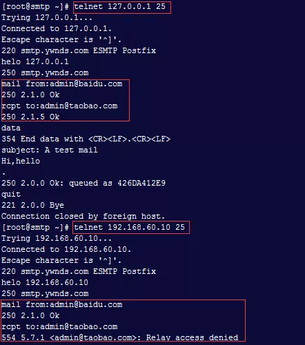

## **环境说明**

#### 准备工作

- Ubuntu 16.04.5 LTS
- MRA 邮件取回代理工具：courier-imap/cyrus-imap/dovecot

## **步骤说明**

**1. Dovecot 特性**

- 高安全性
- 高性能
- 支持 pop3,imap4,pops,imaps 收邮件协议
- 易于管理和扩展性
- 支持两种邮箱格式

**2. 安装 Dovecot**

```@Terminal
yum install dovecot dovecot-mysql
```

- 修改配置文件

```@Terminal
vim /etc/dovecot/dovecot.conf
ssl = no    #禁止SSL机制，不然后面telnet无法连接测试
disable_plaintext_auth = no   #允许明文密码验证，不然账号连接不上
mail_location = maildir:~/Maildir   #设置邮件存储格式及位置（Dovecot收邮件的方式一定要与Postfix收邮件方式相同）
protocols = imap imaps pop3 pop3s   #开启支持的收邮件协议
service dovecot start
chkconfig dovecot on
```

- POP3 协议收邮件命令
  

**3. 编译安装 Dovecot**

- 安装 pam-devel

```@Terminal
yum install pam-devel
```

- 安装 Dovecot

```@Terminal
useradd -M -s /sbin/nologin dovecot
useradd -M -s /sbin/nologin dovenull
tar xvf dovecot-2.1.11.tar.gz -C /usr/src
cd /usr/src/dovecot-2.1.11
./configure --sysconfdir=/etc --with-mysql --with-pam
make && make install
```

- 安装 dovecot.pem

```@Terminal
mkdir -p /etc/ssl/certs
mkdir -p /etc/ssl/private
cd /usr/src/dovecot-2.1.11/doc
sh mkcert.sh    #会在/etc/ssl/certs/下生产一个dovecot.pem证书
```

- 添加系统的服务

```@Terminal
cp dovecot-initd.sh /etc/init.d/dovecot
chmod +x /etc/init.d/dovecot
chkconfig --add dovecot
chkconfig dovecot on
```

- 建立 dovecot.conf 配置文件

```@Terminal
cp -R /usr/local/share/doc/dovecot/example-config/* /etc/dovecot
vi /etc/dovecot/dovecot.conf
!include conf.d/10-auth.conf
ssl = no    #禁止SSL机制
disable_plaintext_auth = no   #允许明文密码验证，不然账号连接不上
mail_location = maildir:~/Maildir   #设置邮件存储格式及位置（Dovecot收邮件的方式一定要与Postfix收邮件方式相同）
protocols = imap pop3   #开启支持的收邮件协议
```

- 创建 PAM 认证文件

```@Terminal
# vi /etc/pam.d/dovecot
auth       required    pam_nologin.so
auth       include     system-auth
account    include     system-auth
session    include     system-auth
```

- 最后启动编译好的 dovecot 服务可以测试收邮件

```@Terminal
/etc/init.d/dovecot start
```

## **注意事项**
