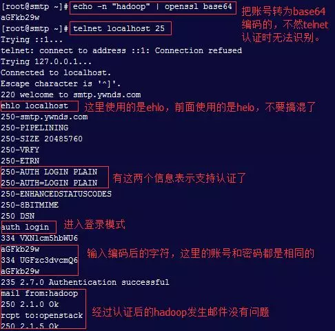

## **环境说明**

#### 准备工作

- Ubuntu 16.04.5 LTS
- 第三方认证组件 SASL：dovecot-SASL/cyrus-SASL/courier-authlib

## **步骤说明**

**1. Postfix+Dovecot+Sasl 工作原理**

- A 用户使用 MUA 客户端借助 smtp 协议登陆 smtpd 服务器，需要先进行用户和密码认证，而 SMTPD 服务器端支持 sasl 认证，例如有一个 sasl 客户端，就会去连接 SASL。当 SASL 接受到验证请求时就会根据验证方式去进行验证，常用的有 PAM，passwd 等。验证成功后就会返回给 Smtpd 服务器。而 smtpd 就会允许 A 用户登陆发送邮件。
- Smtpd 服务器接受到邮件转发请求后，查看邮件是本域的还是外部域的，如果是本域内的用户，就会开启 MDA 进程并进行邮件投递到用户的邮箱。
- B 用户使用 MUA 客户端借助 pop3 协议登陆 dovecot 服务器，需要先进行用户和密码认证，而 Dovecot 服务器端本身就有 sasl 认证的功能，而根据设置的认证方式进行用户和密码的认证。认证成功之后用户登录，Dovecot 就会用 MDR 工具去用户邮箱中取回邮件并下载到用户的客户端本地进行查看。

**2. Postfix+SASL 进行用户发邮件认证，确定 cyrus-sasl 已安装**

```@Terminal
rpm -qa | grep  cyrus-sasl
```

**3. 确定 Postfix 支持 sasl 认证**

```@Terminal
postconf -a   #默认支持cyrus和dovecot这两种认证方式
```

**4. Postfix 主配置添加以下内容**

```@Terminal
vim /etc/postfix/main.cf
###################CYRUS-SASL################
broken_sasl_auth_clients = yes
  #定义是否支持像outlook、foxmail等非标准协议认证
smtpd_sasl_auth_enable = yes
  #开启sasl验证用户功能
smtpd_sasl_local_domain = $myhostname
  #用于识别本地主机
smtpd_sasl_security_options = noanonymous
  #不支持匿名用户
smtpd_sasl_path = smtpd
  #指定使用sasl的程序名
smtpd_banner = welcome to smtp.ywnds.com
  #定义telnet连接时显示信息
smtpd_client_restrictions = permit_sasl_authenticated
  #用于限制客户端连接服务器
smtpd_sasl_authenticated_header = yes
  #从头信息查找用户名
smtpd_sender_restrictions = permit_mynetworks,reject_sender_login_mismatch
  #定义发件人规则
smtpd_recipient_restrictions=permit_mynetworks,permit_sasl_authenticated, reject_invalid_hostname,reject_unauth_destination
  #定义收件人规则
  #permit_mynetworks：允许本地网络
  #permit_sasl_authenticated：允许sasl认证过的用户发送邮件
  #reject_unauth_destination：拒绝没有经过认证的目标地址（这个一定要放在最后）
  #reject_invalid_hostname：HELO命令中的主机名称无效时返回501
  #reject_non_fqdn_hostname：HELO命令中的主机名称不是FQDN形式则返回504
  #reject_non_fqdn_recipient：收件地址不是FQDN则返回504
  #reject_non_fqdn_sender：发件地址不是FQDN则返回504
  #reject_unauth_pipelining：拒绝不守规定的流水线操作
  #reject_unknown_client：DNS查不出客户端IP的PTR记录时拒绝
  #reject_unknown_hostname：HELO命令中的主机名称没有A和MX记录时拒绝
  #reject_unknown_recipient_domain：收件人地址的网域部分查不出有效的A或MX记录时拒绝
  #reject_unknown_sender_domain：发件人地址的网域部分查不出有效的A或MX记录时拒绝
```

**5. 查看 SASL 支持哪些认证机制**

```@Terminal
saslauthd -v
```

**6. Postfix 开启基于 SASL 用户认证**

- 这里介绍 2 种认证方式，saslauthd 和 auxprop，一个是使用系统的账号来做认证，一个使用外部的账户来做认证，对于安全性来说，当然是使用外部的账号更安全了，这里介绍的使用 sasldb2 数据库，mysql 的方式暂不介绍。2 种方式人选其一即可。

```@Terminal
# 登录方式 Saslauthd
vim /usr/lib64/sasl2/smtpd.conf
pwcheck_method: saslauthd
mech_list: PLAIN LOGIN
# 登录方式 Auxprop
vim /usr/lib64/sasl2/smtpd.conf
pwcheck_method: auxprop
auxprop_plugin: sasldb
mech_list: PLAIN LOGIN CRAM-MD5 DIGEST-MD5 NTLM
```

**7. SASL 配置文件/etc/sysconfig/saslauthd**

- SASL 只是个认证框架，实现认证的是认证模块，而 pam 是 sasl 默认使用的认证模块。如果使用 shadow 做认证的话直接修改就可以不需要做其他任何配置了。

```@Terminal
Saslauthd
[root@localhost ~]# vim /etc/sysconfig/saslauthd
SOCKETDIR=/var/run/saslauthd
#MECK= pam
MECK = shadow

Auxprop
[root@localhost ~]# vi /etc/sysconfig/saslauthd
#MECH=
FLAGS=sasldb

[root@localhost ~]# saslpasswd2 -c -u 'ywnds.com' redis
  #执行之后输入2次密码就可以了
[root@localhost ~]# sasldblistusers2
  #查看添加的用户
[root@localhost ~]# saslpasswd2 -d redis@ywnds.com
  #删除用户
[root@localhost ~]# chown postfix:postfix /etc/sasldb2
[root@localhost ~]# chmod 640 /etc/sasldb2
  #数据库权限修改
```

**8. 重启服务**

```@Terminal
/usr/sbin/postfix reload
service saslauthd restart
chkconfig saslauthd on
testsaslauthd -u hadoop -p hadoop
```

**9. SMTP 认证指令**



**10. Postfix 内部邮件过滤**

- 除了在上面配置文件中使用的一些过滤指令外，管理员也可以使用访问表(access map)来自定义限制条件，自定义访问表的条件通常使用 check_client_access, check_helo_access, check_sender_access, check_recipient_access 进行，它们后面通常跟上 type:mapname 格式的访问表类型和名称。其中，check_sender_access 和 check_recipient_access 用来检查客户端提供的邮件地址，因此，其访问表中可以使用完整的邮件地址，如 admin@magedu.com；也可以只使用域名，如 magedu.com；还可以只有用户名的部分，如 marion@

**11. 案例**

11.1 以禁止 172.16.100.66 这台主机通过工作在 172.16.100.1 上的 postfix 服务发送邮件为例演示说明其实现过程。访问表使用 hash 的格式

```
(1)首先编辑/etc/postfix/access文件，以之做为客户端检查的控制文件，在里面定义如下一行：
172.16.100.66          REJECT
(2)将此文件转换为hash格式产生一个access.db文件
postmap /etc/postfix/access
(3)配置postfix使用此文件对客户端进行检查编辑/etc/postfix/main.cf文件添加如下参数：
smtpd_client_restrictions = check_client_access hash:/etc/postfix/access
(4)让postfix重新载入配置文件即可进行发信控制的效果测试了
```

11.2 这里以禁止通过本服务器向 microsoft.com 域发送邮件为例演示其实现过程访问表使用 hash 的格式

```
(1)首先建立/etc/postfix/denydstdomains文件(文件名任取)在里面定义如下一行：
microsoft.com          REJECT
(2)将此文件转换为hash格式
postmap /etc/postfix/denydstdomains
(3)配置postfix使用此文件对客户端进行检查编辑/etc/postfix/main.cf文件添加如下参数：
smtpd_recipient_restrictions = check_recipient_access hash:/etc/postfix/denydstdomains, permit_mynetworks, reject_unauth_destination
(4)让postfix重新载入配置文件即可进行发信控制的效果测试了
```

## **注意事项**
