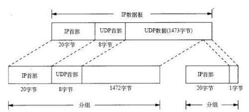

## **环境说明**

#### UDP 协议头

**1. UDP 端口号**

- 由于很多软件需要用到 UDP 协议，所以 UDP 协议必须通过某个标志用以区分不同的程序所需要的数据包。端口号的功能就在于此，例如某一个 UDP 程序 A 在系统中注册了 3000 端口，那么，以后从外面传进来的目的端口号为 3000 的 UDP 包都会交给该程序。端口号理论上可以有 2^16 这么多。因为它的长度是 16 个 bit。

**2. UDP 检验和**

- 这是一个可选的选项，并不是所有的系统都对 UDP 数据包加以检验和数据(相对 TCP 协议的必须来说)，但是 RFC 中标准要求，发送端应该计算检验和。
- UDP 检验和覆盖 UDP 协议头和数据，这和 IP 的检验和是不同的，IP 协议的检验和只是覆盖 IP 数据头，并不覆盖所有的数据。UDP 和 TCP 都包含一个伪首部，这是为了计算检验和而设置的。伪首部甚至还包含 IP 地址这样的 IP 协议里面都有的信息，目的是让 UDP 两次检查数据是否已经正确到达目的地。如果发送端没有打开检验和选项，而接收端计算检验和有差错，那么 UDP 数据将会被悄悄的丢掉（不保证送达），而不产生任何差错报文。

**3. UDP 长度**

- UDP 可以很长很长，可以有 65535 字节那么长。但是一般网络在传送的时候，一次一般传送不了那么长的协议（涉及到 MTU 的问题），就只好对数据分片，当然，这些是对 UDP 等上级协议透明的，UDP 不需要关心 IP 协议层对数据如何分片，下一个章节将会稍微讨论一些分片的策略。

**4. IP 分片**

- 在 IP 头里面，16bit 识别号唯一记录了一个 IP 包的 ID,具有同一个 ID 的 IP 片将会被重新组装；而 13 位片偏移则记录了某 IP 片相对整个包的位置；而这两个表示中间的 3bit 标志则标示着该分片后面是否还有新的分片。

- 因为分片技术在网络上被经常的使用，所以伪造 IP 分片包进行流氓攻击的软件和人也就层出不穷。
  可以用 Trancdroute 程序来进行简单的 MTU 侦测。

**5. UDP 和 ARP 之间的交互式应用**

- 某些系统会让每一个分片都发送一个 ARP 查询，所有的分片都在等待，但是接受到第一个回应的时候，主机却只发送了最后一个数据片而抛弃了其他，这实在是让人匪夷所思。这样，因为分片的数据不能被及时组装，接受主机将会在一段时间内将永远无法组装的 IP 数据包抛弃，并且发送组装超时的 ICMP 报文（其实很多系统不产生这个差错），以保证接受主机自己的接收端缓存不被那些永远得不到组装的分片充满。

**6. ICMP 源站抑制差错**

- 当目标主机的处理速度赶不上数据接收的速度，因为接受主机的 IP 层缓存会被占满，所以主机就会发出一个“我受不了”的一个 ICMP 报文。

**7. UDP 服务器设计**

- 关于客户 IP 和地址：服务器必须有根据客户 IP 地址和端口号判断数据包是否合法的能力（这似乎要求每一个服务器都要具备）
- 关于目的地址：服务器必须要有过滤广播地址的能力。
- 关于数据输入：通常服务器系统的每一个端口号都会和一块输入缓冲区对应，进来的输入根据先来后到的原则等待服务器的处理，所以难免会出现缓冲区溢出的问题，这种情况下，UDP 数据包可能会被丢弃，而应用服务器程序本身并不知道这个问题。
- 服务器应该限制本地 IP 地址，就是说它应该可以把自己绑定到某一个网络接口的某一个端口上。

## **注意事项**
