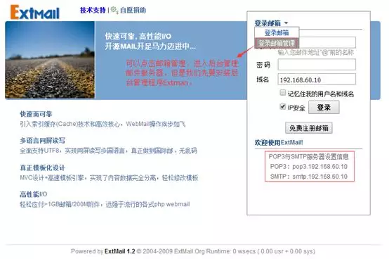
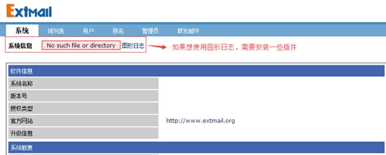
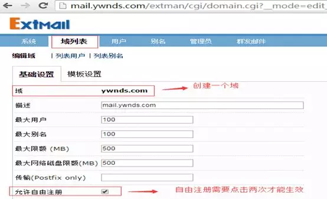
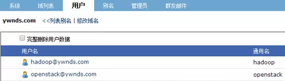
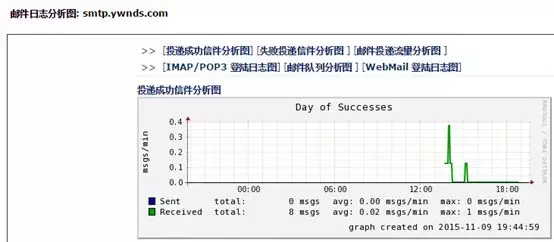

## **环境说明**

#### 准备工作

- Ubuntu 16.04.5 LTS
- Extmail

## **Extmail**

- Extman 两个部分的程序套件。ExtMail 套件用于提供从浏览器中登录、使用邮件系统的 Web 操作界面，提供给普通邮件用户使用。而 Extman 套件用于提供从浏览器中管理邮件系统的 Web 操作界面，提供给邮件系统的管理员使用。它以 GPL 版权释出，设计初衷是希望设计一个适应当前高速发展的 IT 应用环境，满足用户多变的需求，能快速进行开发、改进和升级，适应能力强的 webmail 系统。
- Extmail 还被设计成一个能够替代目前国内外一些主流 webmail 软件的系统，例如：SqWebMail，OpenWebmail 及 squirrel，Igenus 等。
- ExtMail Project 是一个活跃的开源邮件系统项目，目前由 ExtMail 团队维护。该项于 2005 年 9 月 18 日正式启动，最初以 WebMail 软件为主，至今已逐步形成了 ExtMail 软件系列。整个项目的目标是开发出高效、 易用、富有生命力的邮件系统(方案)，经过粗略的统计，截止 2009 年 10 月份，已有超过 8000 个服务器在运行 ExtMail 软件，其中有超过 4000 个运行在互联网上。
- 目前 Extmail 的主要特点集中如下：
- 支持 Maildir，索引技术，速度超快 支持多国语言同屏显示，真正国际邮 支持巨型邮箱（超过 1GB）海量文件 支持无限尺寸附件，I/O 能力强 模板化，多语言，修改非常容易。

## **步骤说明**

**1. 安装 Extmail**

```@Terminal
tar zxvf extmail-1.2.tar.gz
mkdir -pv /var/www/extsuite
mv extmail-1.2 /var/www/extsuite/extmail
cd /var/www/extsuite/extmail/
cp webmail.cf.default webmail.cf
```

**2. 配置 Extmail 连接 MySQY**

```@Terminal
vim /var/www/extsuite/extmail/webmail.cf
SYS_CONFIG = /var/www/extsuite/extmail/
  #默认的网页路径（所以上面直接创建了一个目录）
SYS_MESSAGE_SIZE_LIMIT = 5242880
  #用户可以发送的最大邮件
SYS_USER_LANG = zh_CN
  #语言选项（这里修改为中文，默认是英文）
SYS_MAILDIR_BASE = /var/mailbox
  #此处即为您在前文所设置的虚拟用户邮件的存放目录（这里修改为/var/mailbox）
SYS_MYSQL_USER = extmail
SYS_MYSQL_PASS = extmail
SYS_MYSQL_PASS = extmail
  #以上用来设置连接数据库服务器所使用用户名、密码和邮件服务器用到的数据库
SYS_MYSQL_HOST = localhost
  #指明数据库服务器主机名，这里默认即可
SYS_MYSQL_SOCKET = /var/lib/mysql/mysql.sock
  #指明数据库sock文件，这里默认，如果不是使用RPM包就要修改
SYS_MYSQL_TABLE = mailbox
SYS_MYSQL_ATTR_USERNAME = username
SYS_MYSQL_ATTR_DOMAIN = domain
SYS_MYSQL_ATTR_PASSWD = password
  #以上用来指定验正用户登录里所用到的表，以及用户名字段、域名字段和用户密码字段，这里默认即可
SYS_AUTHLIB_SOCKET = /usr/local/courier-authlib/var/spool/authdaemon/socket
  #此句用来指明authdaemond socket文件的位置（修改为authlib默认的位置）
```

**3. 配置 Httpd 服务器**

- 由于 extmail 要进行本地邮件的投递操作，故必须将运行 apache 服务器用户的身份修改为您的邮件投递代理的用户，本例中打开了 apache 服务器的 suexec 功能，这样其他虚拟主机在运行时不会影响其运行账号，故使用以下方法来实现虚拟主机运行身份的指定。此例中的 MDA 为 postfix 自带因此将指定为 postfix 用户。

```@Terminal
vim /etc/httpd/conf/httpd.conf
ServerName mail.ywnds.com:80
#DocumentRoot "/var/www/html"
User vmail
Group vmailServerName mail.ywnds.com
DocumentRoot /var/www/extsuite/extmail/html/
ScriptAlias /extmail/cgi /var/www/extsuite/extmail/cgi
Alias /extmail /var/www/extsuite/extmail/html
```

- 由于使用 postfix 运行 httpd 有风险，如果一个 Httpd 服务器有多个虚拟主机，那么可以使用 apache 提供的 suexec 只针对这一个虚拟主机运行 postfix 用户和组，而其他主机使用 apache 用户运行。那么就需要将上面的虚拟主机改为以下：

```@Terminal
vim /etc/httpd/conf/httpd.conf
#DocumentRoot "/var/www/html"ServerName mail.ywnds.com
DocumentRoot /var/www/extsuite/extmail/html/
ScriptAlias /extmail/cgi /var/www/extsuite/extmail/cgi
Alias /extmail /var/www/extsuite/extmail/html
SuexecUserGroup vmail vmail
```

**4. 修改网页目录权限**

```@Terminal
chown -R vmail.vmail /var/www/extsuite/extmail
```

**5. 安装 unix-syslog**

- Extmail 是使用 perl 语言写的程序，需要要用到 perl 的 UNIX::syslog 功能

```@Terminal
tar xvf Unix-Syslog-1.1.tar.gz -C /usr/src/
cd /usr/src/Unix-Syslog-1.1
perl Makefile.PL
make && make install
```

**6. 启动 Httpd 服务**

```@Terminal
setenforce 0
service httpd restart
chkconfig httpd on
```

- 客户端配置 DNS 地址为我们设置的 DNS 服务器(192.168.60.10)，或者添加 Hosts 文件，然后访问http://mail.ywnds.com，就可以看到以下页面。



**7. 安装 Extman 后台管理程序**

```@Terminal
tar xvf extman-1.1.tar.gz -C /usr/src/
mv /usr/src/extman-1.1 /var/www/extsuite/extman
```

**8. 修改配置文件以符合本例的需要**

```@Terminal
cd /var/www/extsuite/extman/
cp webman.cf.default webman.cf
vim webman.cf
SYS_CAPTCHA_ON = 0
  #此处是否开启图形验证码，如果开启会有一些依赖软件需要安装
SYS_MAILDIR_BASE = /var/mailbox
  #此处即为您在前文所设置的用户邮件的存放目录
SYS_SESS_DIR = /tmp/extman
SYS_SESS_DIR = /tmp/extman/upload
  #建立会话的目录，默认没有需要建立并且属主和属组还必须是Httpd进程的属主属组
SYS_DEFAULT_UID = 1001
SYS_DEFAULT_GID = 1001
  #使用vmail的UID和GID
SYS_BACKEND_TYPE = mysql
  #后端连接默认使用Mysql
SYS_MYSQL_USER = webman
SYS_MYSQL_PASS = webman
SYS_MYSQL_DB = extmail
SYS_MYSQL_HOST = localhost
SYS_MYSQL_SOCKET = /var/lib/mysql/mysql.sock
SYS_MYSQL_TABLE = manager
SYS_MYSQL_ATTR_USERNAME = username
SYS_MYSQL_ATTR_PASSWD = password
```

**9. 创建 webman 用户**

```@mysql
GRANT all privileges on extmail.* TO webman@localhost IDENTIFIED BY 'webman';
GRANT all privileges on extmail.* TO webman@127.0.0.1 IDENTIFIED BY 'webman';
flush privileges;
```

**10. 创建/tmp/extman**

```@Terminal
mkdir -pv /tmp/extman/upload
chown vmail.vmail /tmp/extman
```

**11. 修改网页目录权限**

```@Terminal
chown -R vmail.vmail /var/www/extsuite/extman
```

**12. 修改 httpd.conf 配置文件在 extmail 主机添加上 extman 路径**

```@Terminal
vim /etc/httpd/conf/httpd.confServerName mail.ywnds.com
DocumentRoot "/var/www/extsuite/extmail/html/"
ScriptAlias /extmail/cgi /var/www/extsuite/extmail/cgi
Alias /extmail /var/www/extsuite/extmail/html
ScriptAlias /extman/cgi /var/www/extsuite/extman/cgi
Alias /extman /var/www/extsuite/extman/html
```

**13. 重启所有服务**

```@Terminal
service httpd restart
service saslauthd restart
service courier-authlib restart
service dovecot restart
service postfix restart
service named restart
service mysqld restart
chkconfig | egrep 'named|postfix|saslauthd|courier-authlib|dovecot|httpd|mysqld'
```

**14. 测试 webmail**

- 登录 extmail 然后转到 extman 后台管理程序进行邮箱服务器的管理，其默认账号密码如下：
  帐号：root@extmail.org
  密码：extmail*123*





**15. 可选项**

- 如果你想使用校验码，需要安装 perl-GD 模块会解决校验码不显示的问题。
- Extman-1.1 自带了图形化显示日志的功能，如果想使用需要安装图形日志的运行所需要的软件包 Time::HiRes、File::Tail 和 rrdtool。其中前两个包您可以去http://search.cpan.org搜索并下载获得。

```@Terminal
#安装依赖包
yum install tcl tcl-devel libart_lgpl libart_lgpl-devel
#安装Time::HiRes
tar xvf Time-HiRes-1.9721.tar.gz
cd Time-HiRes-1.9721
perl Makefile.PL
make
make test
make install
#安装File::Tail
tar xvf File-Tail-0.99.3.tar.gz
cd File-Tail-0.99.3
perl Makefile.PL
make
make test
make install
#安装rrdtool-1.2.23
tar xvf rrdtool-1.4.5.tar.gz
cd rrdtool-1.4.5
./configure --prefix=/usr/local/rrdtool
make && make install
#创建链接
cd /usr/local/rrdtool/lib/perl/5.10.1/x86_64-linux-thread-multi/auto/RRDs/
ln -sv RRDs.so /usr/lib64/perl5/5.10.0/x86_64-linux-thread-multi/
ln -sv /usr/local/rrdtool/lib/perl/5.10.1/RRDp.pm /usr/lib64/perl5/5.10.0/
ln -sv /usr/local/rrdtool/lib/perl/5.10.1/x86_64-linux-thread-multi/RRDs.pm /usr/lib64/perl5/5.10.0/
#Extman会到这些路径下找相关的库文件,复制mailgraph_ext到/usr/local
cp -r /var/www/extsuite/extman/addon/mailgraph_ext/ /usr/local
/usr/local/mailgraph_ext/mailgraph-init start
/var/www/extsuite/extman/daemon/cmdserver -v -d
echo "/usr/local/mailgraph_ext/mailgraph-init start" >> /etc/rc.local
echo “/var/www/extsuite/extman/daemon/cmdserver -v -d” >> /etc/rc.local
#如果编译安装的RRD不行就YUM安装
yum install rrdtool rrdtool-perl
```



## **注意事项**
