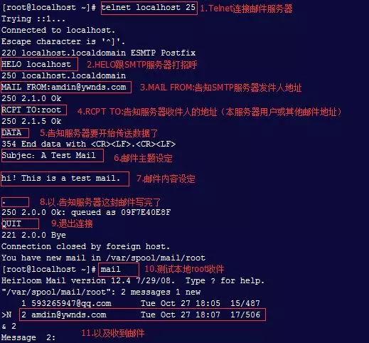
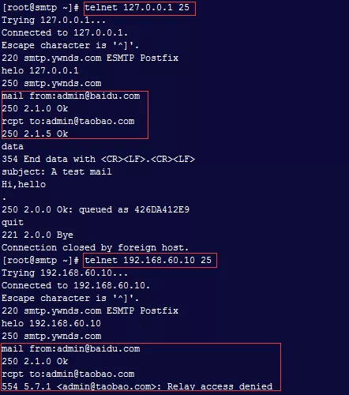

## **环境说明**

#### 准备工作

- Ubuntu 16.04.5 LTS
- 部署 DNS 服务器

## **步骤说明**

**1. postfix 根据域名和地址做一个 MX 记录，A 记录，PTR 记录(一般在互联网上邮件服务器都要反解，没有 PTR 记录会认为是垃圾邮件)**

```@Terminal
$ service iptables stop
$ chkconfig iptables on
$ setenforce 0
$ hostname mail.ywnds.com
$ echo "127.0.0.1  mail.ywnds.com" >> /etc/hosts
$ yum install bind bind-utils bind-libs
```

**2. 配置 DNS**

```@Terminal
cat /etc/named.conf
options {
  listen-on port 53 { any; };
  directory       "/var/named";
  allow-query     { any; };
  recursion yes;
{
zone "ywnds.com" IN {
  type master;
  file "ywnds.com";
};
#include "/etc/named.root.key";
```

- 添加和修改以下内容

```@Terminal
cat /var/named/ywnds.com
$TTL 1D
@       IN    SOA    ns.ywnds.com.    root.ywnds.com. (
                                        0      ; serial
                                        1D     ; refresh
                                        1H     ; retry
                                        1W     ; expire
                                        3H )   ; minimum
@       IN    NS      ns
ns      IN    A       192.168.60.10
@       IN    MX 10   smtp
smtp    IN    A       192.168.60.10
pop3    IN    A       192.168.60.10
mail    IN    A       192.168.60.10
$ service named restart
$ chkeconfig named on
```

**3. postfix 主配置文件添加以下内容**

- 配置文件说明：

```
/etc/postfix/main.cf：这个文件保存全局配置信息，所有进程都会用到，除非这些配置在 master.cf 文件中被重新设置了。
/etc/postfix/master.cf：这个文件保存了额外的进程运行时环境参数，在 main.cf 文件中定义的配置可能会被本文件的配置覆盖掉。
```

- 在配置文件中所有的参数都必须顶格写不然就会当做是上一行参数的续写。另外 postfix 大部分配置文件都进行默认化处理了，可以使用 postconf -d 进行查看。

```@Terminal
$cat /etc/postfix/main.cf
inet_protocols = all
inet_interfaces = 192.168.60.10,127.0.0.1
myhostname = mail.ywnds.com
mydomain = ywnds.com
myorigin = $mydomain
mydestination = $myhostname， localhost.$mydomain， localhost， $mydomain
mynetworks = 127.0.0.0/8
message_size_limit = 20485760
mailbox_size_limit = 5097152000
show_user_unknown_table_name = no
bounce_queue_lifetime = 1d
maximal_queue_lifetime = 1d
home_mailbox = Maildir/
#home_mailbox = Mailbox
#mailbox_command = /some/where/procmail
```

- 参数说明：
  | 名称 | 说明 |
  | -------- | ---------------------------- |
  | inet_protocols = all | 指定协议 |
  | inet_interfaces = 192.168.60.10,127.0.0.1 | 指定 postfix 系统监听的网络接口 |
  | myhostname = mail.ywnds.com | 指定主机名 |
  | mydomain = ywnds.com | 指定域名，默认情况下 postfix 将 myhostname 的第一部分删除而作为 mydomain 的值 |
  | myorigin = $mydomain | 用来自动补全本域用户，用来指明发件人所在的域名，即做发件地址伪装 |
| mydestination = $myhostname， localhost.$mydomain， localhost， $mydomain | 定义了 Postfix 接收邮件时的收件人域名，即 Postfix 要接收哪些域名的邮件，不在此区域内的都算是中继邮件，如果不加\$mydomain 的话那么就不允许收本域内邮件 |
  | mynetworks = 127.0.0.0/8 | 根据网络地址中继，默认给你所在的整个网络中继，postfix 系统根据其值来区别用户是远程的还是本地的，这里设置只给本机中继。 |
  | message_size_limit = 20485760 mailbox_size_limit = 5097152000 show_user_unknown_table_name = no | 邮件大小限制为 20M，邮箱大小限制为 5G |
  | bounce_queue_lifetime = 1d maximal_queue_lifetime = 1d | 队列超时限制为 1 天 |
  | home_mailbox = Maildir/#home_mailbox = Mailbox | 邮箱投递方式 |
  | mailbox_command = /some/where/procmail | 配置 MDA 使用 procmail 方式(postfix 默认的投递代理) |

**4. SMTP 协议发送邮件命令**



```
SMTP状态码：
1xx：纯信息
2xx：正确
3xx：上一步操作尚未完成，需要继续补充
4xx：暂时性错误
5xx：永久性错误
```

- SMTP 协议非常简单，简单到允许任何用户发送邮件同时也允许发送到任何用户。在发件人（MAIL FROM）哪里可以随意指定地址。但是收件人（RCPT TO）可以发给本域内用户也可以通过中继发送给其他域用户。如 163 或 QQ 邮箱。但是一般公网邮箱都是需要进行发件人域名反向解析，如果能解析就接收邮件，不能解析就丢失邮件。如果全部解析就有点太苛刻了，也可以针对部分域名进行解析。

**5. Postfix 默认允许本机和本机所在网络的所有主机都允许中继，所以可以发给其他域邮件。但是由于我们上面是用来了指令“mynetworks = 127.0.0.0/8”表示只给本机中继。所以其他主机是无法发送邮件给其他域的，如下图：**



- 注意：127.0.0.1 跟 192.168.60.10 虽然都能访问本机，但它们两的意义不同，127.0.0.1 是在本机内部，而 192.168.60.10 是通过网卡的。另外查看邮件服务器的日志信息在/var/log/maillog

**6. 创建两个邮箱测试用户并给密码（密码也同用户名）**

```@Terminal
useradd -s /sbin/nologin openstack
useradd -s /sbin/nologin hadoop
```

- 创建邮件别名，在/etc/aliases 文件中可以定义用户别名格式如下:

```
Openstack:  root  #表示所有发给Openstack用户的邮件，都发送给root用户
```

- 通过 hash 编码转换为另外一种格式/etc/aliases.db（postfix 支持 hash 格式），而 newaliases 命令就可以进行它们之间的相互转码的，直接执行命令 newaliases 即可。

**7. 邮件队列**

- Postfix 维护两个队列：未决邮件队列（pending mails queue）和等待邮件队列（deferred mail queue）。等待队列包含了暂时发送失败、需要重新发送的邮件，Postfix 会定期重发（默认 5 分钟，可自定义设置）。

- Postfix 维护 5 个队列：

```
输入队列，邮件进入Postfix系统的第一站；
活动队列，qmgr 将输入队列的邮件移到活动队列；
等待队列，保存暂时不能发送出去的邮件；
故障队列，保存受损或无法解读的邮件；
保留队列，将邮件无限期留在 Postfix 队列系统中；

列出邮件队列
$ postqueue -p  #删除所有队列邮件
$ postsuper -d ALL deferred  #删除所有邮件
stsuper -d ALL
```

- 发送一份邮件一般也可使用 tail /var/log/maillog 查看邮件队列日志信息，如“status=sent”表示邮件发送成功，而“status=deferred”表示邮件在等待队列。

## **注意事项**

1、在 postfix 的配置文件中，参数行和注释行是不能处在同一行中的；
2、任何一个参数的值都不需要加引号，否则，引号将会被当作参数值的一部分来使用；
3、每修改参数及其值后执行 postfix reload 即可令其生效；但若修改了 inet_interfaces，则需重新启动 postfix；
4、如果一个参数的值有多个，可以将它们放在不同的行中，只需要在其后的每个行前多置一个空格即可；postfix 会把第一个字符为空格或 tab 的文本行视为上一行的延续；

**邮箱投递方式说明**

- 一种是 Mailbox 方式，即同一个用户的所有邮件内容存储为单个文件，通常保存在/var/spool/mail/目录下文件名与用户名相同（Postfix 默认使用）；第二种是 Maildir 方式，即使用目录结构来存储用户的邮件内容每一个用户使用一个文件夹，每封邮件都作为一个独立的文件存放。Maildir 方式的存取速度和效率要好一些对于管理邮件内容页更加方便。
